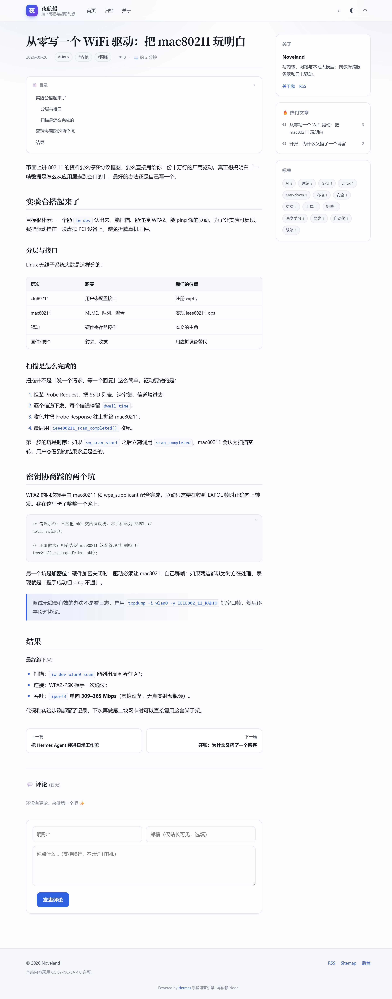
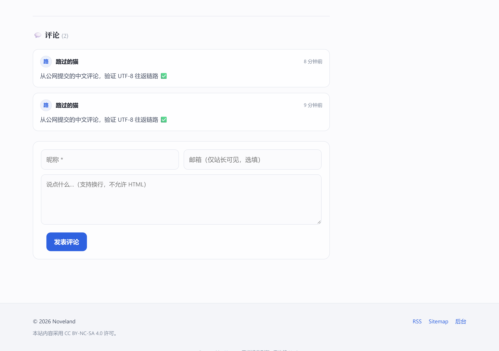
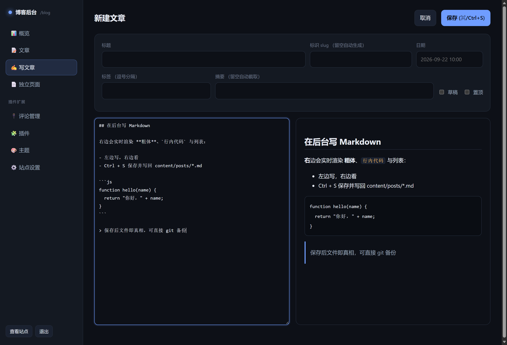
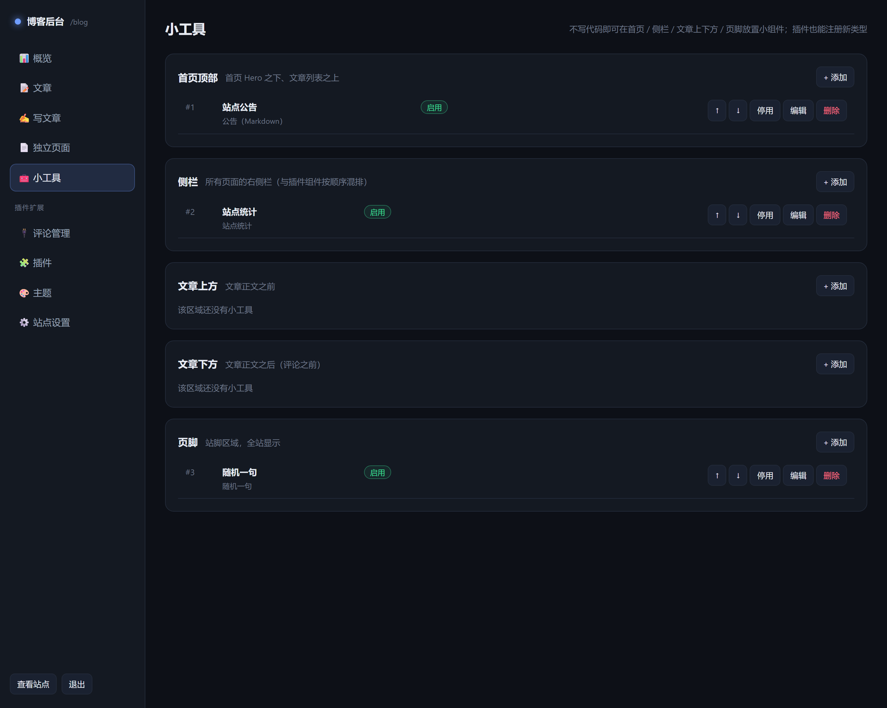
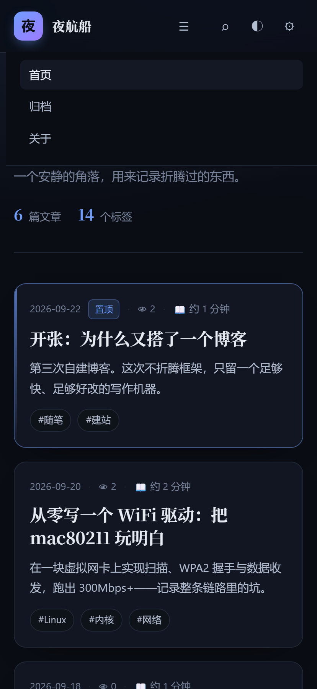

# 夜航船 · 个人博客引擎

**零 npm 依赖**的自托管博客：Node 标准库写就（`node:sqlite` + `node:http`），
Markdown 为内容源，**插件 / 主题 / 小工具三层可扩展**，前台服务端渲染 + 自带后台 SPA。

> 内核约 2900 行，`node server.js` 即可运行，无需构建、无需 `npm install`、无需部署数据库。


## 特性

| 类别 | 说明 |
|:--|:--|
| 内容 | `content/posts/*.md` 文件即数据；frontmatter 支持标题/日期/标签/摘要/草稿/置顶；改文件自动热重载 |
| 前台 | 服务端渲染（首屏只有 1 个 CSS + 2 个小 JS）；列表/详情/标签/归档/搜索/RSS/Sitemap；深色+浅色双模式；移动端适配 |
| 后台 | 原生 JS 单页应用：Markdown 编辑器（实时预览、`Ctrl+S` 保存）、文章/页面管理、**小工具管理**、插件管理、主题切换、站点设置、评论审核面板 |
| 扩展① 插件 | 12 个钩子 + 自有路由 + 自有静态资源 + 后台面板，支持**启用/停用/热重载** |
| 扩展② 主题 | 只改 CSS 变量即可换肤，可选 `layout.js` 覆盖渲染片段 |
| 扩展③ 小工具 | **不写代码**就能在首页/侧栏/文章上下方/页脚放置小工具（6 种内置类型 + 插件可注册新类型） |
| 安全 | scrypt 口令、nonce CSP、同源校验、限流、路径穿越防护、改密即注销会话……见 [SECURITY.md](SECURITY.md) |
| 自检 | `node tests/smoke.js` 共 **117 项**端到端断言（含 24 项安全专项） |

## 快速开始

```bash
git clone <repo> && cd personal-blog
node server.js                        # → http://127.0.0.1:3081
node tools/set-password.js '你的密码'  # 设置后台密码
node tests/smoke.js                   # 端到端自检
```

环境要求：**Node.js 22.5+**（依赖内置 `node:sqlite`）。
环境变量：`BLOG_HOST` / `BLOG_PORT` / `BLOG_BASE_PATH` / `BLOG_DATA_DIR`。
部署到服务器、nginx（含「复用已有端口做子路径」）见 **[DEPLOY.md](DEPLOY.md)**。

## 界面

| 文章页（目录 + 语法高亮 + 浏览量） | 评论区（插件提供） |
|:--|:--|
|  |  |

| 后台编辑器 | 小工具管理 | 移动端 |
|:--|:--|:--|
|  |  |  |

## 架构一览

```
┌─ 浏览器 ─────────────────────────────────────────────┐
│  前台（服务端渲染 HTML）      后台 SPA（原生 JS）      │
└───────────────┬──────────────────────┬───────────────┘
                │ HTTPS                │
        ┌───────▼──────────────────────▼───────┐
        │ nginx（TLS 终止 + 反代）              │
        └───────────────┬──────────────────────┘
                        │ http://127.0.0.1:3081
        ┌───────────────▼──────────────────────┐
        │ server.js  ── 路由 / 鉴权 / 静态资源  │
        │   ├─ lib/markdown  零依赖渲染器       │
        │   ├─ lib/plugins   插件系统（钩子）   │
        │   ├─ lib/widgets   小工具系统（区域） │
        │   ├─ lib/themes    主题系统（CSS 变量）│
        │   └─ lib/store     文件 + SQLite      │
        └───────────────┬──────────────────────┘
                        │
     content/posts/*.md · data/blog.db · plugins/ · themes/ · public/
```

## 目录结构

```
server.js            入口：路由 / 鉴权 / 静态资源 / 生命周期
lib/
  markdown.js        零依赖 Markdown 渲染器（先转义再套行内语法，XSS 安全）
  plugins.js         插件系统（钩子 / 热重载 / 路由归属 / 插件设置校验）
  widgets.js         小工具系统（区域 / 类型注册 / CRUD / 渲染）
  themes.js          主题系统（CSS 变量 + 可选 layout 覆盖）
  store.js           内容索引 + SQLite（设置/会话/插件数据/小工具）
  render.js          渲染层（默认布局，可被主题覆盖）
  auth.js            认证（scrypt / 会话 / 登录防爆破 / 同源校验）
  router.js utils.js config.js
content/posts/*.md   文章      content/pages/*.md  独立页面
plugins/<name>/      插件      themes/<name>/      主题
public/assets/       前端资源  data/blog.db        运行数据（不入库）
deploy/              启动脚本 / nginx 片段 / systemd 单元 / nginx 补丁脚本
tests/smoke.js       端到端自检   tools/  改密脚本、CDP 截图工具
```

## 写文章

```markdown
---
title: 标题
date: 2026-09-22 09:30
tags: [随笔, 建站]
summary: 自定义摘要（留空自动截取）
draft: false      # true 则不公开
pinned: true      # 置顶
cover:            # 可选封面
---

正文… 支持表格、任务列表、引用、代码块、==高亮==、~~删除线~~、自动链接
```

文件名即 slug（也可用 `slug:` 覆盖）。保存文件后内核会自动重载内容，**不需要重启**。

## 小工具（不写代码的扩展）

后台「🧰 小工具」页：选区域 → 选类型 → 填表单 → 保存，即刻生效；可启用/停用、上下排序、删除，
填表时可先「预览」。

| 区域 | 位置 |
|:--|:--|
| `homeTop` | 首页 Hero 之下、文章列表之上 |
| `sidebar` | 所有页面右侧栏（与插件组件按顺序混排） |
| `postTop` / `postBottom` | 文章正文的上方 / 下方 |
| `footer` | 页脚 |

内置类型：`html`（自定义 HTML）、`notice`（Markdown 公告）、`stats`（站点统计）、
`recentPosts`（最新文章）、`links`（友链）、`quote`（随机一句）。
插件也能注册新类型（`widgetTypes` 钩子），注册后同样出现在类型下拉里 —— 见 `plugins/example/`。

## 插件（写代码的扩展）

```
plugins/<name>/
  plugin.json    清单（title/hooks/settings/enabledByDefault…）
  index.js       钩子实现（或工厂函数）
  public/        静态资源 → <前缀>/plugin-assets/<name>/
```

| 钩子 | 时机 |
|:--|:--|
| `setup` / `teardown` | 加载 / 重载或卸载前 |
| `routes(router, ctx)` | 注册路由（`{auth:'admin'}` 表示需登录） |
| `head` / `navItems` / `postMeta` / `postHeader` / `postFooter` / `sidebar` / `footer` | 各挂载点注入 HTML |
| `contentFilter` | 正文渲染后处理（返回 `{html}` 替换） |
| `adminPanels` | 后台自定义页签 |
| `widgetTypes` | 注册小工具类型 |

内置插件：

| 插件 | 说明 |
|:--|:--|
| `comments` | 评论系统：表单 + 列表 + 审核面板 + 反垃圾（蜜罐/限流/长度/链接数） |
| `toc` | 长文目录，滚动高亮 |
| `page-views` | 浏览量统计 + 侧栏热门文章 |
| `reading-time` | 阅读时长 / 字数 |
| `example` | 扩展示例（默认停用，可作模板）：整页路由、自有数据表、插件小工具 |

## 主题

复制 `themes/midnight` → 改 `theme.css` 里的 CSS 变量（`--bg / --text / --accent / --border / --font-*`…，
浅色模式用 `:root[data-mode="light"]` 覆盖）→ 后台一键切换。需要改结构时再用可选 `layout.js` 覆盖
`shell` / `postCard`。

## 路由一览

| 路由 | 说明 |
|:--|:--|
| `/` `/page/:n` | 首页与分页 |
| `/post/:slug` | 文章页 |
| `/p/:slug` | 独立页面 |
| `/tag/:tag` | 标签页 |
| `/archive` `/search?q=` | 归档 / 搜索 |
| `/feed.xml` `/sitemap.xml` `/robots.txt` | 订阅与爬虫 |
| `/admin` | 后台 |
| `/api/…` | 公开 API（posts / tags / post）与后台 API |
| `/plugin-assets/<插件>/…` | 插件静态资源 |

## 文档

- [ARCHITECTURE.md](ARCHITECTURE.md) — 架构、钩子契约、请求流程、扩展开发指南
- [SECURITY.md](SECURITY.md) — 安全复盘报告（15 项发现与处置 + 残余风险）
- [DEPLOY.md](DEPLOY.md) — 部署：本机 / 服务器 / nginx（独立端口与子路径两种）/ 备份迁移
- [plugins/example/README.md](plugins/example/README.md) — 插件开发速查

## 自检

```bash
node tests/smoke.js                                        # 117 项断言
BLOG_BASE=https://example.com/blog python tests/remote-check.py '密码' --check   # 线上实例自检
node tools/cdp-shot.js <url> out.png --port 9444           # CDP 截图（自签证书站点可用）
```

## License

MIT — 见 [LICENSE](LICENSE)。
