## 简介

hostapd 是host access point daemon的缩写。它是运行在用户空间的守护程序。它通常在后台运行，用于将无线网络卡充当访问点（AP），并作为控制身份验证的后端组件。曾经有三个不同版本的hostapd，分别是Jouni Malinen版、OpenBSD版和OWL（ Open Wireless Linux ）版。第三种版本的hostapd未曾有稳定版本发布，目前整个项目已经终止。Jouni Malinen版的hostapd是目前应用最为广泛的一个版本，安卓手机、基于OpenWrt的无线AP、Linux PC等设备多使用该版本的hostapd来创建无线接入点和管理无线设备的接入。

本文将介绍Jouni Malinen版的hostapd的使用和实现。目前稳定的发布版本为2.10，源代码可以在https://w1.fi/cgit/ 下载。

除了 hostapd 本身，本文还把视角延伸到了「连上 WiFi 的那几秒」：wpa_supplicant 是跑在用户空间的无线客户端守护程序，扫描、选网、认证与密钥协商都归它管。从敲下 `wpa_supplicant -i wlan0 -c wpa.conf` 到连接建立，往往只有几秒钟；但这几秒里，用户态程序、内核、无线固件、对端 AP 之间要走完一整套消息：进程启动、事件循环运转、扫描、选网、认证、关联，最后靠四次握手谈出会话密钥。这几秒里经过的代码路径相当可观，主干却只有三件事：程序怎么醒过来、它靠什么跟外界说话、一次连接到底是怎么谈成的。
漫游部分以 STA 侧连接 AP 为主线，碰到 AP 侧的逻辑就拿 hostapd 对照着说；所有 `路径:行号` 引用都对着 `hostap` 仓库 HEAD `d05533d`（2026-09 的上游 main）实测核对过，复核方法见文末附录。

## 如何使用hostapd

### 检测设备是否支持AP模式

并非所有的无线网卡都支持AP模式，可以使用“iw list | grep "Wiphy" -A 12”检测无线网卡是否支持运行在AP模式。

```text
root@OpenWrt:/#  iw list | grep "Wiphy" -A 12
Wiphy phy1
        wiphy index: 1
        max # scan SSIDs: 10
        max scan IEs length: 255 bytes
        max # sched scan SSIDs: 0
        max # match sets: 0
        max # scan plans: 1
        max scan plan interval: -1
        max scan plan iterations: 0
        Retry short limit: 7
        Retry long limit: 4
        Coverage class: 0 (up to 0m)
        Device supports AP-side u-APSD.
--
Wiphy phy0
        wiphy index: 0
        max # scan SSIDs: 10
        max scan IEs length: 255 bytes
        max # sched scan SSIDs: 0
        max # match sets: 0
        max # scan plans: 1
        max scan plan interval: -1
        max scan plan iterations: 0
        Retry short limit: 7
        Retry long limit: 4
        Coverage class: 0 (up to 0m)
        Device supports AP-side u-APSD.
```

### 加载模拟无线网卡

如果你现在手头没有一块无线网卡，或者现有无线网卡所支持的功能有限，则可以使用内核的模拟无线网卡。内核mac80211_hwsim模块可以模拟多个Radio（目前最多7个），我们可以利用它们来体验hostapd的基本功能。多数的发布版本默认支持这一功能，如果你目前使用的版本未使能该模块，可以通过更新内核配置选项CONFIG_MAC80211_HWSIM=m，并重新编译内核使能它。当mac80211_hwsim模块没有被加载时，我所使用的环境中，仅有一张无线网卡wlo1。

```text
test@test-pc:~$ ifconfig -a
enp0s25: flags=4163<UP,BROADCAST,RUNNING,MULTICAST>  mtu 1500
        inet 192.168.1.8 netmask 255.255.254.0  broadcast 192.168.1.255
        inet6 fe80::3625:d6d3:6608:7625  prefixlen 64  scopeid 0x20<link>
        ether 84:34:97:22:d5:f7  txqueuelen 1000  (Ethernet)
        RX packets 88811883  bytes 29645435158 (29.6 GB)
        RX errors 0  dropped 0  overruns 0  frame 0
        TX packets 17240600  bytes 12567111909 (12.5 GB)
        TX errors 0  dropped 0 overruns 0  carrier 0  collisions 0
        device interrupt 20  memory 0xd4500000-d4520000  

lo: flags=73<UP,LOOPBACK,RUNNING>  mtu 65536
        inet 127.0.0.1  netmask 255.0.0.0
        inet6 ::1  prefixlen 128  scopeid 0x10<host>
        loop  txqueuelen 1000  (Local Loopback)
        RX packets 3445549  bytes 8977135908 (8.9 GB)
        RX errors 0  dropped 0  overruns 0  frame 0
        TX packets 3445549  bytes 8977135908 (8.9 GB)
        TX errors 0  dropped 0 overruns 0  carrier 0  collisions 0

wlo1: flags=4098<BROADCAST,MULTICAST>  mtu 1500
        ether 24:77:03:c3:88:ec  txqueuelen 1000  (Ethernet)
        RX packets 0  bytes 0 (0.0 B)
        RX errors 0  dropped 0  overruns 0  frame 0
        TX packets 0  bytes 0 (0.0 B)
        TX errors 0  dropped 0 overruns 0  carrier 0  collisions 0
```

当mac80211_hwsim被加载之后，系统中会多出一个网络设备hwsim0，并会自动多出两个无线网络接口wlan0和wlan1。

```text
test@test-pc:~$ sudo modprobe mac80211_hwsim
test@test-pc:~$ ifconfig -a
enp0s25: flags=4163<UP,BROADCAST,RUNNING,MULTICAST>  mtu 1500
        inet 192.168.1.8 netmask 255.255.254.0  broadcast 192.168.1.255
        inet6 fe80::3625:d6d3:6608:7625  prefixlen 64  scopeid 0x20<link>
        ether 84:34:97:22:d5:f7  txqueuelen 1000  (Ethernet)
        RX packets 88813093  bytes 29645634959 (29.6 GB)
        RX errors 0  dropped 0  overruns 0  frame 0
        TX packets 17240741  bytes 12567135324 (12.5 GB)
        TX errors 0  dropped 0 overruns 0  carrier 0  collisions 0
        device interrupt 20  memory 0xd4500000-d4520000  

hwsim0: flags=4098<BROADCAST,MULTICAST>  mtu 1500
        unspec 12-00-00-00-00-00-30-3A-00-00-00-00-00-00-00-00  txqueuelen 1000  (UNSPEC)
        RX packets 0  bytes 0 (0.0 B)
        RX errors 0  dropped 0  overruns 0  frame 0
        TX packets 0  bytes 0 (0.0 B)
        TX errors 0  dropped 0 overruns 0  carrier 0  collisions 0

lo: flags=73<UP,LOOPBACK,RUNNING>  mtu 65536
        inet 127.0.0.1  netmask 255.0.0.0
        inet6 ::1  prefixlen 128  scopeid 0x10<host>
        loop  txqueuelen 1000  (Local Loopback)
        RX packets 3445549  bytes 8977135908 (8.9 GB)
        RX errors 0  dropped 0  overruns 0  frame 0
        TX packets 3445549  bytes 8977135908 (8.9 GB)
        TX errors 0  dropped 0 overruns 0  carrier 0  collisions 0

wlan0: flags=4098<BROADCAST,MULTICAST>  mtu 1500
        ether 02:00:00:00:00:00  txqueuelen 1000  (Ethernet)
        RX packets 0  bytes 0 (0.0 B)
        RX errors 0  dropped 0  overruns 0  frame 0
        TX packets 0  bytes 0 (0.0 B)
        TX errors 0  dropped 0 overruns 0  carrier 0  collisions 0

wlan1: flags=4098<BROADCAST,MULTICAST>  mtu 1500
        ether 02:00:00:00:01:00  txqueuelen 1000  (Ethernet)
        RX packets 0  bytes 0 (0.0 B)
        RX errors 0  dropped 0  overruns 0  frame 0
        TX packets 0  bytes 0 (0.0 B)
        TX errors 0  dropped 0 overruns 0  carrier 0  collisions 0

wlo1: flags=4098<BROADCAST,MULTICAST>  mtu 1500
        ether 24:77:03:c3:88:ec  txqueuelen 1000  (Ethernet)
        RX packets 0  bytes 0 (0.0 B)
        RX errors 0  dropped 0  overruns 0  frame 0
        TX packets 0  bytes 0 (0.0 B)
        TX errors 0  dropped 0 overruns 0  carrier 0  collisions 0
```

### 运行hostapd

hostapd的使用其实很简单，我们先看看程序自带的帮助信息。

```text
test@test-pc:~$ hostapd -h
hostapd v2.9
User space daemon for IEEE 802.11 AP management,
IEEE 802.1X/WPA/WPA2/EAP/RADIUS Authenticator
Copyright (c) 2002-2019, Jouni Malinen <j@w1.fi> and contributors

usage: hostapd [-hdBKtv] [-P <PID file>] [-e <entropy file>] \
         [-g <global ctrl_iface>] [-G <group>]\
         [-i <comma-separated list of interface names>]\
         <configuration file(s)>

options:
   -h   show this usage
   -d   show more debug messages (-dd for even more)
   -B   run daemon in the background
   -e   entropy file
   -g   global control interface path
   -G   group for control interfaces
   -P   PID file
   -K   include key data in debug messages
   -f   log output to debug file instead of stdout
   -T = record to Linux tracing in addition to logging
        (records all messages regardless of debug verbosity)
   -i   list of interface names to use
   -S   start all the interfaces synchronously
   -t   include timestamps in some debug messages
   -v   show hostapd version
```

头部是版本和版权信息。尾部是各选项的详细说明，选项虽然不少，但如注释所示，它们都不是必须的。

- 选项h后不带参数用于显示帮助信息。
- 选项v后不带参数用于显示当前版本信息。
- 选项d后不带参数用于简单调试，该选项可以重复使用，每增加一个d调试等级降低一级，更多的运行信息会被显示出来。最多可以添加3个d。
- 选项f用来指定保存所有log的文件。默认情况下log信息被输出到标准输出设备，使用该选项可以将log信息重定位到一个指定的文件存放。
- 选项t后无参数，它给每一条输出信息前加上时间戳，该选项对于检查性能相关的问题很有帮助。
- 选项e用来指定熵文件，其后参数为该文件存放的路径。hostapd将使用其中的数据增加自身的熵值。注意该文件存放的数据长度限制为为21字节。
- 选项K用于显示接入握手过程中，AP和STA之间交换的各种密钥。它必须和选项d同时使用。
- 选项i之后的参数是“,"分隔的网络接口名称，该选项后的参数将替换配置文件中指定的网络接口名称，以实现同一份配置文件在不同网络接口上的复用。
- 选项G通常配合选项g，其后参数设置控制接口所隶属的用户组。由于hostapd需要修改网络接口的配置，它通常由root运行。而GUI/CLI模块通常是非root用户运行，如果对控制接口的访问不加限制，就如同为内核开放了不安全的窗口。该选项仅允许隶属于特定用户组（参数指定）的用户可以使用该接口。
- 选项B使得hostapd在独立于当前控制台的后台运行。使用该选项后，即使将当前控制台（运行hostapd的控制台）被关闭，hostapd仍然继续执行。选项P通常和选项B一起使用，选项B用于将hostapd的进程ID保存在文件中。其后需要代一个指定文件存放路径的参数。
- 选项g用来创建一个IPC Socket。其参数为该socket的完整文件名（访问路径+文件名）。这个socket提供向上的控制接口，别的应用程序（如UI）可以通过这个接口和hostapd进行通信。基于文本的前端程序hostapd_cli就是通过该接口和hostapd通讯。

从以下输出信息可以看出：在我当前的设备上，hostapd以deamon的形式在后台运行。其使用/var/run/hostapd/global作为全局控制接口。hostapd的进程ID被存放在文件/var/run/hostapd-global.pid中。

```text
root@OpenWrt:/# ps|grep hostapd
 2605 root      4548 S    hostapd -g /var/run/hostapd/global -B -P /var/run/hostapd-global.pid
 4153 root      1348 S    grep hostapd
root@OpenWrt:/# cat /var/run/hostapd-global.pid 
2605
```

hostapd的主要目的是管理网络接口，使其以AP模式工作。上文中的例子仅仅启动了hostapd这个应用程序，但无线网卡并未工作在AP模式。如果想使其工作在AP模式，还需要由前端模块通过全局控制接口发送配置参数和启动命令。一种比较便捷的方式是使用配置文件，即在启动hostapd使用参数<configuration file(s)>。 由于与AP运行模式相关的各种参数实现太多，因此这些参数被存放在一个配置文件中，hostapd运行时将从该文件中解析相关参数。命令行参数<configuration file(s)>即为该文件的保存路径。细心的读者可能会注意到这里配置文件可以是多个。某些无线网卡可以同时支持多个BSS，每个BSS都需要一个独立的配置文件。

以下配置参数将在5G频段启动一个支持11AX的AP，该AP使用开放的接入模式。

```ini
river=nl80211
ssid=demo_ap
interface=wlo0      # 注意：该参数可以被-i选项后的参数替换
channel=auto
ieee80211ac=1
ieee80211n=1
ieee80211ax=1
he_oper_chwidth=1
he_oper_centr_freq_seg0_idx=-6
ht_capab=[LDPC][SMPS-DYNAMIC][TX-STBC][RX-STBC-1][MAX-AMSDU-7935][DSSS_CCK-40] [SHORT-GI-40]
vht_capab=[MAX-MPDU-11454][VHT160-80PLUS80][RXLDPC][SHORT-GI-80][SHORT-GI-160][TX-STBC-2BY1][RX-STBC1][MAX-A-MPDU-LEN-EXP7][RX-ANTENNA-PATTERN][TX-ANTENNA-PATTERN]
hw_mode=a
wmm_enabled=1
dtim_period=1
ignore_broadcast_ssid=0
owe_ptk_workaround=1
ctrl_interface=/var/run/hostapd
send_probe_response=0
auth_algs=1
wpa=0
bridge=br-lan
wps_cred_add_sae=0
```

关于配置参数的更为详细的介绍将在后文详细介绍。

这样，hostapd成功启动之后，无线网卡也会工作在AP模式。以下是通过命令行传入配置参数的示例：

```text
root@OpenWrt:/# hostapd /data/vendor/wifi/hostapd.conf
rfkill: Cannot open RFKILL control device
l2_packet_init: ioctl[SIOCGIFINDEX]: No such device
Failed to open l2_packet interface for vlan bridge
wlo0: interface state UNINITIALIZED->COUNTRY_UPDATE
wpa_driver_nl80211_set_key: ifindex=24 (wlo0) alg=3 addr=0x5590b68494 key_idx=1 set_tx=1 seq_len=0 key_len=16 key_flag=0x1a
wlo0: interface state COUNTRY_UPDATE->ENABLED
wlo0: AP-ENABLED 
wlo0: IEEE 802.11 driver had channel switch: freq=5220, ht=1, vht_ch=0x0, offset=1, width=3 (80 MHz), cf1=5210, cf2=0
wlo0: CTRL-EVENT-CHANNEL-SWITCH freq=5220 ht_enabled=1 ch_offset=1 ch_width=80 MHz cf1=5210 cf2=0 dfs=0
```

如果在启动hostapd时，使用了-d、-t、-k选项，则输出的信息将大幅增加。限于篇幅这里就不展示这些选项对输出的影响了。

### 配置文件中的配置选项

另一个无线网卡工作在AP模式需要很多的配置参数，通过命令行向hostapd传递相关参数非常的不方便。因此更多的配置选项经由配置文件传送。配置文件是文本格式的文件，hostapd解析该文件时，会忽略掉每一行中第一个#字符及其之后的所有字符。因此，可以使用#在配置文件中添加注释。源代码中自带了一个模板文件hostapd.conf，该文件以注释的方式对所有的参数都进行了详细的说明。本节仅对一些常用的配置参数进行说明。

**配置选项的格式**  
选项名 = *参数值*

**ssid**  
管理帧中的SSID。参数值的格式可以是：

- 不加双引号的字符串 ssid=test
- 加双引号的字符串 ssid=“test”
- 以16进制表示的字符串 ssid=74657374
- 转义字符串 ssid=P“Hello\nWorld"

**interface**  
如果未在命令行使用参数i指明网络设备，则该配置选项是必需的。它被用于指定在哪个net device上创建AP。

**driver**  
该用于指明无线网卡设备驱动的类型。如模板文件中注释所示，Linux目前流行的无线网卡驱动多采用mac80211架构，此时配置选项的参数必须为nl80211。

**ctrl_interface**  
命令行参数中的g选项，也可以由该配置选项替代。参数值为socket文件存放的绝对路径，hoastapd会以当前设备名在该路径下创建socket文件，这一点和命令行g选项不同。

**ctrl_interface_group**  
命令行参数中的G选项，可以由该配置选项替代。该配置选项的参数值可以是用户组名或用户组ID。这点不同于命令行G选项。

**country_code**  
用来设置AP工作的无线监管领域。参数值为ISO/IEC 3166-1规定的国家字符串的前两个字符。

**hw_mode**  
该配置选项用来设置无线网卡工作的频段。g对应IEEE 802.11规范中2.4G频段，a对应5G频段。该选项和ieee80211n、ieee80211ac、ieee80211ax组合可以设定的硬件模式有：IEEE 802.11a，IEEE 802.11b，IEEE 802.11g，IEEE 802.11n，IEEE 802.11ac，IEEE 802.11ad，IEEE 802.11ax。当hw_mode=g时，无线网卡将工作在2.4G频段，因此ieee80211ac和ieee80211ax的值必须为0（disable）。ieee80211n=0，无线网卡的工作模式是11g legacy mode。ieee80211n=1，无线网卡的工作模式是11ng。 当hw_mode=a时，无线网卡将工作在5G频段，此时ieee80211n、ieee80211ac和ieee80211ax的值都可以为1，如果多个值同时为1，则IEEE802.11规范中最晚出现的模式优先级最高。譬如ieee80211n和ieee80211ac同时为1，则AP启动后工作在IEEE 802.11ac模式。

**ieee80211n**  
**ieee80211ac**  
**ieee80211ax**  
该配置选项用来设置AP支持的IEEE 802.11 规范的版本，和hw_mode组合设定AP的工作模式。

**channel**  
该配置选项用来设置AP工作的信道编号。如果未设置，或者参数值为0则自动信道选择（ACS）机制会被触发，该过程有可能由设备驱动完成（前提是所使用的设备驱动支持该功能），也可以由hostapd完成。当AP所在信道宽度超过20MHz时，该参数指定beacon所在的信道。对于HT，VHT和HE模式下的AP，信道编号需要额外的配置选项一起指定。

**beacon_int**  
该配置选项用来设置Beacon发送的周期，取值范围15～65536，通常使用的值为100。

**dtim_period**  
该配置选项用来设置DTIM周期，值为n则每n个beacon中会有一个DTIM IE。

**max_num_sta**  
该配置选项用来设置AP可以允许接入的最大STA数目。IEEE 802.11 规范中规定在一个BSS中AID（Association ID）的取值范围是1～2007。因此这个值不能大于2007。

**ht_capab**  
该配置选项是一个标识列表，用于指明AP支持的HT能力。需要额外注意的是信道带宽的标识，该标识用于使能40M带宽，可选的标识有HT40-和HT40+。40MHz带宽的信道可以视为由两个20MHz带宽子信道绑定而成，由于Beacon必须以20MHz带宽的信号发送（该信道被称为主信道），因此需要额外的参数说明另外一个子信道相对与主信道的位置。 HT40-表示副信道中心频点低于主信道的中心频点，HT40+表示副信道中心频点高于主信道的中心频点。IEEE 802.11-2020 规范对于40MHz带宽信道的编号做了规定，同时也规定了副信道的相对位置。参数设置如下表：

| 信道编号 | 副信道相对位置 |
|:--|:--|
| 1 – 9 | HT40- |
| 5 – 13 | HT40+ |
| 36、44、52、60、100、108、116、124、132 | HT40- |
| 40、48、56、64、104、112、120、128、136 | HT40+ |

**ieee80211ac**

- 0禁用IEEE 802.11ac (VHT)模式；
- 1使能IEEE 802.11ac (VHT)模式。

仅仅将该参数设置为1并不能使能完整的IEEE 802.11ac的功能，还要配合其它的参数设置，比如：WMM的相关参数。

**vht_calab**  
与ht_capab类似，该参数是一个标识列表，AP所支持的IEEE 802.11ac新引入的特性由该列表说明。IEEE 802.11ac新引入了80MHz和160Mhz两种最大带宽，其中160MHz可以是连续的信道，也可以是两个不连续的80MHz信道。因此需要额外的标签对带宽进行说明。VHT160代表连续的160MHz信道，VHT160-80PLUS80代表两个不连续的80Mhz信道拼接成160Mhz信道。如果这两个标签都没有使用，则AP支持的最大带宽是80MHz。

**vht_oper_chwidth**  
AP的信道带宽：

- 0：20/40 MHz
- 1：80 MHz
- 2：160 MHz
- 3： 80+80 MHz

**vht_oper_centr_freq_seg0_idx**  
VHT模式下，AP所在信道编号。根据IEEE 802.11-2020规范，80MHz带宽的信道可以使用的信道编号有42、58、106、122，160MHz带宽的信道可以使用的信道编号有50、114。注意：由于beacon是以20MHz带宽的信号发送，因此在VHT模式下，最多可以有8个20Mhz子信道可供选择。beacon所在信道由参数channel指定，注意该参数的值必须在vht_oper_centr_freq_seg0_idx覆盖的范围之内，否则hostapd将返回错误。

**vht_oper_centr_freq_seg1_idx**  
当160 MHz信道是两个不连续的80 MHz信道组成时，该参数指明第二个80 MHz信道的编号。

**ieee80211ax**

- 0：禁用IEEE 802.11ax (HE)模式
- 1：使能IEEE 802.11ax (HE)模式

**he_oper_chwidth**  
该配置选项的含义和vht_oper_chwidth一致。

**he_oper_centr_freq_seg0_idx**  
和vht_oper_centr_freq_seg0_idx一致

**he_oper_centr_freq_seg1_idx**  
和vht_oper_centr_freq_seg1_idx一致

**wpa**  
该配置选项用于使能WPA。WPA的实现目前有三个版本：WPA、WPA2、WPA3。wpa参数是一个位图，bit0对应WPA；bit1对应WPA2/WPA3。将bit1置为1，则WPA2/WPA3将被使能。

**wpa_passphrase**  
该配置选项用来设置AP的ASCII密码。如果使能wpa，该选项必须被设置参数。

**wpa_key_mgmt**  
该配置选项设置密钥管理算法，wpa使能后，必须使用该配置选项。可以通过该配置选项同时设置多个算法，不同算法之间用空格隔开。

**rsn_pairwise**  
该配置选项设置一组可接受的密码套件。各密码套件之间用空格隔开。

以上是启动AP所必须的相关配置选项，剩余配置选项留待分析具体代码和功能时再作详细解释。

hostapd是一个后台的服务程序，它在启动的时候会自动为每一个interface创建一个控制接口，前台程序可以通过该接口控制相应的interface。hostapd_cli是与hostapd相伴的命令行式的前台程序。

### 运行hostapd_cli

hostapd_cli是一个命令行式的前端程序，它可以实时的对某一interface进行控制。譬如：停止/启动该interface、设置interface运行的特定参数等。它的命令行参数如下：

hostapd_cli [-p] [-i] [-a] [-hvB] [command..]

其中：

```text
-p <path>   interface控制接口socket文件访问路径。默认为：/var/run/hostapd。注意不是hostapd -g参数指定的全局控制接口路径。
-i<ifname>  侦听的interface。默认为：socket文件所在目录下的第一个接口。
-a<path>    当收到hostapd的event之后，以后台的方式运行path指定的action file。
-B          以后台程序的方式运行hostapd_cli。
-r          当与控制接口断连时，尝试重连。
-h          显示帮助信息。
-v          显示版本信息。
```

hostapd_cli对interface的配置方式有两种：

1. shell交互式。如果命令行不带[command]，hostapd_cli将会运行一个交互式shell。
2. 带参数直接配置。如果命令行带[command]，hostapd_cli将该命令通过控制接口发送给hostapd，并不会运行交互式shell。
3. 待与hostapd连接之后，运行action file，并将hostapd发回的event做为其命令行参数。

以下是shell交互式运行hostapd_cli的结果。

```text
test@test-pc:~$ hostapd_cli
hostapd_cli v2.9
Copyright (c) 2004-2019, Jouni Malinen <j@w1.fi> and contributors

This software may be distributed under the terms of the BSD license.
See README for more details.


Selected interface 'wlan0'

Interactive mode

> 
```

此时可以使用help命令查看hostapd_cli所支持的命令

```text
> help
commands:
  ping = pings hostapd
  mib = get MIB variables (dot1x, dot11, radius)
  relog = reload/truncate debug log output file
  status = show interface status info
  sta <addr> = get MIB variables for one station
  all_sta = get MIB variables for all stations
  list_sta = list all stations
  new_sta <addr> = add a new station
  deauthenticate <addr> = deauthenticate a station
  disassociate <addr> = disassociate a station
  sa_query <addr> = send SA Query to a station
  wps_pin <uuid> <pin> [timeout] [addr] = add WPS Enrollee PIN
  wps_check_pin <PIN> = verify PIN checksum
  wps_pbc = indicate button pushed to initiate PBC
  wps_cancel = cancel the pending WPS operation
  wps_nfc_tag_read <hexdump> = report read NFC tag with WPS data
  wps_nfc_config_token <WPS/NDEF> = build NFC configuration token
  wps_nfc_token <WPS/NDEF/enable/disable> = manager NFC password token
  wps_ap_pin <cmd> [params..] = enable/disable AP PIN
  wps_config <SSID> <auth> <encr> <key> = configure AP
  wps_get_status = show current WPS status
  disassoc_imminent = send Disassociation Imminent notification
  ess_disassoc = send ESS Dissassociation Imminent notification
  bss_tm_req = send BSS Transition Management Request
  get_config = show current configuration
  help = show this usage help
  interface [ifname] = show interfaces/select interface
  raw <params..> = send unprocessed command
  level <debug level> = change debug level
  license = show full hostapd_cli license
  quit = exit hostapd_cli
  set <name> <value> = set runtime variables
  get <name> = get runtime info
  set_qos_map_set <arg,arg,...> = set QoS Map set element
  send_qos_map_conf <addr> = send QoS Map Configure frame
  chan_switch <cs_count> <freq> [sec_channel_offset=] [center_freq1=]
    [center_freq2=] [bandwidth=] [blocktx] [ht|vht]
    = initiate channel switch announcement
  hs20_wnm_notif <addr> <url>
    = send WNM-Notification Subscription Remediation Request
  hs20_deauth_req <addr> <code (0/1)> <Re-auth-Delay(sec)> [url]
    = send WNM-Notification imminent deauthentication indication
  vendor <vendor id> <sub command id> [<hex formatted data>]
    = send vendor driver command
  enable = enable hostapd on current interface
  reload = reload configuration for current interface
  disable = disable hostapd on current interface
  erp_flush = drop all ERP keys
  log_level [level] = show/change log verbosity level
  pmksa  = show PMKSA cache entries
  pmksa_flush  = flush PMKSA cache
  set_neighbor <addr> <ssid=> <nr=> [lci=] [civic=] [stat]
    = add AP to neighbor database
  remove_neighbor <addr> <ssid=> = remove AP from neighbor database
  req_lci <addr> = send LCI request to a station
  req_range  = send FTM range request
  driver_flags  = show supported driver flags
  accept_acl =Add/Delete/Show/Clear accept MAC ACL
  deny_acl =Add/Delete/Show/Clear deny MAC ACL
  poll_sta <addr> = poll a STA to check connectivity with a QoS null frame
> 
```

使用命令行修改ssid

```text
> set ssid Test
OK
> reload
OK
```

如果hostapd收到相应的命令并成功执行，则hostapd_cli会输出“OK”，否则输出“FAIL”。

使用status命令可以查看当前BSS的连接信息：

```ini
> status
state=ENABLED
phy=phy0
freq=2462
num_sta_non_erp=0
num_sta_no_short_slot_time=0
num_sta_no_short_preamble=0
olbc=0
num_sta_ht_no_gf=0
num_sta_no_ht=0
num_sta_ht_20_mhz=0
num_sta_ht40_intolerant=0
olbc_ht=0
ht_op_mode=0x0
cac_time_seconds=0
cac_time_left_seconds=N/A
channel=11
secondary_channel=0
ieee80211n=1
ieee80211ac=0
beacon_int=100
dtim_period=2
ht_caps_info=000e
ht_mcs_bitmask=ffff0000000000000000
supported_rates=02 04 0b 16 0c 12 18 24 30 48 60 6c
max_txpower=20
bss[0]=wl3
bssid[0]=20:00:00:00:00:00
ssid[0]=Test
num_sta[0]=0
```

使用get_config可以获得当前BSS的配置信息

```ini
> get_config
bssid=20:00:00:00:00:00
ssid=EdgerOS
wps_state=configured
passphrase=987654321
psk=d1b952932f9c3c4db8fe39930c2b88d6849a01a66a7e58a2c41f82c3724549c8
wpa=2
key_mgmt=WPA-PSK
group_cipher=CCMP
rsn_pairwise_cipher=CCMP
> 
```

带参数运行时hostapd_cli不会启动交互shell，命令执行后hostapd_cli会立即终止。这种模式通常适合用于编写控制类脚本。譬如以下是修改ssid的操作：

```text
test@test-pc:~$ hostapd_cli set ssid Test
Selected interface 'wlan0'
OK
test@test-pc:~$ hostapd_cli set reload
Selected interface 'wlan0'
OK
test@test-pc:~$
```

注意以上命令行中均没有使用-p或者-i选项，因此hostapd_cli便使用默认的路径（var/run/hostapd）下的第一个socket文件。

## hostapd 源代码

hostapd使用可移植的C语言实现了WPA的所有功能，这些功能不依赖于具体的硬件、驱动或操作系统。

### 获取源代码

hostapd的官方主页是[https://w1.fi/hostapd/](https://w1.fi/hostapd/)。通过这个网站，我们可以获得最新发布的源代码和相关的技术文档。如果想获取正在开发中的最新代码，可以使用以下方法获取

```sh
git clone git://w1.fi/srv/git/hostap.git -b master
```

### 代码目录

**hostapd**  
特定于hostapd的代码，用于配置、控制接口和AP管理。

**wpa_supplicant**  
特定于wpa_supplicer的代码，用于配置、控制接口和客户端管理。

**src**  
与IEEE 802.11 规范相关的功能、hostapd和wpa_supplicant都会调用的API统一在这里实现。

**wpaspy**  
该部分代码允许可以通过Python来访问hostapd/wpa_spllicant的控制接口

**wpadebug**  
为Andoid平台开发的调试接口。开发者可以通过Android framework对hostapd/wpa_supplicant进行调试。

**wlantest**  
简易的抓包功能，既可以在monitor模式下使用，也可以在普通模式下使用。

**test**  
该目录下是用于测试hostapd/wpa_supplicant的一些工具，其中包括一个模拟的无线网卡。

**radius_example**  
此目录包含一个示例，显示如何将 hostapd 的 RADIUS 客户机功能用作另一个程序中的库。

**hs20**  
此目录是Hotspot 2.0的示例代码，包括server和client两部分。

**eap_example**  
该目录包含一个示例，说明如何将wpa_supplicant和hostapd中的EAP peer和server代码以库的方式使用。

**doc**  
该目录包含hostapd和wpa_supplicant的doxygen文档。

### hostapd软件架构

hostapd所包含的功能有：IEEE 802.11接入点管理（认证和接入）、IEEE 802.1X/WPA/WPA2/WPA3认证、EAP服务器、RADIUS认证服务。在编译hostapd时，通过不同的配置，可使实现：一个独立的AP或者一个支持多个EAP方法的RADIUS身份验证服务器。

以下是软件架构图。

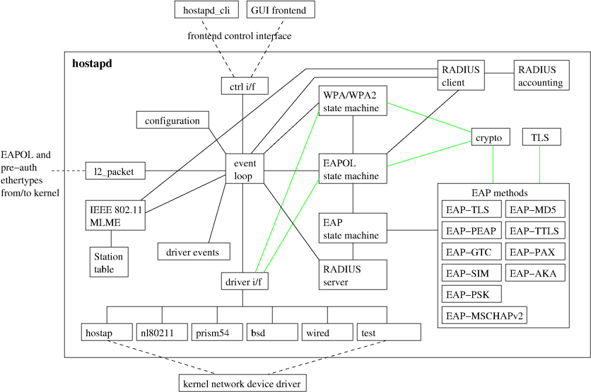

从架构图中，可以看出所有与具体硬件和驱动相关的功能都通过driver i/f被隔离。 EAPOL（IEEE 802.1X）状态机是一个可以和EAP服务器交互的独立模块。同样，RADIUS服务器也是一个独立的模块。IEEE 802.1X和RADIUS认证服务器都可以使用EAP服务。 控制接口（ctrl i/f）为另外的应用程序提供了和hostapd交互的接口。通过该接口，外部程序可以对hostapd进行配置；可以查询AP运行的状态。hostapd也可以通过该接口向外部程序通报某些特定的事件。 eloop处于架构图的中心，说明它是hostapd的核心模块。它负责处理hostapd内部不同模块以及外部的事件。eloop是event loop的缩写，这个名字很形象，因为hostapd启动后，并不会创建新的进程和线程，所有的事件都将在一个循环中被顺序的处理。

### 编译代码

编译hostapd依赖于以下软件包。  
libpcap0.8-dev、libxml2-dev、libcurl4-openssl-dev、libsqlite3-dev、binutils-dev、libnl-3-dev、libnl-genl-3-dev、libnl-route-3-dev、libdbus-1-dev

如果只想编译源代码，直接在源代码目录$(WORKSPACE)/hostapd运行命令

```sh
cp defconfig .config
make clean
make hostapd
```

但是这样得到的结果不一定可以在目标平台上运行。根据特定平台的需求，在编译之前还应该修改defconfig中的编译配置选项。如果使用的是mac80211_hwsim模拟网卡，则需要替换.config文件

```sh
cp ../tests/hwsim/example-hostapd.config .config
make clean
make hostapd
```

## 代码详解

### eloop

hostapd是一个简单的循环程序，运行后它没有创建额外的进程或线程。做为一个管理程序，hostapd需要对不同的事件做出响应。待处理的事件可以被分为三类，分别来自外部接口、内核、hostapd本身。所有这些事件均是在一个被成为event loop的循环中被处理。不同的事件会分别触发：signal、timeout和socket event。hostapd中使用类型为struct eloop_data的实例eloop来保存当前待处理的所有事件。三类事件可能会同时来到，eloop处理它们的先后顺序是： terminate signal --- time out --- other signals --- socket

#### Signals

目前hostapd使用的signal有：SIGHUP、SIGUSR1、SIGINT、SIGTERM、SIGPOLL、SIGSEGV、SIGALRM、SIGUSR1。 Signal是如何被集中处理的呢？让我们先来看一看eloop_register_signal()。其它模块首先使用函数eloop_register_signal将要接收的signal统一登记到eloop.signals中。所有的signal都向内核注册统一的处理函数eloop_handle_signal。

```c
int eloop_register_signal(int sig, eloop_signal_handler handler,
			  void *user_data)
{
	struct eloop_signal *tmp;

	tmp = os_realloc_array(eloop.signals, eloop.signal_count + 1,
			       sizeof(struct eloop_signal));
	if (tmp == NULL)
		return -1;

	tmp[eloop.signal_count].sig = sig;
	tmp[eloop.signal_count].user_data = user_data;
	tmp[eloop.signal_count].handler = handler;
	tmp[eloop.signal_count].signaled = 0;
	eloop.signal_count++;
	eloop.signals = tmp;
	signal(sig, eloop_handle_signal);

	return 0;
}
```

eloop.signals中的每一个条目的结构如下：

```c
struct eloop_signal {
	int sig;
	void *user_data;
	eloop_signal_handler handler;
	int signaled;
};
```

每个signal的编号、真正的处理函数都记录在对应的条目中。每个条目中还有用来标识signal是由内核发出的标识。再看eloop_handle_signal，

```c
static void eloop_handle_signal(int sig)
{
	size_t i;

#ifndef CONFIG_NATIVE_WINDOWS
	if ((sig == SIGINT || sig == SIGTERM) && !eloop.pending_terminate) {
		/* Use SIGALRM to break out from potential busy loops that
		 * would not allow the program to be killed. */
		eloop.pending_terminate = 1;
		signal(SIGALRM, eloop_handle_alarm);
		alarm(2);
	}
#endif /* CONFIG_NATIVE_WINDOWS */

	eloop.signaled++;
	for (i = 0; i < eloop.signal_count; i++) {
		if (eloop.signals[i].sig == sig) {
			eloop.signals[i].signaled++;
			break;
		}
	}
}
```

有signal到达hostapd时，这个函数会根据signal编号，更新eloop.signals中对应的条目的signal接收标识。后续的工作，则交由eloop处理。eloop是如何处理的，我们留在后面再介绍。

由于终止运行的信号有两个：SIGINT和SIGTERM。因此eloop_register_signal_terminate将这两个signal的注册操作封装在了一起。

#### Time_out

我们可以将其视作timer，但是由于代码实现中只保证所注册的接口在指定的时间间隔之后被调用，无法保证时间上的精确度，故而被称为timeout而不是timer。所有待处理的超时事件按发生的先后顺序被记录在eloop.timeout之中。

以下代码是用于描述time_out的结构体。其中主要的是：list用于将所有time out实例按时间先后顺序串起来；time表示超时时长，单位是us；eloop_data和user_data是超时处理的函数的两个入参，并无严格的区分（本人未能从代码中看出两者的区别，因为大多数的应用场景只使用了一个参数）。handler是超时处理函数。

```c
struct eloop_timeout {
	struct dl_list list;
	struct os_reltime time;
	void *eloop_data;
	void *user_data;
	eloop_timeout_handler handler;
	WPA_TRACE_REF(eloop);
	WPA_TRACE_REF(user);
	WPA_TRACE_INFO
};
```

以下是timeout的注册接口。入参分别是time_out实例所需要的四个元素：超时时间、超时处理函数、两个参数（空指针表示不需要入参）。

```c
int eloop_register_timeout(unsigned int secs, unsigned int usecs,
			   eloop_timeout_handler handler,
			   void *eloop_data, void *user_data)
```

超时机制是如何实现，超时处理函数怎么被调用，我们留在后文介绍。

#### Socket

eloop支持三种类型的socket：read、write、exceptions。在hostapd中目前只用到前两种类型的socket。 每种类型的socket其基本属性都是一样的：socket句柄、eloop参数、user参数、类型。eloop轮询到某一个socket上的事件后，会调用相应的handler。hostapd支持select、poll、epoll、kqueue四种不同的方式来查询Socket是否ready，因此我们可以看到eloop.c中大部分与socket相关的代码都被编译宏所包裹。在编译时只能选择一种方式，默认的方式是select。

我们可以看到socket和timeout、signal非常类似。都有：用来区别比此的ID、处理函数以及它的两个入参数（空指针表示不需要入参）。

```c
struct eloop_sock {
	int sock;
	void *eloop_data;
	void *user_data;
	eloop_sock_handler handler;
	WPA_TRACE_REF(eloop);
	WPA_TRACE_REF(user);
	WPA_TRACE_INFO
};
```

不同于signal和time_out的是socket有三个类型，因此eloop实例中保存的是三张表，分别登记三种类型的socket。以下是描述登记表的数据结构。

```c
struct eloop_sock_table {
	size_t count;
	struct eloop_sock *table;
	eloop_event_type type;
	int changed;
};
```

其它模块调用以下接口向eloop注册socket。相比signal和time_out，socket多了一个描述类型的参数。

```text
int eloop_register_sock(int sock, eloop_event_type type,
			eloop_sock_handler handler,
			void *eloop_data, void *user_data)
```

如果注册read socket可以使用下面的接口，这样可以少传入一个类型参数。

```text
int eloop_register_read_sock(int sock, eloop_sock_handler handler,
			     void *eloop_data, void *user_data)
```

该函数实际上就是对eloop_register_sock的封装。

#### eloop_init

eloop模块是hostapd运行之后，初始化的第一个模块。初始化的工作在函数eloop_init()中。

```c
int eloop_init(void)
{
	os_memset(&eloop, 0, sizeof(eloop));
	dl_list_init(&eloop.timeout);
#ifdef CONFIG_ELOOP_EPOLL
	eloop.epollfd = epoll_create1(0);
	if (eloop.epollfd < 0) {
		wpa_printf(MSG_ERROR, "%s: epoll_create1 failed. %s",
			   __func__, strerror(errno));
		return -1;
	}
#endif /* CONFIG_ELOOP_EPOLL */
#ifdef CONFIG_ELOOP_KQUEUE
	eloop.kqueuefd = kqueue();
	if (eloop.kqueuefd < 0) {
		wpa_printf(MSG_ERROR, "%s: kqueue failed: %s",
			   __func__, strerror(errno));
		return -1;
	}
#endif /* CONFIG_ELOOP_KQUEUE */
#if defined(CONFIG_ELOOP_EPOLL) || defined(CONFIG_ELOOP_KQUEUE)
	eloop.readers.type = EVENT_TYPE_READ;
	eloop.writers.type = EVENT_TYPE_WRITE;
	eloop.exceptions.type = EVENT_TYPE_EXCEPTION;
#endif /* CONFIG_ELOOP_EPOLL || CONFIG_ELOOP_KQUEUE */
#ifdef WPA_TRACE
	signal(SIGSEGV, eloop_sigsegv_handler);
#endif /* WPA_TRACE */
	return 0;
}
```

细读代码后我们会发现初始化的内容很少，默认情况下仅会执行这个函数最初的两行代码。因为后面的内容全受编译开关控制，而这些开关默认情况下都是关闭的。

我们来看一看这些被编译开关包裹的代码都是干嘛的。前文已经介绍过————eloop模块支持4种不同的socket同步方式，如果选择了epoll和kqueue，则需要创建相应的文件描述符以供检测同步事件时使用。eloop_init()函数体内部大部分的代码就是针对不同的配置创建不同的文件描述符。最后一部分可选代码是注册SIGSEGV处理函数，这个signal有些特殊，因为它是由eloop注册到系统的，而不是其它模块注册到eloop的，大家务必注意这一差异。

#### eloop_run

eloop是hostap唯一保持运行的模块。其主体便是函数eloop_run()。这个函数是hostapd的主体，hostapd启动之后未创建新的进程或线程，就是这个函数的循环体在运行。循环内部首先要检测并处理终止信号。eloop.pending_terminate是用来表征是否有待处理terminate signal的标识。一旦有待处理terminate signal，函数eloop_process_pending_signals()会被调用。

```c
static void eloop_process_pending_signals(void)
{
	size_t i;

	if (eloop.signaled == 0)
		return;
	eloop.signaled = 0;

	if (eloop.pending_terminate) {
#ifndef CONFIG_NATIVE_WINDOWS
		alarm(0);
#endif /* CONFIG_NATIVE_WINDOWS */
		eloop.pending_terminate = 0;
	}

	for (i = 0; i < eloop.signal_count; i++) {
		if (eloop.signals[i].signaled) {
			eloop.signals[i].signaled = 0;
			eloop.signals[i].handler(eloop.signals[i].sig,
						 eloop.signals[i].user_data);
		}
	}
}
```

前文我们看到eloop.signals[i].signaled是在signal发生后，由eloop_handle_signal()加1。这里如果同一signal多次收到，则统一处理。在这里所有待处理的signal（包括非terminating signal）都会被处理。最终hostapd结束运行。

如果没有terminating signal，eloop会等待time_out和socket事件。如果socket事件和time_out同时发生，则time_out事件具有较高的处理优先级。如何做到同时等待socket事件和time_out呢？源代码中做了很巧妙的处理。限于篇幅，这里就不贴出全部的源代码，仅摘录部分代码，完整上下文读者可以自行参阅源代码。

```c
		timeout = dl_list_first(&eloop.timeout, struct eloop_timeout,
					list);
		if (timeout) {
			os_get_reltime(&now);
			if (os_reltime_before(&now, &timeout->time))
				os_reltime_sub(&timeout->time, &now, &tv);
			else
				tv.sec = tv.usec = 0;
if defined(CONFIG_ELOOP_POLL) || defined(CONFIG_ELOOP_EPOLL)
			timeout_ms = tv.sec * 1000 + tv.usec / 1000;
#endif /* defined(CONFIG_ELOOP_POLL) || defined(CONFIG_ELOOP_EPOLL) */
#ifdef CONFIG_ELOOP_SELECT
			_tv.tv_sec = tv.sec;
			_tv.tv_usec = tv.usec;
#endif /* CONFIG_ELOOP_SELECT */
#ifdef CONFIG_ELOOP_KQUEUE
			ts.tv_sec = tv.sec;
			ts.tv_nsec = tv.usec * 1000L;
#endif /* CONFIG_ELOOP_KQUEUE */
		}
```

以上代码用来计算最近超时时间。由于time_out按超时时间先后排列，队列中最前面的是第一个超时事件。通过队列首部的超时事件，计算第一个超时时刻。如果事件已经超时，则将超时等待的时间设为0。接着以这个超时等待时间做为socket ready检测的超时参数。 对于socket的同步处理有poll、select、epoll和kqueue四种方式（在编译hostapd时，只需（也只能）根据运行的目标平台选择一种方式）。我们可以看到如果采用poll或epoll机制，则超时时间是临时变量timeout_ms；如果使用kqueue则是ts；如果使用select则是_tv。超时等待的时长确定之后，接下来代码便使用这个量来等待socket ready。

```c
#ifdef CONFIG_ELOOP_POLL
		num_poll_fds = eloop_sock_table_set_fds(
			&eloop.readers, &eloop.writers, &eloop.exceptions,
			eloop.pollfds, eloop.pollfds_map,
			eloop.max_pollfd_map);
		res = poll(eloop.pollfds, num_poll_fds,
			   timeout ? timeout_ms : -1);
#endif /* CONFIG_ELOOP_POLL */
#ifdef CONFIG_ELOOP_SELECT
		eloop_sock_table_set_fds(&eloop.readers, rfds);
		eloop_sock_table_set_fds(&eloop.writers, wfds);
		eloop_sock_table_set_fds(&eloop.exceptions, efds);
		res = select(eloop.max_sock + 1, rfds, wfds, efds,
			     timeout ? &_tv : NULL);
#endif /* CONFIG_ELOOP_SELECT */
#ifdef CONFIG_ELOOP_EPOLL
		if (eloop.count == 0) {
			res = 0;
		} else {
			res = epoll_wait(eloop.epollfd, eloop.epoll_events,
					 eloop.count, timeout_ms);
		}
#endif /* CONFIG_ELOOP_EPOLL */
#ifdef CONFIG_ELOOP_KQUEUE
		if (eloop.count == 0) {
			res = 0;
		} else {
			res = kevent(eloop.kqueuefd, NULL, 0,
				     eloop.kqueue_events, eloop.kqueue_nevents,
				     timeout ? &ts : NULL);
		}
#endif /* CONFIG_ELOOP_KQUEUE */
		if (res < 0 && errno != EINTR && errno != 0) {
			wpa_printf(MSG_ERROR, "eloop: %s: %s",
#ifdef CONFIG_ELOOP_POLL
				   "poll"
#endif /* CONFIG_ELOOP_POLL */
#ifdef CONFIG_ELOOP_SELECT
				   "select"
#endif /* CONFIG_ELOOP_SELECT */
#ifdef CONFIG_ELOOP_EPOLL
				   "epoll"
#endif /* CONFIG_ELOOP_EPOLL */
#ifdef CONFIG_ELOOP_KQUEUE
				   "kqueue"
#endif /* CONFIG_ELOOP_EKQUEUE */

				   , strerror(errno));
			goto out;
		}
```

这段代码比较长，由于存在大量的编译宏，看起来很乱。它的功能很简单————利用最近的time_out超时值等待socket ready。

在等待socket ready的过程中，可能会有signal到来，因此等待结束后，立即要调用eloop_process_pending_signals()检测并处理相应的signal。等待socket ready的过程会消耗掉一部分或全部等待时间。如果仅消耗了一部分等待时间，则更新time_out的超时值。如果全部等待时间被耗光，则意味着time_out发生。此时，需要调用该time_out的处理函数，并将其从eloop的time_out链表中移除。接下来便是检测是否有具体的socket ready。这一部分便是函数eloop_run()中看起来相对比较干净的一段代码。

```c
eloop.readers.changed = 0;
eloop.writers.changed = 0;
eloop.exceptions.changed = 0;

eloop_process_pending_signals();


/* check if some registered timeouts have occurred */
timeout = dl_list_first(&eloop.timeout, struct eloop_timeout,
			list);
if (timeout) {
	os_get_reltime(&now);
	if (!os_reltime_before(&now, &timeout->time)) {
		void *eloop_data = timeout->eloop_data;
		void *user_data = timeout->user_data;
		eloop_timeout_handler handler =
			timeout->handler;
		eloop_remove_timeout(timeout);
		handler(eloop_data, user_data);
	}

}

if (res <= 0)
	continue;

if (eloop.readers.changed ||
    eloop.writers.changed ||
    eloop.exceptions.changed) {
	 /*
	  * Sockets may have been closed and reopened with the
	  * same FD in the signal or timeout handlers, so we
	  * must skip the previous results and check again
	  * whether any of the currently registered sockets have
	  * events.
	  */
	continue;
}
```

接下来的代码就是处理socket上事件了。代码这里就不再贴了。

以下是eloop_run的流程图。

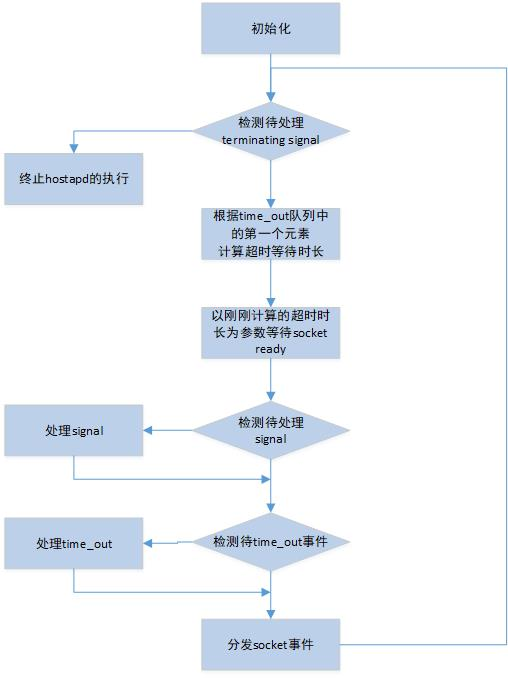

### state machine

hostapd代码中实现了以下几种状态机：

1. EAP Authenticator
2. EAP peer
3. EAPOL suppicant
4. EAPOL Authenticator
5. Controlled Port PAE
6. RSN / WPA Authenticator

既然是状态机，那必须拥有状态（state）属性，并且需要支持状态的切换（transition），还需要对外部事件（event）做出响应（action）。hostapd虽然是用c代码实现，但是依然可以做到面向对象的设计。state_machine.h中定义的宏，可视为以上状态机的模板。

宏SM_STATE用来定义/声明一个函数。该函数以sm为前缀，以Enter为后缀。当状态机发生状态切换时，该函数被调用。注意函数入参之一的类型是STATE_MACHINE_DATA。如state_machine.h的文件注释中说明：宏STATE_MACHINE_DATA即为某一状态机对应的数据结构。该宏必须在相应状态机实现代码中定义。

```text
/**
 * SM_STATE - Declaration of a state machine function
 * @machine: State machine name
 * @state: State machine state
 *
 * This macro is used to declare a state machine function. It is used in place
 * of a C function definition to declare functions to be run when the state is
 * entered by calling SM_ENTER or SM_ENTER_GLOBAL.
 */
#define SM_STATE(machine, state) \
static void sm_ ## machine ## _ ## state ## _Enter(STATE_MACHINE_DATA *sm, \
	int global)
```

宏SM_ENTRY更新状态机当前状态、输出调试信息（状态机当前要进入的状态）。这个宏只能出现在SM_STATE定义的函数体内，通常位于函数入口处。

```c
/**
 * SM_ENTRY - State machine function entry point
 * @machine: State machine name
 * @state: State machine state
 *
 * This macro is used inside each state machine function declared with
 * SM_STATE. SM_ENTRY should be in the beginning of the function body, but
 * after declaration of possible local variables. This macro prints debug
 * information about state transition and update the state machine state.
 */
#define SM_ENTRY(machine, state) \
if (!global || sm->machine ## _state != machine ## _ ## state) { \
	sm->changed = true; \
	wpa_printf(MSG_DEBUG, STATE_MACHINE_DEBUG_PREFIX ": " #machine \
		   " entering state " #state); \
} \
sm->machine ## _state = machine ## _ ## state;
```

宏SM_ENTRY_M与宏SM_ENTRY的功能类似：更新状态机当前状态、输出调试信息（状态机当前要进入的状态）。这个宏也只能出现在SM_STATE定义的函数体内，通常位于函数入口处。STATE_MACHINE_DATA中可能存在某种类型的状态机的多个实例。SM_ENTRY仅能够访问一种实例（可以认为该实例是默认实例，因为它的名称和状态机类型同名）。而 宏SM_ENTRY_M可以访问STATE_MACHINE_DATA内同一种状态机的多个实例，data即为不同实例各自的名称。

```c
/**
 * SM_ENTRY_M - State machine function entry point for state machine group
 * @machine: State machine name
 * @_state: State machine state
 * @data: State variable prefix (full variable: prefix_state)
 *
 * This macro is like SM_ENTRY, but for state machine groups that use a shared
 * data structure for more than one state machine. Both machine and prefix
 * parameters are set to "sub-state machine" name. prefix is used to allow more
 * than one state variable to be stored in the same data structure.
 */
#define SM_ENTRY_M(machine, _state, data) \
if (!global || sm->data ## _ ## state != machine ## _ ## _state) { \
	sm->changed = true; \
	wpa_printf(MSG_DEBUG, STATE_MACHINE_DEBUG_PREFIX ": " \
		   #machine " entering state " #_state); \
} \
sm->data ## _ ## state = machine ## _ ## _state;
```

宏SM_ENTRY_MA与宏SM_ENTRY_M的进行了扩展，在调试信息中增加了状态机对应的MAC地址。

```c
/**
 * SM_ENTRY_MA - State machine function entry point for state machine group
 * @machine: State machine name
 * @_state: State machine state
 * @data: State variable prefix (full variable: prefix_state)
 *
 * This macro is like SM_ENTRY_M, but a MAC address is included in debug
 * output. STATE_MACHINE_ADDR has to be defined to point to the MAC address to
 * be included in debug.
 */
#define SM_ENTRY_MA(machine, _state, data) \
if (!global || sm->data ## _ ## state != machine ## _ ## _state) { \
	sm->changed = true; \
	wpa_printf(MSG_DEBUG, STATE_MACHINE_DEBUG_PREFIX ": " MACSTR " " \
		   #machine " entering state " #_state, \
		   MAC2STR(STATE_MACHINE_ADDR)); \
} \
sm->data ## _ ## state = machine ## _ ## _state;
```

宏SM_ENTER是调用SM_STATE定义的函数，代表状态切换。

```text
/**
 * SM_ENTER - Enter a new state machine state
 * @machine: State machine name
 * @state: State machine state
 *
 * This macro expands to a function call to a state machine function defined
 * with SM_STATE macro. SM_ENTER is used in a state machine step function to
 * move the state machine to a new state.
 */
#define SM_ENTER(machine, state) \
sm_ ## machine ## _ ## state ## _Enter(sm, 0)
```

从定义看，宏SM_ENTER_GLOBAL和宏SM_ENTER的差别仅在调用sm_XXX_Enter函数时的第二个入参。从以上定义中，我们可以看到当global==1时，状态机的changed属性不会被改为真，调试信息也不会输出。因此SM_ENTER_GLOBAL通常用于希望状态机停留在某种状态。

```text
/**
 * SM_ENTER_GLOBAL - Enter a new state machine state based on global rule
 * @machine: State machine name
 * @state: State machine state
 *
 * This macro is like SM_ENTER, but this is used when entering a new state
 * based on a global (not specific to any particular state) rule. A separate
 * macro is used to avoid unwanted debug message floods when the same global
 * rule is forcing a state machine to remain in on state.
 */
#define SM_ENTER_GLOBAL(machine, state) \
sm_ ## machine ## _ ## state ## _Enter(sm, 1)
```

宏SM_STEP定义的函数就是状态机的实现。

```text
/**
 * SM_STEP - Declaration of a state machine step function
 * @machine: State machine name
 *
 * This macro is used to declare a state machine step function. It is used in
 * place of a C function definition to declare a function that is used to move
 * state machine to a new state based on state variables. This function uses
 * SM_ENTER and SM_ENTER_GLOBAL macros to enter new state.
 */
#define SM_STEP(machine) \
static void sm_ ## machine ## _Step(STATE_MACHINE_DATA *sm)
```

宏SM_STEP_RUN用来启动状态机。

```text
/**
 * SM_STEP_RUN - Call the state machine step function
 * @machine: State machine name
 *
 * This macro expands to a function call to a state machine step function
 * defined with SM_STEP macro.
 */
#define SM_STEP_RUN(machine) sm_ ## machine ## _Step(sm)
```

以上8个宏定义，是hostapd中状态机的模板。虽然c语言不是面向对象的语言，但是hostapd还是使用了以面向对象的实现方法。各种状态机的实现就是一个很好的例子。这里先介绍代码中将会使用到的模板，具体如何使用后文会结合实例介绍。

### 启动流程

#### hostapd：接口初始化与 beacon 下发

hostapd 的 `main()` 很朴素，它只做三件事：解析命令行、把 `hostapd.conf` 里的每个 BSS 变成内存中的 `hostapd_iface`/`hostapd_data`，然后逐个初始化接口。真正开始工作的入口是 `hostapd_setup_interface()`，该函数很短，可以整段引出（`src/ap/hostapd.c:3001`）：

```c
int hostapd_setup_interface(struct hostapd_iface *iface)
{
	int ret;

	if (!iface->conf)
		return -1;
	ret = setup_interface(iface);
	if (ret) {
		wpa_printf(MSG_ERROR, "%s: Unable to setup interface.",
			   iface->conf->bss[0]->iface);
		return -1;
	}

	return 0;
}
```

它本身只是一个封装，实际工作由 `setup_interface()` 完成：初始化驱动、与驱动协商能力、清空 STA 列表、设置信道与加密方式。另外注意一点：如果后面还有耗时的动作（ACS 选信道、DFS 雷达检测、HT 共存扫描），`setup_interface()` 会先返回 0，等这些动作在事件循环里做完，再由回调 `hostapd_setup_interface_complete()` 收尾。

这种"先返回、后回调"的模式在 hostap 中反复出现。如果你读到一个函数没做完就返回了，多半是它把后续工作挂到了 eloop 上。

接口就绪之后是 BSS 装配（`hostapd_setup_bss()`）：启动 hostapd 自己的状态机、准备 WPA 认证器、把 BSS 挂到驱动上。最后一步是下发 beacon，入口为 `ieee802_11_set_beacon()`（`src/ap/beacon.c:3397`）。beacon 的内容由 `ieee802_11_build_ap_params()`（`src/ap/beacon.c:2283`）组装；该函数将近 500 行，基本是在做填空题：SSID、支持的速率、DS 参数、国家码、各种能力元素、RSN、WMM、HE/EHT、RNR、MBSSID……一个 AP 的"人设"就是在这 500 行里拼出来的。

还有一个容易忽略的细节：如果该 AP 是 6 GHz 共置（同一台机器同时开启 2.4/5/6 GHz），或者是 Wi-Fi 7 的 MLD，`ieee802_11_set_beacon()` 不只设置自己，还会把兄弟接口的 beacon 一并重设。多链路时代，beacon 不再是单个接口的事。

#### wpa_supplicant：启动链路与首次扫描的排期

wpa_supplicant 的启动链路要长一些，顺序如下：`main()` → `wpa_supplicant_init()`（全局部分：eloop、全局控制接口、驱动注册表）→ 对每个 `-i` 指定的接口调用 `wpa_supplicant_add_iface()` → `wpa_supplicant_init_iface()`。

`wpa_supplicant_init_iface()` 中有一串按顺序执行的初始化，其中几处位置可以记一下：驱动初始化 `wpa_supplicant_driver_init()` 在 `wpa_supplicant/wpa_supplicant.c:7294`，控制接口在 `:8970`，BSS 表在 `:9012`。

驱动初始化段的尾部有一小段可以单独拎出来看（`wpa_supplicant/wpa_supplicant.c:7343`）：

```c
#ifndef ANDROID
		if (!wpa_s->p2p_mgmt &&
		    wpa_supplicant_delayed_sched_scan(wpa_s,
						      interface_count % 3,
						      100000))
			wpa_supplicant_req_scan(wpa_s, interface_count % 3,
						100000);
#endif /* ANDROID */
```

从中可以看出：启动阶段**不会**立刻扫描。它先把扫描排到一个定时器上：延迟 `interface_count % 3` 秒，再加 100 ms；`interface_count` 是全局递增的接口序号。也就是说，插了三张网卡的话，三个 wpa_supplicant 实例的首次扫描会彼此错开，不会在同一毫秒里抢射频。扫描方式优先尝试 `sched_scan`（交由驱动/固件在后台完成），失败后才退回到普通扫描。

`wpa_supplicant_req_scan()` 本身只有二十几行（`wpa_supplicant/scan.c:1624`）。它其实连扫描都不发，而是调用 `eloop_deplete_timeout()` 调整那个定时器：已经存在更早的请求就忽略本次，还没排过则新注册一个。

#### eloop：共同的事件循环

无论 hostapd 还是 wpa_supplicant，`main()` 的最后一步都是进入事件循环。hostap 全仓库没有一处 `pthread_create`，所有 I/O 都在单线程的 eloop 上运行，实现集中在 `src/utils/eloop.c` 一个文件里（select/poll/epoll/kqueue 四套后端，编译期选择其一）。

超时是如何排队的？看 `eloop_register_timeout()` 中的这几行（`src/utils/eloop.c:805`）：

```c
	/* Maintain timeouts in order of increasing time */
	dl_list_for_each(tmp, &eloop.timeout, struct eloop_timeout, list) {
		if (os_reltime_before(&timeout->time, &tmp->time)) {
			dl_list_add(tmp->list.prev, &timeout->list);
			return 0;
		}
	}
	dl_list_add_tail(&eloop.timeout, &timeout->list);
```

所有超时挂在一条按到期时间升序排列的链表上，插入时线性查找位置。实现虽朴素，但整个进程只有这一条链，主循环每次只需取链表头，就知道下一次应等待多久。插入复杂度是 O(n)，而 n 是同时存在的定时器数量，实际为百量级，足够使用。

`eloop_run()`（`src/utils/eloop.c:1075`）的主循环只做三件事：计算下一次超时、等待 socket 事件、派发回调。信号的处理也不是异步回调，而是"置一个标志位，等主循环来收取"。

<figure class="diagram">
<div class="diagram-box">
<svg style="max-width:100%;height:auto" id="fin1790155034007" xmlns="http://www.w3.org/2000/svg" class="flowchart" style="max-width: 277.85546875px;" viewBox="4 4 277.85546875 802" role="graphics-document document" aria-roledescription="flowchart-v2"><style>#fin1790155034007{font-family:"Recursive Variable",arial,sans-serif;font-size:14px;fill:#28253D;}@keyframes edge-animation-frame{from{stroke-dashoffset:0;}}@keyframes dash{to{stroke-dashoffset:0;}}#fin1790155034007 .edge-animation-slow{stroke-dasharray:9,5!important;stroke-dashoffset:900;animation:dash 50s linear infinite;stroke-linecap:round;}#fin1790155034007 .edge-animation-fast{stroke-dasharray:9,5!important;stroke-dashoffset:900;animation:dash 20s linear infinite;stroke-linecap:round;}#fin1790155034007 .error-icon{fill:#ffffff;}#fin1790155034007 .error-text{fill:#000000;stroke:#000000;}#fin1790155034007 .edge-thickness-normal{stroke-width:2px;}#fin1790155034007 .edge-thickness-thick{stroke-width:3.5px;}#fin1790155034007 .edge-pattern-solid{stroke-dasharray:0;}#fin1790155034007 .edge-thickness-invisible{stroke-width:0;fill:none;}#fin1790155034007 .edge-pattern-dashed{stroke-dasharray:3;}#fin1790155034007 .edge-pattern-dotted{stroke-dasharray:2;}#fin1790155034007 .marker{fill:#000000;stroke:#000000;}#fin1790155034007 .marker.cross{stroke:#000000;}#fin1790155034007 svg{font-family:"Recursive Variable",arial,sans-serif;font-size:14px;}#fin1790155034007 p{margin:0;}#fin1790155034007 [data-look="neo"][data-color-id="color-0"].cluster:not(.swimlane) rect{stroke:#E879F9;fill:#FDF4FF;}#fin1790155034007 [data-look="neo"][data-color-id="color-0"].cluster:not(.swimlane) path{stroke:#E879F9;fill:#FDF4FF;}#fin1790155034007 [data-look="neo"][data-color-id="color-0"].swimlane.cluster rect.swimlane-title,#fin1790155034007 [data-look="neo"][data-color-id="color-0"].swimlane.cluster rect.swimlane-body{stroke:#E879F9;fill:#FDF4FF;}#fin1790155034007 [data-look="neo"][data-color-id="color-0"].swimlane.cluster .swimlane-title path:nth-of-type(2),#fin1790155034007 [data-look="neo"][data-color-id="color-0"].swimlane.cluster .swimlane-body path:nth-of-type(2){stroke:#E879F9;}#fin1790155034007 [data-look="neo"][data-color-id="color-0"].swimlane.cluster .swimlane-title path:first-of-type,#fin1790155034007 [data-look="neo"][data-color-id="color-0"].swimlane.cluster .swimlane-body path:first-of-type{stroke:#FDF4FF;}#fin1790155034007 [data-look="neo"][data-color-id="color-0"].node .collapsed-group,#fin1790155034007 [data-look="neo"][data-color-id="color-0"].rough-node .collapsed-group,#fin1790155034007 [data-look="neo"][data-color-id="color-0"].node .collapsed-group path,#fin1790155034007 [data-look="neo"][data-color-id="color-0"].rough-node .collapsed-group path{stroke:#E879F9;fill:#FDF4FF;}#fin1790155034007 [data-look="neo"][data-color-id="color-0"].node .collapsed-indicator,#fin1790155034007 [data-look="neo"][data-color-id="color-0"].rough-node .collapsed-indicator{fill:#E879F9;}#fin1790155034007 [data-look="neo"][data-color-id="color-0"].node .collapsed-separator,#fin1790155034007 [data-look="neo"][data-color-id="color-0"].rough-node .collapsed-separator{stroke:#E879F9;}#fin1790155034007 [data-look="neo"][data-color-id="color-1"].cluster:not(.swimlane) rect{stroke:#2DD4BF;fill:#F0FDFA;}#fin1790155034007 [data-look="neo"][data-color-id="color-1"].cluster:not(.swimlane) path{stroke:#2DD4BF;fill:#F0FDFA;}#fin1790155034007 [data-look="neo"][data-color-id="color-1"].swimlane.cluster rect.swimlane-title,#fin1790155034007 [data-look="neo"][data-color-id="color-1"].swimlane.cluster rect.swimlane-body{stroke:#2DD4BF;fill:#F0FDFA;}#fin1790155034007 [data-look="neo"][data-color-id="color-1"].swimlane.cluster .swimlane-title path:nth-of-type(2),#fin1790155034007 [data-look="neo"][data-color-id="color-1"].swimlane.cluster .swimlane-body path:nth-of-type(2){stroke:#2DD4BF;}#fin1790155034007 [data-look="neo"][data-color-id="color-1"].swimlane.cluster .swimlane-title path:first-of-type,#fin1790155034007 [data-look="neo"][data-color-id="color-1"].swimlane.cluster .swimlane-body path:first-of-type{stroke:#F0FDFA;}#fin1790155034007 [data-look="neo"][data-color-id="color-1"].node .collapsed-group,#fin1790155034007 [data-look="neo"][data-color-id="color-1"].rough-node .collapsed-group,#fin1790155034007 [data-look="neo"][data-color-id="color-1"].node .collapsed-group path,#fin1790155034007 [data-look="neo"][data-color-id="color-1"].rough-node .collapsed-group path{stroke:#2DD4BF;fill:#F0FDFA;}#fin1790155034007 [data-look="neo"][data-color-id="color-1"].node .collapsed-indicator,#fin1790155034007 [data-look="neo"][data-color-id="color-1"].rough-node .collapsed-indicator{fill:#2DD4BF;}#fin1790155034007 [data-look="neo"][data-color-id="color-1"].node .collapsed-separator,#fin1790155034007 [data-look="neo"][data-color-id="color-1"].rough-node .collapsed-separator{stroke:#2DD4BF;}#fin1790155034007 [data-look="neo"][data-color-id="color-2"].cluster:not(.swimlane) rect{stroke:#FB923C;fill:#FFF7ED;}#fin1790155034007 [data-look="neo"][data-color-id="color-2"].cluster:not(.swimlane) path{stroke:#FB923C;fill:#FFF7ED;}#fin1790155034007 [data-look="neo"][data-color-id="color-2"].swimlane.cluster rect.swimlane-title,#fin1790155034007 [data-look="neo"][data-color-id="color-2"].swimlane.cluster rect.swimlane-body{stroke:#FB923C;fill:#FFF7ED;}#fin1790155034007 [data-look="neo"][data-color-id="color-2"].swimlane.cluster .swimlane-title path:nth-of-type(2),#fin1790155034007 [data-look="neo"][data-color-id="color-2"].swimlane.cluster .swimlane-body path:nth-of-type(2){stroke:#FB923C;}#fin1790155034007 [data-look="neo"][data-color-id="color-2"].swimlane.cluster .swimlane-title path:first-of-type,#fin1790155034007 [data-look="neo"][data-color-id="color-2"].swimlane.cluster .swimlane-body path:first-of-type{stroke:#FFF7ED;}#fin1790155034007 [data-look="neo"][data-color-id="color-2"].node .collapsed-group,#fin1790155034007 [data-look="neo"][data-color-id="color-2"].rough-node .collapsed-group,#fin1790155034007 [data-look="neo"][data-color-id="color-2"].node .collapsed-group path,#fin1790155034007 [data-look="neo"][data-color-id="color-2"].rough-node .collapsed-group path{stroke:#FB923C;fill:#FFF7ED;}#fin1790155034007 [data-look="neo"][data-color-id="color-2"].node .collapsed-indicator,#fin1790155034007 [data-look="neo"][data-color-id="color-2"].rough-node .collapsed-indicator{fill:#FB923C;}#fin1790155034007 [data-look="neo"][data-color-id="color-2"].node .collapsed-separator,#fin1790155034007 [data-look="neo"][data-color-id="color-2"].rough-node .collapsed-separator{stroke:#FB923C;}#fin1790155034007 [data-look="neo"][data-color-id="color-3"].cluster:not(.swimlane) rect{stroke:#22D3EE;fill:#ECFEFF;}#fin1790155034007 [data-look="neo"][data-color-id="color-3"].cluster:not(.swimlane) path{stroke:#22D3EE;fill:#ECFEFF;}#fin1790155034007 [data-look="neo"][data-color-id="color-3"].swimlane.cluster rect.swimlane-title,#fin1790155034007 [data-look="neo"][data-color-id="color-3"].swimlane.cluster rect.swimlane-body{stroke:#22D3EE;fill:#ECFEFF;}#fin1790155034007 [data-look="neo"][data-color-id="color-3"].swimlane.cluster .swimlane-title path:nth-of-type(2),#fin1790155034007 [data-look="neo"][data-color-id="color-3"].swimlane.cluster .swimlane-body path:nth-of-type(2){stroke:#22D3EE;}#fin1790155034007 [data-look="neo"][data-color-id="color-3"].swimlane.cluster .swimlane-title path:first-of-type,#fin1790155034007 [data-look="neo"][data-color-id="color-3"].swimlane.cluster .swimlane-body path:first-of-type{stroke:#ECFEFF;}#fin1790155034007 [data-look="neo"][data-color-id="color-3"].node .collapsed-group,#fin1790155034007 [data-look="neo"][data-color-id="color-3"].rough-node .collapsed-group,#fin1790155034007 [data-look="neo"][data-color-id="color-3"].node .collapsed-group path,#fin1790155034007 [data-look="neo"][data-color-id="color-3"].rough-node .collapsed-group path{stroke:#22D3EE;fill:#ECFEFF;}#fin1790155034007 [data-look="neo"][data-color-id="color-3"].node .collapsed-indicator,#fin1790155034007 [data-look="neo"][data-color-id="color-3"].rough-node .collapsed-indicator{fill:#22D3EE;}#fin1790155034007 [data-look="neo"][data-color-id="color-3"].node .collapsed-separator,#fin1790155034007 [data-look="neo"][data-color-id="color-3"].rough-node .collapsed-separator{stroke:#22D3EE;}#fin1790155034007 [data-look="neo"][data-color-id="color-4"].cluster:not(.swimlane) rect{stroke:#4ADE80;fill:#F0FDF4;}#fin1790155034007 [data-look="neo"][data-color-id="color-4"].cluster:not(.swimlane) path{stroke:#4ADE80;fill:#F0FDF4;}#fin1790155034007 [data-look="neo"][data-color-id="color-4"].swimlane.cluster rect.swimlane-title,#fin1790155034007 [data-look="neo"][data-color-id="color-4"].swimlane.cluster rect.swimlane-body{stroke:#4ADE80;fill:#F0FDF4;}#fin1790155034007 [data-look="neo"][data-color-id="color-4"].swimlane.cluster .swimlane-title path:nth-of-type(2),#fin1790155034007 [data-look="neo"][data-color-id="color-4"].swimlane.cluster .swimlane-body path:nth-of-type(2){stroke:#4ADE80;}#fin1790155034007 [data-look="neo"][data-color-id="color-4"].swimlane.cluster .swimlane-title path:first-of-type,#fin1790155034007 [data-look="neo"][data-color-id="color-4"].swimlane.cluster .swimlane-body path:first-of-type{stroke:#F0FDF4;}#fin1790155034007 [data-look="neo"][data-color-id="color-4"].node .collapsed-group,#fin1790155034007 [data-look="neo"][data-color-id="color-4"].rough-node .collapsed-group,#fin1790155034007 [data-look="neo"][data-color-id="color-4"].node .collapsed-group path,#fin1790155034007 [data-look="neo"][data-color-id="color-4"].rough-node .collapsed-group path{stroke:#4ADE80;fill:#F0FDF4;}#fin1790155034007 [data-look="neo"][data-color-id="color-4"].node .collapsed-indicator,#fin1790155034007 [data-look="neo"][data-color-id="color-4"].rough-node .collapsed-indicator{fill:#4ADE80;}#fin1790155034007 [data-look="neo"][data-color-id="color-4"].node .collapsed-separator,#fin1790155034007 [data-look="neo"][data-color-id="color-4"].rough-node .collapsed-separator{stroke:#4ADE80;}#fin1790155034007 [data-look="neo"][data-color-id="color-5"].cluster:not(.swimlane) rect{stroke:#A78BFA;fill:#F5F3FF;}#fin1790155034007 [data-look="neo"][data-color-id="color-5"].cluster:not(.swimlane) path{stroke:#A78BFA;fill:#F5F3FF;}#fin1790155034007 [data-look="neo"][data-color-id="color-5"].swimlane.cluster rect.swimlane-title,#fin1790155034007 [data-look="neo"][data-color-id="color-5"].swimlane.cluster rect.swimlane-body{stroke:#A78BFA;fill:#F5F3FF;}#fin1790155034007 [data-look="neo"][data-color-id="color-5"].swimlane.cluster .swimlane-title path:nth-of-type(2),#fin1790155034007 [data-look="neo"][data-color-id="color-5"].swimlane.cluster .swimlane-body path:nth-of-type(2){stroke:#A78BFA;}#fin1790155034007 [data-look="neo"][data-color-id="color-5"].swimlane.cluster .swimlane-title path:first-of-type,#fin1790155034007 [data-look="neo"][data-color-id="color-5"].swimlane.cluster .swimlane-body path:first-of-type{stroke:#F5F3FF;}#fin1790155034007 [data-look="neo"][data-color-id="color-5"].node .collapsed-group,#fin1790155034007 [data-look="neo"][data-color-id="color-5"].rough-node .collapsed-group,#fin1790155034007 [data-look="neo"][data-color-id="color-5"].node .collapsed-group path,#fin1790155034007 [data-look="neo"][data-color-id="color-5"].rough-node .collapsed-group path{stroke:#A78BFA;fill:#F5F3FF;}#fin1790155034007 [data-look="neo"][data-color-id="color-5"].node .collapsed-indicator,#fin1790155034007 [data-look="neo"][data-color-id="color-5"].rough-node .collapsed-indicator{fill:#A78BFA;}#fin1790155034007 [data-look="neo"][data-color-id="color-5"].node .collapsed-separator,#fin1790155034007 [data-look="neo"][data-color-id="color-5"].rough-node .collapsed-separator{stroke:#A78BFA;}#fin1790155034007 [data-look="neo"][data-color-id="color-6"].cluster:not(.swimlane) rect{stroke:#F87171;fill:#FEF2F2;}#fin1790155034007 [data-look="neo"][data-color-id="color-6"].cluster:not(.swimlane) path{stroke:#F87171;fill:#FEF2F2;}#fin1790155034007 [data-look="neo"][data-color-id="color-6"].swimlane.cluster rect.swimlane-title,#fin1790155034007 [data-look="neo"][data-color-id="color-6"].swimlane.cluster rect.swimlane-body{stroke:#F87171;fill:#FEF2F2;}#fin1790155034007 [data-look="neo"][data-color-id="color-6"].swimlane.cluster .swimlane-title path:nth-of-type(2),#fin1790155034007 [data-look="neo"][data-color-id="color-6"].swimlane.cluster .swimlane-body path:nth-of-type(2){stroke:#F87171;}#fin1790155034007 [data-look="neo"][data-color-id="color-6"].swimlane.cluster .swimlane-title path:first-of-type,#fin1790155034007 [data-look="neo"][data-color-id="color-6"].swimlane.cluster .swimlane-body path:first-of-type{stroke:#FEF2F2;}#fin1790155034007 [data-look="neo"][data-color-id="color-6"].node .collapsed-group,#fin1790155034007 [data-look="neo"][data-color-id="color-6"].rough-node .collapsed-group,#fin1790155034007 [data-look="neo"][data-color-id="color-6"].node .collapsed-group path,#fin1790155034007 [data-look="neo"][data-color-id="color-6"].rough-node .collapsed-group path{stroke:#F87171;fill:#FEF2F2;}#fin1790155034007 [data-look="neo"][data-color-id="color-6"].node .collapsed-indicator,#fin1790155034007 [data-look="neo"][data-color-id="color-6"].rough-node .collapsed-indicator{fill:#F87171;}#fin1790155034007 [data-look="neo"][data-color-id="color-6"].node .collapsed-separator,#fin1790155034007 [data-look="neo"][data-color-id="color-6"].rough-node .collapsed-separator{stroke:#F87171;}#fin1790155034007 [data-look="neo"][data-color-id="color-7"].cluster:not(.swimlane) rect{stroke:#FACC15;fill:#FEFCE8;}#fin1790155034007 [data-look="neo"][data-color-id="color-7"].cluster:not(.swimlane) path{stroke:#FACC15;fill:#FEFCE8;}#fin1790155034007 [data-look="neo"][data-color-id="color-7"].swimlane.cluster rect.swimlane-title,#fin1790155034007 [data-look="neo"][data-color-id="color-7"].swimlane.cluster rect.swimlane-body{stroke:#FACC15;fill:#FEFCE8;}#fin1790155034007 [data-look="neo"][data-color-id="color-7"].swimlane.cluster .swimlane-title path:nth-of-type(2),#fin1790155034007 [data-look="neo"][data-color-id="color-7"].swimlane.cluster .swimlane-body path:nth-of-type(2){stroke:#FACC15;}#fin1790155034007 [data-look="neo"][data-color-id="color-7"].swimlane.cluster .swimlane-title path:first-of-type,#fin1790155034007 [data-look="neo"][data-color-id="color-7"].swimlane.cluster .swimlane-body path:first-of-type{stroke:#FEFCE8;}#fin1790155034007 [data-look="neo"][data-color-id="color-7"].node .collapsed-group,#fin1790155034007 [data-look="neo"][data-color-id="color-7"].rough-node .collapsed-group,#fin1790155034007 [data-look="neo"][data-color-id="color-7"].node .collapsed-group path,#fin1790155034007 [data-look="neo"][data-color-id="color-7"].rough-node .collapsed-group path{stroke:#FACC15;fill:#FEFCE8;}#fin1790155034007 [data-look="neo"][data-color-id="color-7"].node .collapsed-indicator,#fin1790155034007 [data-look="neo"][data-color-id="color-7"].rough-node .collapsed-indicator{fill:#FACC15;}#fin1790155034007 [data-look="neo"][data-color-id="color-7"].node .collapsed-separator,#fin1790155034007 [data-look="neo"][data-color-id="color-7"].rough-node .collapsed-separator{stroke:#FACC15;}#fin1790155034007 [data-look="neo"][data-color-id="color-8"].cluster:not(.swimlane) rect{stroke:#818CF8;fill:#EEF2FF;}#fin1790155034007 [data-look="neo"][data-color-id="color-8"].cluster:not(.swimlane) path{stroke:#818CF8;fill:#EEF2FF;}#fin1790155034007 [data-look="neo"][data-color-id="color-8"].swimlane.cluster rect.swimlane-title,#fin1790155034007 [data-look="neo"][data-color-id="color-8"].swimlane.cluster rect.swimlane-body{stroke:#818CF8;fill:#EEF2FF;}#fin1790155034007 [data-look="neo"][data-color-id="color-8"].swimlane.cluster .swimlane-title path:nth-of-type(2),#fin1790155034007 [data-look="neo"][data-color-id="color-8"].swimlane.cluster .swimlane-body path:nth-of-type(2){stroke:#818CF8;}#fin1790155034007 [data-look="neo"][data-color-id="color-8"].swimlane.cluster .swimlane-title path:first-of-type,#fin1790155034007 [data-look="neo"][data-color-id="color-8"].swimlane.cluster .swimlane-body path:first-of-type{stroke:#EEF2FF;}#fin1790155034007 [data-look="neo"][data-color-id="color-8"].node .collapsed-group,#fin1790155034007 [data-look="neo"][data-color-id="color-8"].rough-node .collapsed-group,#fin1790155034007 [data-look="neo"][data-color-id="color-8"].node .collapsed-group path,#fin1790155034007 [data-look="neo"][data-color-id="color-8"].rough-node .collapsed-group path{stroke:#818CF8;fill:#EEF2FF;}#fin1790155034007 [data-look="neo"][data-color-id="color-8"].node .collapsed-indicator,#fin1790155034007 [data-look="neo"][data-color-id="color-8"].rough-node .collapsed-indicator{fill:#818CF8;}#fin1790155034007 [data-look="neo"][data-color-id="color-8"].node .collapsed-separator,#fin1790155034007 [data-look="neo"][data-color-id="color-8"].rough-node .collapsed-separator{stroke:#818CF8;}#fin1790155034007 [data-look="neo"][data-color-id="color-9"].cluster:not(.swimlane) rect{stroke:#A3E635;fill:#F7FEE7;}#fin1790155034007 [data-look="neo"][data-color-id="color-9"].cluster:not(.swimlane) path{stroke:#A3E635;fill:#F7FEE7;}#fin1790155034007 [data-look="neo"][data-color-id="color-9"].swimlane.cluster rect.swimlane-title,#fin1790155034007 [data-look="neo"][data-color-id="color-9"].swimlane.cluster rect.swimlane-body{stroke:#A3E635;fill:#F7FEE7;}#fin1790155034007 [data-look="neo"][data-color-id="color-9"].swimlane.cluster .swimlane-title path:nth-of-type(2),#fin1790155034007 [data-look="neo"][data-color-id="color-9"].swimlane.cluster .swimlane-body path:nth-of-type(2){stroke:#A3E635;}#fin1790155034007 [data-look="neo"][data-color-id="color-9"].swimlane.cluster .swimlane-title path:first-of-type,#fin1790155034007 [data-look="neo"][data-color-id="color-9"].swimlane.cluster .swimlane-body path:first-of-type{stroke:#F7FEE7;}#fin1790155034007 [data-look="neo"][data-color-id="color-9"].node .collapsed-group,#fin1790155034007 [data-look="neo"][data-color-id="color-9"].rough-node .collapsed-group,#fin1790155034007 [data-look="neo"][data-color-id="color-9"].node .collapsed-group path,#fin1790155034007 [data-look="neo"][data-color-id="color-9"].rough-node .collapsed-group path{stroke:#A3E635;fill:#F7FEE7;}#fin1790155034007 [data-look="neo"][data-color-id="color-9"].node .collapsed-indicator,#fin1790155034007 [data-look="neo"][data-color-id="color-9"].rough-node .collapsed-indicator{fill:#A3E635;}#fin1790155034007 [data-look="neo"][data-color-id="color-9"].node .collapsed-separator,#fin1790155034007 [data-look="neo"][data-color-id="color-9"].rough-node .collapsed-separator{stroke:#A3E635;}#fin1790155034007 [data-look="neo"][data-color-id="color-10"].cluster:not(.swimlane) rect{stroke:#38BDF8;fill:#F0F9FF;}#fin1790155034007 [data-look="neo"][data-color-id="color-10"].cluster:not(.swimlane) path{stroke:#38BDF8;fill:#F0F9FF;}#fin1790155034007 [data-look="neo"][data-color-id="color-10"].swimlane.cluster rect.swimlane-title,#fin1790155034007 [data-look="neo"][data-color-id="color-10"].swimlane.cluster rect.swimlane-body{stroke:#38BDF8;fill:#F0F9FF;}#fin1790155034007 [data-look="neo"][data-color-id="color-10"].swimlane.cluster .swimlane-title path:nth-of-type(2),#fin1790155034007 [data-look="neo"][data-color-id="color-10"].swimlane.cluster .swimlane-body path:nth-of-type(2){stroke:#38BDF8;}#fin1790155034007 [data-look="neo"][data-color-id="color-10"].swimlane.cluster .swimlane-title path:first-of-type,#fin1790155034007 [data-look="neo"][data-color-id="color-10"].swimlane.cluster .swimlane-body path:first-of-type{stroke:#F0F9FF;}#fin1790155034007 [data-look="neo"][data-color-id="color-10"].node .collapsed-group,#fin1790155034007 [data-look="neo"][data-color-id="color-10"].rough-node .collapsed-group,#fin1790155034007 [data-look="neo"][data-color-id="color-10"].node .collapsed-group path,#fin1790155034007 [data-look="neo"][data-color-id="color-10"].rough-node .collapsed-group path{stroke:#38BDF8;fill:#F0F9FF;}#fin1790155034007 [data-look="neo"][data-color-id="color-10"].node .collapsed-indicator,#fin1790155034007 [data-look="neo"][data-color-id="color-10"].rough-node .collapsed-indicator{fill:#38BDF8;}#fin1790155034007 [data-look="neo"][data-color-id="color-10"].node .collapsed-separator,#fin1790155034007 [data-look="neo"][data-color-id="color-10"].rough-node .collapsed-separator{stroke:#38BDF8;}#fin1790155034007 [data-look="neo"][data-color-id="color-11"].cluster:not(.swimlane) rect{stroke:#FB7185;fill:#FFF1F2;}#fin1790155034007 [data-look="neo"][data-color-id="color-11"].cluster:not(.swimlane) path{stroke:#FB7185;fill:#FFF1F2;}#fin1790155034007 [data-look="neo"][data-color-id="color-11"].swimlane.cluster rect.swimlane-title,#fin1790155034007 [data-look="neo"][data-color-id="color-11"].swimlane.cluster rect.swimlane-body{stroke:#FB7185;fill:#FFF1F2;}#fin1790155034007 [data-look="neo"][data-color-id="color-11"].swimlane.cluster .swimlane-title path:nth-of-type(2),#fin1790155034007 [data-look="neo"][data-color-id="color-11"].swimlane.cluster .swimlane-body path:nth-of-type(2){stroke:#FB7185;}#fin1790155034007 [data-look="neo"][data-color-id="color-11"].swimlane.cluster .swimlane-title path:first-of-type,#fin1790155034007 [data-look="neo"][data-color-id="color-11"].swimlane.cluster .swimlane-body path:first-of-type{stroke:#FFF1F2;}#fin1790155034007 [data-look="neo"][data-color-id="color-11"].node .collapsed-group,#fin1790155034007 [data-look="neo"][data-color-id="color-11"].rough-node .collapsed-group,#fin1790155034007 [data-look="neo"][data-color-id="color-11"].node .collapsed-group path,#fin1790155034007 [data-look="neo"][data-color-id="color-11"].rough-node .collapsed-group path{stroke:#FB7185;fill:#FFF1F2;}#fin1790155034007 [data-look="neo"][data-color-id="color-11"].node .collapsed-indicator,#fin1790155034007 [data-look="neo"][data-color-id="color-11"].rough-node .collapsed-indicator{fill:#FB7185;}#fin1790155034007 [data-look="neo"][data-color-id="color-11"].node .collapsed-separator,#fin1790155034007 [data-look="neo"][data-color-id="color-11"].rough-node .collapsed-separator{stroke:#FB7185;}#fin1790155034007 .label{font-family:"Recursive Variable",arial,sans-serif;color:#28253D;}#fin1790155034007 .cluster-label text{fill:#000000;}#fin1790155034007 .cluster-label span{color:#000000;}#fin1790155034007 .cluster-label span p{background-color:transparent;}#fin1790155034007 .label text,#fin1790155034007 span{fill:#28253D;color:#28253D;}#fin1790155034007 .node rect,#fin1790155034007 .node circle,#fin1790155034007 .node ellipse,#fin1790155034007 .node polygon,#fin1790155034007 .node path{fill:#ffffff;stroke:#28253D;stroke-width:2px;}#fin1790155034007 .rough-node .label text,#fin1790155034007 .node .label text,#fin1790155034007 .image-shape .label,#fin1790155034007 .icon-shape .label{text-anchor:middle;}#fin1790155034007 .node .katex path{fill:#000;stroke:#000;stroke-width:1px;}#fin1790155034007 .rough-node .label,#fin1790155034007 .node .label,#fin1790155034007 .image-shape .label,#fin1790155034007 .icon-shape .label{text-align:center;}#fin1790155034007 .node.clickable{cursor:pointer;}#fin1790155034007 .root .anchor path{fill:#000000!important;stroke-width:0;stroke:#000000;}#fin1790155034007 .arrowheadPath{fill:#000000;}#fin1790155034007 .edgePaths .path{stroke:#000000;stroke-width:2px;}#fin1790155034007 .flowchart-link{stroke:#000000;fill:none;}#fin1790155034007 .edgeLabel{background-color:hsl(-120, 0%, 80%);text-align:center;}#fin1790155034007 .edgeLabel p{background-color:hsl(-120, 0%, 80%);}#fin1790155034007 .edgeLabel rect{opacity:0.5;background-color:hsl(-120, 0%, 80%);fill:hsl(-120, 0%, 80%);}#fin1790155034007 .labelBkg{background-color:rgba(204, 204, 204, 0.5);}#fin1790155034007 .cluster rect{fill:#F9F9FB;stroke:#BDBCCC;stroke-width:1px;}#fin1790155034007 .cluster text{fill:#000000;}#fin1790155034007 .cluster span{color:#000000;}#fin1790155034007 .node .collapsed-indicator{fill:#BDBCCC;stroke:none;opacity:0.6;}#fin1790155034007 .node .collapsed-separator{stroke:#BDBCCC;stroke-width:0.75px;}#fin1790155034007 div.mermaidTooltip{position:absolute;text-align:center;max-width:200px;padding:2px;font-family:"Recursive Variable",arial,sans-serif;font-size:12px;background:#ffffff;border:1px solid hsl(0, 0%, 90%);border-radius:2px;pointer-events:none;z-index:100;}#fin1790155034007 .flowchartTitleText{text-anchor:middle;font-size:18px;fill:#28253D;}#fin1790155034007 rect.text{fill:none;stroke-width:0;}#fin1790155034007 .icon-shape,#fin1790155034007 .image-shape{background-color:hsl(-120, 0%, 80%);text-align:center;}#fin1790155034007 .icon-shape p,#fin1790155034007 .image-shape p{background-color:hsl(-120, 0%, 80%);padding:2px;}#fin1790155034007 .icon-shape .label rect,#fin1790155034007 .image-shape .label rect{opacity:0.5;background-color:hsl(-120, 0%, 80%);fill:hsl(-120, 0%, 80%);}#fin1790155034007 .label-icon{display:inline-block;height:1em;overflow:visible;vertical-align:-0.125em;}#fin1790155034007 .node .label-icon path{fill:currentColor;stroke:revert;stroke-width:revert;}#fin1790155034007 .node .neo-node{stroke:#28253D;}#fin1790155034007 [data-look="neo"].node rect,#fin1790155034007 [data-look="neo"].cluster rect,#fin1790155034007 [data-look="neo"].node polygon{stroke:#28253D;filter:url(#fin1790155034007-drop-shadow);}#fin1790155034007 [data-look="neo"].swimlane.cluster rect{filter:none;}#fin1790155034007 [data-look="neo"].node path{stroke:#28253D;stroke-width:2px;}#fin1790155034007 [data-look="neo"].node .outer-path{filter:url(#fin1790155034007-drop-shadow);}#fin1790155034007 [data-look="neo"].node .neo-line path{stroke:#28253D;filter:none;}#fin1790155034007 [data-look="neo"].node circle{stroke:#28253D;filter:url(#fin1790155034007-drop-shadow);}#fin1790155034007 [data-look="neo"].node circle .state-start{fill:#000000;}#fin1790155034007 [data-look="neo"].icon-shape .icon{fill:#28253D;filter:url(#fin1790155034007-drop-shadow);}#fin1790155034007 [data-look="neo"].icon-shape .icon-neo path{stroke:#28253D;filter:url(#fin1790155034007-drop-shadow);}#fin1790155034007 :root{--mermaid-font-family:"trebuchet ms",verdana,arial,sans-serif;}</style><g><marker id="fin1790155034007_flowchart-v2-pointEnd" class="marker flowchart-v2" viewBox="0 0 10 10" refX="5" refY="5" markerUnits="userSpaceOnUse" markerWidth="8" markerHeight="8" orient="auto"><path d="M 0 0 L 10 5 L 0 10 z" class="arrowMarkerPath" style="stroke-width: 1; stroke-dasharray: 1, 0;"></path></marker><marker id="fin1790155034007_flowchart-v2-pointStart" class="marker flowchart-v2" viewBox="0 0 10 10" refX="4.5" refY="5" markerUnits="userSpaceOnUse" markerWidth="8" markerHeight="8" orient="auto"><path d="M 0 5 L 10 10 L 10 0 z" class="arrowMarkerPath" style="stroke-width: 1; stroke-dasharray: 1, 0;"></path></marker><marker id="fin1790155034007_flowchart-v2-pointEnd-margin" class="marker flowchart-v2" viewBox="0 0 11.5 14" refX="11.5" refY="7" markerUnits="userSpaceOnUse" markerWidth="10.5" markerHeight="14" orient="auto"><path d="M 0 0 L 11.5 7 L 0 14 z" class="arrowMarkerPath" style="stroke-width: 0; stroke-dasharray: 1, 0;"></path></marker><marker id="fin1790155034007_flowchart-v2-pointStart-margin" class="marker flowchart-v2" viewBox="0 0 11.5 14" refX="1" refY="7" markerUnits="userSpaceOnUse" markerWidth="11.5" markerHeight="14" orient="auto"><polygon points="0,7 11.5,14 11.5,0" class="arrowMarkerPath" style="stroke-width: 0; stroke-dasharray: 1, 0;"></polygon></marker><marker id="fin1790155034007_flowchart-v2-circleEnd" class="marker flowchart-v2" viewBox="0 0 10 10" refX="11" refY="5" markerUnits="userSpaceOnUse" markerWidth="11" markerHeight="11" orient="auto"><circle cx="5" cy="5" r="5" class="arrowMarkerPath" style="stroke-width: 1; stroke-dasharray: 1, 0;"></circle></marker><marker id="fin1790155034007_flowchart-v2-circleStart" class="marker flowchart-v2" viewBox="0 0 10 10" refX="-1" refY="5" markerUnits="userSpaceOnUse" markerWidth="11" markerHeight="11" orient="auto"><circle cx="5" cy="5" r="5" class="arrowMarkerPath" style="stroke-width: 1; stroke-dasharray: 1, 0;"></circle></marker><marker id="fin1790155034007_flowchart-v2-circleEnd-margin" class="marker flowchart-v2" viewBox="0 0 10 10" refY="5" refX="12.25" markerUnits="userSpaceOnUse" markerWidth="14" markerHeight="14" orient="auto"><circle cx="5" cy="5" r="5" class="arrowMarkerPath" style="stroke-width: 0; stroke-dasharray: 1, 0;"></circle></marker><marker id="fin1790155034007_flowchart-v2-circleStart-margin" class="marker flowchart-v2" viewBox="0 0 10 10" refX="-2" refY="5" markerUnits="userSpaceOnUse" markerWidth="14" markerHeight="14" orient="auto"><circle cx="5" cy="5" r="5" class="arrowMarkerPath" style="stroke-width: 0; stroke-dasharray: 1, 0;"></circle></marker><marker id="fin1790155034007_flowchart-v2-crossEnd" class="marker cross flowchart-v2" viewBox="0 0 11 11" refX="12" refY="5.2" markerUnits="userSpaceOnUse" markerWidth="11" markerHeight="11" orient="auto"><path d="M 1,1 l 9,9 M 10,1 l -9,9" class="arrowMarkerPath" style="stroke-width: 2; stroke-dasharray: 1, 0;"></path></marker><marker id="fin1790155034007_flowchart-v2-crossStart" class="marker cross flowchart-v2" viewBox="0 0 11 11" refX="-1" refY="5.2" markerUnits="userSpaceOnUse" markerWidth="11" markerHeight="11" orient="auto"><path d="M 1,1 l 9,9 M 10,1 l -9,9" class="arrowMarkerPath" style="stroke-width: 2; stroke-dasharray: 1, 0;"></path></marker><marker id="fin1790155034007_flowchart-v2-crossEnd-margin" class="marker cross flowchart-v2" viewBox="0 0 15 15" refX="17.7" refY="7.5" markerUnits="userSpaceOnUse" markerWidth="12" markerHeight="12" orient="auto"><path d="M 1,1 L 14,14 M 1,14 L 14,1" class="arrowMarkerPath" style="stroke-width: 2.5;"></path></marker><marker id="fin1790155034007_flowchart-v2-crossStart-margin" class="marker cross flowchart-v2" viewBox="0 0 15 15" refX="-3.5" refY="7.5" markerUnits="userSpaceOnUse" markerWidth="12" markerHeight="12" orient="auto"><path d="M 1,1 L 14,14 M 1,14 L 14,1" class="arrowMarkerPath" style="stroke-width: 2.5; stroke-dasharray: 1, 0;"></path></marker><g class="root"><g class="clusters"></g><g class="edges edgePaths"><path d="M176.51953125,78L176.51953125,114" id="fin1790155034007-L_A_B_0" class=" edge-thickness-normal edge-pattern-solid edge-thickness-normal edge-pattern-solid flowchart-link" style="stroke-dasharray: 0 0 32 4; stroke-dashoffset: 0;;" data-edge="true" data-et="edge" data-id="L_A_B_0" data-points="W3sieCI6MTc2LjUxOTUzMTI1LCJ5Ijo3OH0seyJ4IjoxNzYuNTE5NTMxMjUsInkiOjExOH1d" data-look="neo" marker-end="url(#fin1790155034007_flowchart-v2-pointEnd-margin)"></path><path d="M176.51953125,184L176.51953125,220" id="fin1790155034007-L_B_C_0" class=" edge-thickness-normal edge-pattern-solid edge-thickness-normal edge-pattern-solid flowchart-link" style="stroke-dasharray: 0 0 32 4; stroke-dashoffset: 0;;" data-edge="true" data-et="edge" data-id="L_B_C_0" data-points="W3sieCI6MTc2LjUxOTUzMTI1LCJ5IjoxODR9LHsieCI6MTc2LjUxOTUzMTI1LCJ5IjoyMjR9XQ==" data-look="neo" marker-end="url(#fin1790155034007_flowchart-v2-pointEnd-margin)"></path><path d="M176.51953125,290L176.51953125,326" id="fin1790155034007-L_C_D_0" class=" edge-thickness-normal edge-pattern-solid edge-thickness-normal edge-pattern-solid flowchart-link" style="stroke-dasharray: 0 0 32 4; stroke-dashoffset: 0;;" data-edge="true" data-et="edge" data-id="L_C_D_0" data-points="W3sieCI6MTc2LjUxOTUzMTI1LCJ5IjoyOTB9LHsieCI6MTc2LjUxOTUzMTI1LCJ5IjozMzB9XQ==" data-look="neo" marker-end="url(#fin1790155034007_flowchart-v2-pointEnd-margin)"></path><path d="M154.51953125,459L154.51953125,471.9289321881345Q154.51953125,479 147.44846343813452,479L115.89919281186548,479Q108.828125,479 108.828125,486.0710678118655L108.828125,495" id="fin1790155034007-L_D_E_0" class=" edge-thickness-normal edge-pattern-solid edge-thickness-normal edge-pattern-solid flowchart-link" style="stroke-dasharray: 0 0 72.36312103271484 4; stroke-dashoffset: 0;;" data-edge="true" data-et="edge" data-id="L_D_E_0" data-points="W3sieCI6MTU0LjUxOTUzMTI1LCJ5Ijo0NTl9LHsieCI6MTU0LjUxOTUzMTI1LCJ5Ijo0Nzl9LHsieCI6MTA4LjgyODEyNSwieSI6NDc5fSx7IngiOjEwOC44MjgxMjUsInkiOjQ5OX1d" data-look="neo" marker-end="url(#fin1790155034007_flowchart-v2-pointEnd-margin)"></path><path d="M108.828125,586L108.828125,622" id="fin1790155034007-L_E_F_0" class=" edge-thickness-normal edge-pattern-solid edge-thickness-normal edge-pattern-solid flowchart-link" style="stroke-dasharray: 0 0 32 4; stroke-dashoffset: 0;;" data-edge="true" data-et="edge" data-id="L_E_F_0" data-points="W3sieCI6MTA4LjgyODEyNSwieSI6NTg2fSx7IngiOjEwOC44MjgxMjUsInkiOjYyNn1d" data-look="neo" marker-end="url(#fin1790155034007_flowchart-v2-pointEnd-margin)"></path><path d="M108.828125,692L108.828125,704.9289321881345Q108.828125,712 115.89919281186548,712L145.52658843813452,712Q152.59765625,712 152.59765625,719.0710678118655L152.59765625,728" id="fin1790155034007-L_F_G_0" class=" edge-thickness-normal edge-pattern-solid edge-thickness-normal edge-pattern-solid flowchart-link" style="stroke-dasharray: 0 0 70.44125366210938 4; stroke-dashoffset: 0;;" data-edge="true" data-et="edge" data-id="L_F_G_0" data-points="W3sieCI6MTA4LjgyODEyNSwieSI6NjkyfSx7IngiOjEwOC44MjgxMjUsInkiOjcxMn0seyJ4IjoxNTIuNTk3NjU2MjUsInkiOjcxMn0seyJ4IjoxNTIuNTk3NjU2MjUsInkiOjczMn1d" data-look="neo" marker-end="url(#fin1790155034007_flowchart-v2-pointEnd-margin)"></path><path d="M200.44140625,732L200.44140625,719.0710678118655Q200.44140625,712 207.51247406186548,712L237.13986968813452,712Q244.2109375,712 244.2109375,704.9289321881345L244.2109375,659L244.2109375,486.0710678118655Q244.2109375,479 237.13986968813452,479L205.59059906186548,479Q198.51953125,479 198.51953125,471.9289321881345L198.51953125,463" id="fin1790155034007-L_G_D_0" class=" edge-thickness-normal edge-pattern-dotted edge-thickness-normal edge-pattern-solid flowchart-link" style="stroke-dasharray: 0 0 2 2 2 2 2 2 2 2 2 2 2 2 2 2 2 2 2 2 2 2 2 2 2 2 2 2 2 2 2 2 2 2 2 2 2 2 2 2 2 2 2 2 2 2 2 2 2 2 2 2 2 2 2 2 2 2 2 2 2 2 2 2 2 2 2 2 2 2 2 2 2 2 2 2 2 2 2 2 2 2 2 2 2 2 2 2 2 2 2 2 2 2 2 2 2 2 2 2 2 2 2 2 2 2 2 2 2 2 2 2 2 2 2 2 2 2 2 2 2 2 2 2 2 2 2 2 2 2 2 2 2 2 2 2 2 2 2 2 2 2 2 2 2 2 2 2 2 2 2 2 2 2 2 2 2 2 2 2 2 2 2 2 2 2 2 2 2 2 2 2 4; stroke-dashoffset: 0;;" data-edge="true" data-et="edge" data-id="L_G_D_0" data-points="W3sieCI6MjAwLjQ0MTQwNjI1LCJ5Ijo3MzJ9LHsieCI6MjAwLjQ0MTQwNjI1LCJ5Ijo3MTJ9LHsieCI6MjQ0LjIxMDkzNzUsInkiOjcxMn0seyJ4IjoyNDQuMjEwOTM3NSwieSI6NjU5fSx7IngiOjI0NC4yMTA5Mzc1LCJ5Ijo0Nzl9LHsieCI6MTk4LjUxOTUzMTI1LCJ5Ijo0Nzl9LHsieCI6MTk4LjUxOTUzMTI1LCJ5Ijo0NTl9XQ==" data-look="neo" marker-end="url(#fin1790155034007_flowchart-v2-pointEnd-margin)"></path></g><g class="edgeLabels"><g class="edgeLabel" transform="translate(244.2109375, 542.5)"><g class="label" data-id="L_G_D_0" transform="translate(-14, -10.5)"><foreignObject height="21"><div xmlns="http://www.w3.org/1999/xhtml" class="labelBkg" style="display: table-cell; white-space: nowrap; line-height: 1.5; max-width: 200px; text-align: center;"><span class="edgeLabel "><p>回调</p></span></div></foreignObject></g></g></g><g class="nodes"><g class="node default  " id="fin1790155034007-flowchart-A-0" data-look="neo" transform="translate(176.51953125, 45)"><rect class="basic label-container" style="" x="-76" y="-33" width="152" height="66"></rect><g class="label" style="" transform="translate(-60, -21)"><rect></rect><foreignObject width="120" height="42"><div xmlns="http://www.w3.org/1999/xhtml" style="display: table; white-space: nowrap; line-height: 1.5; max-width: 120px; text-align: center; width: 120px;"><span class="nodeLabel "><p>main()<br/>解析 argv 与配置</p></span></div></foreignObject></g></g><g class="node default  " id="fin1790155034007-flowchart-B-1" data-look="neo" transform="translate(176.51953125, 151)"><rect class="basic label-container" style="" x="-76" y="-33" width="152" height="66"></rect><g class="label" style="" transform="translate(-60, -21)"><rect></rect><foreignObject width="120" height="42"><div xmlns="http://www.w3.org/1999/xhtml" style="display: table; white-space: break-spaces; line-height: 1.5; max-width: 120px; text-align: center; width: 120px;"><span class="nodeLabel "><p>建立 iface / bss 数据结构</p></span></div></foreignObject></g></g><g class="node default  " id="fin1790155034007-flowchart-C-3" data-look="neo" transform="translate(176.51953125, 257)"><rect class="basic label-container" style="" x="-97.3359375" y="-33" width="194.671875" height="66"></rect><g class="label" style="" transform="translate(-81.3359375, -21)"><rect></rect><foreignObject width="162.671875" height="42"><div xmlns="http://www.w3.org/1999/xhtml" style="display: table; white-space: break-spaces; line-height: 1.5; max-width: 120px; text-align: center; width: 120px;"><span class="nodeLabel "><p>hostapd_setup_interface()<br/>src/ap/hostapd.c:3001</p></span></div></foreignObject></g></g><g class="node default  " id="fin1790155034007-flowchart-D-5" data-look="neo" transform="translate(176.51953125, 394.5)"><rect class="basic label-container" style="" x="-76" y="-64.5" width="152" height="129"></rect><g class="label" style="" transform="translate(-60, -52.5)"><rect></rect><foreignObject width="120" height="105"><div xmlns="http://www.w3.org/1999/xhtml" style="display: table; white-space: break-spaces; line-height: 1.5; max-width: 120px; text-align: center; width: 120px;"><span class="nodeLabel "><p>setup_interface()<br/>驱动 init + 能力协商<br/>必要时先返回，尾巴挂 eloop</p></span></div></foreignObject></g></g><g class="node default  " id="fin1790155034007-flowchart-E-7" data-look="neo" transform="translate(108.828125, 542.5)"><rect class="basic label-container" style="" x="-81.3828125" y="-43.5" width="162.765625" height="87"></rect><g class="label" style="" transform="translate(-65.3828125, -31.5)"><rect></rect><foreignObject width="130.765625" height="63"><div xmlns="http://www.w3.org/1999/xhtml" style="display: table; white-space: break-spaces; line-height: 1.5; max-width: 120px; text-align: center; width: 120px;"><span class="nodeLabel "><p>hostapd_setup_bss()<br/>认证器 / 状态机 / 驱动挂载</p></span></div></foreignObject></g></g><g class="node default  " id="fin1790155034007-flowchart-F-9" data-look="neo" transform="translate(108.828125, 659)"><rect class="basic label-container" style="" x="-96.828125" y="-33" width="193.65625" height="66"></rect><g class="label" style="" transform="translate(-80.828125, -21)"><rect></rect><foreignObject width="161.65625" height="42"><div xmlns="http://www.w3.org/1999/xhtml" style="display: table; white-space: break-spaces; line-height: 1.5; max-width: 120px; text-align: center; width: 120px;"><span class="nodeLabel "><p>ieee802_11_set_beacon()<br/>src/ap/beacon.c:3397</p></span></div></foreignObject></g></g><g class="node default  " id="fin1790155034007-flowchart-G-11" data-look="neo" transform="translate(176.51953125, 765)"><rect class="basic label-container" style="" x="-81.765625" y="-33" width="163.53125" height="66"></rect><g class="label" style="" transform="translate(-65.765625, -21)"><rect></rect><foreignObject width="131.53125" height="42"><div xmlns="http://www.w3.org/1999/xhtml" style="display: table; white-space: break-spaces; line-height: 1.5; max-width: 120px; text-align: center; width: 120px;"><span class="nodeLabel "><p>eloop_run()<br/>src/utils/eloop.c:1075</p></span></div></foreignObject></g></g></g></g></g><defs><filter id="fin1790155034007-drop-shadow" height="130%" width="130%"><feDropShadow dx="4" dy="4" stdDeviation="0" flood-opacity="0.06" flood-color="#000000"></feDropShadow></filter></defs><defs><filter id="fin1790155034007-drop-shadow-small" height="150%" width="150%"><feDropShadow dx="2" dy="2" stdDeviation="0" flood-opacity="0.06" flood-color="#000000"></feDropShadow></filter></defs></svg>
</div>
<figcaption>图 1　hostapd 的启动链路：接口初始化把耗时的活挂到 eloop 上，由回调收尾</figcaption>
</figure>

（STA 侧结构相同，只是把"下发 beacon"换成了"排期首次扫描"。）

启动流程最容易被低估的地方在于：它决定了后面所有的能力边界。驱动能力协商那一刻谈成了什么，决定了这个进程之后能不能做 offchannel、能不能卸载四次握手、能不能开启 MLO。之后的一切，都在这条边界之内运行。

### main()

#### 重要的数据结构

hostapd是由C语言实现的一个应用程序，因此它的入口自然是函数main()。已进入函数main()我们便会遇到一个重要的数据结构struct hapd_interfaces。hostapd利用struct hapd_interfaces、struct hostapd_iface、struct hostapd_data、struct hostapd_config和struct hostapd_bss_config这五个数据结构对它要管理的对象进行了描述。在分析源代码之前，我们需要搞清楚这五个数据结构之间的关系。

以下是数据结构struct hapd_interfaces。hostapd利用struct hapd_interfaces、struct hostapd_iface、struct hostapd_data、struct hostapd_config和struct hostapd_bss_config之间的关系。

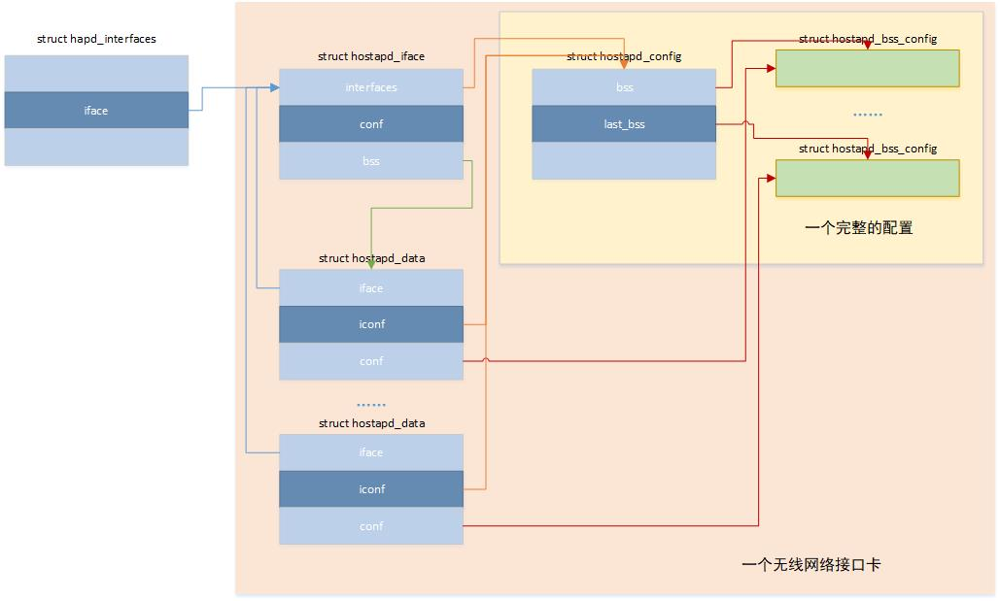

图中指向相同对象的指针用同色线条表示。数据结构struct hapd_interfaces是对hostapd本身的抽象。其它四个数据结构是对hostapd所管理无线网卡的描述。有_config后缀的数据结构用来描述具体的配置数据。没有_config后缀的数据结构是对被管理对象的描述。被管理的对象有两级：第一级是网路接口卡，我们可以认为Radio这个层面；第二级是BSS，我们可以视其为mac层面。之所以分两层，是因为目前多数的无线网卡都可以在一个Radio上支持多个BSS。这就是为什么在图中我们可以看到一个interface后可以有多个bss。需要注意的是radio只可能有一个。

除了这五兄弟之外，还有一个重要的数据结构。这个数据结构比较短小，这里我把它贴出来。

```c
struct hapd_global {
	void **drv_priv;
	size_t drv_count;
};

static struct hapd_global global;
```

这个数据结构及其实例命名得实在是太随意了（hostapd中这种随意的代码其实很多枯☹）。前文介绍过，hostapd设计的目标之一是核心功能不依赖具体驱动。一个hostapd的实例可以同时管理不同类型的无线网卡。这个global的目的就是为了记录hostapd当前支持的驱动类型，以及每种类型的驱动下都注册了哪些设备。global实际上是一个指针数组，它的大小将与另一个全局变量wpa_drivers一致。

#### 全局接口

```text
os_memset(&interfaces, 0, sizeof(interfaces));
interfaces.reload_config = hostapd_reload_config;
interfaces.config_read_cb = hostapd_config_read;
interfaces.for_each_interface = hostapd_for_each_interface;
interfaces.ctrl_iface_init = hostapd_ctrl_iface_init;
interfaces.ctrl_iface_deinit = hostapd_ctrl_iface_deinit;
interfaces.driver_init = hostapd_driver_init;
interfaces.global_iface_path = NULL;
interfaces.global_iface_name = NULL;
interfaces.global_ctrl_sock = -1;
dl_list_init(&interfaces.global_ctrl_dst);
```

这是函数main()开始的一段代码，初始化了六个全局接口。这六个接口在hostapd运行时，为其它模块提供服务。

##### hostapd_reload_config

该接口被用于重新加载配置。配置被修改的途径有两种： 1. 直接修改了内存中保存的参数值（本节开始所介绍的struct hostapd_config和struct hostapd_config_bss的实例）. 2. 使用新的配置文件。

对于第一种方式，仅仅刷新BSS相关的配置，Radio相关的设置保持不变。第二种方式对应的操作比较复杂，首先从新的配置文件中读取配置参数；然后将已有的连接断掉，并清空接入认证服务相关的设置；如果interface（其实就是Radio相关）的配置有变化，就重新创建一个interface实例，并使能该interface；如果interface的配置没有变化，则仅更新BSS的相关配置项。通过阅读这个函数的源代码，我们会发现：如果想修改radio相关的配置，只能通过修改配置文件这种方式。

##### hostapd_for_each_interface

该接口被用于遍历hostapd当前管理的每一个interface，并使用模块提供的处理函数对每一个interface进行处理。

##### hostapd_ctrl_iface_init

该接口被用于创建控制接口，我们可以看到hostapd_ctrl_iface_receive是这个socket上的接收处理函数。关于它的细节，我们留在后文分析。该函数的入参是struct hostapd_data，这意味着控制接口是针对每一个BSS的。

##### hostapd_ctrl_iface_deinit

该接口被用于销毁BSS的控制接口。

##### hostapd_driver_init

该接口被用于准备无线网卡所使用的驱动。前文介绍过hostapd可以支持多个使用不同类型驱动的无线网卡。该函数就是为具体的网卡准备与之对接的驱动。目前hostapd所支持的驱动类型有： - Linux mac80211 drivers - Linux drivers that support nl80211/cfg80211 in AP mode - Host AP driver for Prism2/2.5/3 - madwifi (Atheros ar521x) - BSD net80211 layer (e.g., Atheros driver) (FreeBSD 6-CURRENT)

hostapd所支持的全部驱动类型被定义在全局变量wpa_drivers中。 wpa_drivers实质上是一个类型为struct wpa_driver_ops *的指针数组，每个指针指向一种类型设备驱动的封装。可以将这一封装理解为一个适配层。这个适配层使得hostapd可以和任何一种符合以上驱动规范的厂商设备驱动对接。每一种类型的设备驱动仅仅初始化一次，前提是该种类型驱动具有global_init接口。global_init返回具体该类型驱动的私有数据，被赋予global中的一个成员。为了方便理解两者的关系，现在把函数中相关的一段代码贴出来。

```c
os_memset(&params, 0, sizeof(params));
for (i = 0; wpa_drivers[i]; i++) {
	if (wpa_drivers[i] != hapd->driver)
		continue;

	if (global.drv_priv[i] == NULL &&
	    wpa_drivers[i]->global_init) {
		global.drv_priv[i] =
			wpa_drivers[i]->global_init(iface->interfaces);
		if (global.drv_priv[i] == NULL) {
			wpa_printf(MSG_ERROR, "Failed to initialize "
				   "driver '%s'",
				   wpa_drivers[i]->name);
			return -1;
		}
	}

	params.global_priv = global.drv_priv[i];
	break;
}
```

这段代码的逻辑是：从所有的驱动封装中找出一个和当前接口匹配的成员。如果global没有缓存该驱动的内部数据，则说明这种类型驱动未被初始化过，此时如果该类型封装存在global_init，就调用该接口对其进行初始化。如果globle存在相应的内部数据，则说明该驱动已经被初始话过，无需重复调用global_init，后续对该interface的操作可以直接使用相关驱动的API。

对于支持cfg80211的设备驱动，需要在配置文件中将选项driver的值设为nl0211（driver=nl80211）。此时globle_init指向nl80211_global_init。本文后续内如，默认认为与hostapd对接的就是支持cfg80211接口的设备驱动。 nl80211_global_init()所完成的内容有： 1. 创建netlink socket用来接收网络接口的create/delete/up/down 等事件。 2. 创建nl80211 socket用于支持mac80211的内核驱动通信。扫描、接入、信道切换、断连等事件都通过该socket接收。 3. 创建ioctl_socket以便使用WEXT接口和内核驱动通信。

这里需要特别说明的是hapd->driver。hapd的类型是struct hostapd_data *。它所指向的是BSS。在hostapd_driver_init中它具体指向一个接口的第一个BSS。hostapd将interface对应的驱动封装保存在每一个BSS的实例中，如果interface需要使用相关API，则从第一个BSS中调取。

```c
params.bssid = b;
params.ifname = hapd->conf->iface;
params.driver_params = hapd->iconf->driver_params;
params.use_pae_group_addr = hapd->conf->use_pae_group_addr;

params.num_bridge = hapd->iface->num_bss;
params.bridge = os_calloc(hapd->iface->num_bss, sizeof(char *));
if (params.bridge == NULL)
	return -1;
for (i = 0; i < hapd->iface->num_bss; i++) {
	struct hostapd_data *bss = hapd->iface->bss[i];
	if (bss->conf->bridge[0])
		params.bridge[i] = bss->conf->bridge;
}

params.own_addr = hapd->own_addr;

hapd->drv_priv = hapd->driver->hapd_init(hapd, &params);
os_free(params.bridge);
if (hapd->drv_priv == NULL) {
	wpa_printf(MSG_ERROR, "%s driver initialization failed.",
		   hapd->driver->name);
	hapd->driver = NULL;
	return -1;
}
```

这了可以看出，由于interface所使用的驱动已经准备好了，所以这里便可以使用相关的API了。关于函数hostapd_driver_init我暂时讲解到这里，先回到函数main中断的地方继续向下看。

#### 计算接口数量

函数main接着是对命令行参数的解析，相关参数在[运行hostapd](#p2_3)一节有过详细介绍。这里就不再复述了。再接着是与运行log相关的初始化代码，如果log到指定的文件或者系统运行日志，log到stdout的功能就不会打开。

```c
interfaces.count = argc - optind;
if (interfaces.count || num_bss_configs) {
	interfaces.iface = os_calloc(interfaces.count + num_bss_configs,
				     sizeof(struct hostapd_iface *));
	if (interfaces.iface == NULL) {
		wpa_printf(MSG_ERROR, "malloc failed");
		return -1;
	}
}
```

从接下来的这段代码，我们可以看出计算命令行参数中配置文件的数目就是接口的数目，因此不同配置文件中接口名称选项interface应该使用不同的参数值，否则后续的代码执行将会出错。

#### 全局初始化

以下代码片段完成全局的初始化。

```c
if (hostapd_global_init(&interfaces, entropy_file)) {
	wpa_printf(MSG_ERROR, "Failed to initialize global context");
	return -1;
}

eloop_register_timeout(HOSTAPD_CLEANUP_INTERVAL, 0,
		       hostapd_periodic, &interfaces, NULL);

if (fst_global_init()) {
	wpa_printf(MSG_ERROR,
		   "Failed to initialize global FST context");
	goto out;
}
```

hostapd_global_init实现了以下内容的初始化： - 初始化全局变量global，前文已经介绍过该变量用来记录hostapd目前管理不同驱动实例。 - 向debug模块注册运行日志处理接口。debug模块默认会将运行日志输出到标准输出，通过该注册可以将运行日志重定位到操作系统的运行日志。 - 注册EAP方法。 - 完成了eloop模块的初始化。 - 初始化随机数模块，往随机数池子添加熵。默认情况是从/dev/random中读取20个字节，做为种子。由于/dev/random的读取可能会引起阻塞，为提升程序运行的效率，对/dev/random的读操作被注册到eloop（注意：eloop在之前已经被初始化）。如果使用了命令行选项e，该随机数池会额外增加一个熵。该参数指定的文件如果不存在或者其中数据不满足要求，则随机数池子的熵值不会增加，但并不会导致初始化失败。无论输入如何，接下来hostapd都会使用操作系统提供的伪随机数更新该文件的内容。 - 注册reload、crash_dump、terminate三种signal - 根据hostap目前支持的驱动种类，初始化变量global，主要是分配global.drv_priv指针数组。特定类型的驱动可能会有私有的属性，该数组中的指针将指向存放具体驱动私有属性的buffer。

hostapd_periodic将周期性的清理hostapd的访问控制列表（ACL）。

FST模块也在这里被初始化。

#### 初始化网络接口

```c
/* Allocate and parse configuration for full interface files */
for (i = 0; i < interfaces.count; i++) {
	char *if_name = NULL;

	if (i < if_names_size)
		if_name = if_names[i];

	interfaces.iface[i] = hostapd_interface_init(&interfaces,
						     if_name,
						     argv[optind + i],
						     debug);
	if (!interfaces.iface[i]) {
		wpa_printf(MSG_ERROR, "Failed to initialize interface");
		goto out;
	}
	if (start_ifaces_in_sync)
		interfaces.iface[i]->need_to_start_in_sync = 1;
}
```

这段代码根据输入的参数对网络接口进行初始化。hostapd做为一个后台管理程序，可以同时管理多个网络接口。以上的循环既是为每一个接口创建一个hostapd_iface对象，该对象中的属性即相关的配置参数。如果没有使用配置文件为它们指定参数，代码中将使用默认参数。以下是hostapd_interface_init的代码：

```c
static struct hostapd_iface *
hostapd_interface_init(struct hapd_interfaces *interfaces, const char *if_name,
		       const char *config_fname, int debug)
{
	struct hostapd_iface *iface;
	int k;

	wpa_printf(MSG_DEBUG, "Configuration file: %s", config_fname);
	iface = hostapd_init(interfaces, config_fname);
	if (!iface)
		return NULL;

	if (if_name) {
		os_strlcpy(iface->conf->bss[0]->iface, if_name,
			   sizeof(iface->conf->bss[0]->iface));
	}

	iface->interfaces = interfaces;

	for (k = 0; k < debug; k++) {
		if (iface->bss[0]->conf->logger_stdout_level > 0)
			iface->bss[0]->conf->logger_stdout_level--;
	}

	if (iface->conf->bss[0]->iface[0] == '\0' &&
	    !hostapd_drv_none(iface->bss[0])) {
		wpa_printf(MSG_ERROR,
			   "Interface name not specified in %s, nor by '-i' parameter",
			   config_fname);
		hostapd_interface_deinit_free(iface);
		return NULL;
	}

	return iface;
}
```

网络接口对象由hostapd_init创建并初始化。接口名称和运行日志级别这两个属性有点特殊：第一，它们不是在hostapd_init中被初始化。第二，它们都做为该接口的第一个BSS的属性被保存。既然别的属性都在hostapd_init中被赋值，那么它们就一定有特别的地方。特别的地方是，它们的值来自启动时的配置文件。hostapd_init首先会创建一个hostapd_iface对象，然后调用hostapd_config_read（详细的代码就不在帖了，大家注意这里不是函数直接调用。hostapd_config_read被做为hapd_interfaces的一种操作在main函数起始处已经注册到该对象上了）。hostapd_config_read首先创建一个配置对象，并使用默认值对其初始化，然后对配置文件进行文本解析，并使用解析到的值修改相应选项的初始值。解析完毕之后，如果配置中存在多个BSS，则需要为相应的BSS创建hostapd_bss对象。

#### 初始化BSS

初始化也可以按BSS进行。请看以下代码：

```c
/* Allocate and parse configuration for per-BSS files */
for (i = 0; i < num_bss_configs; i++) {
	struct hostapd_iface *iface;
	char *fname;

	wpa_printf(MSG_INFO, "BSS config: %s", bss_config[i]);
	fname = os_strchr(bss_config[i], ':');
	if (fname == NULL) {
		wpa_printf(MSG_ERROR,
			   "Invalid BSS config identifier '%s'",
			   bss_config[i]);
		goto out;
	}
	*fname++ = '\0';
	iface = hostapd_interface_init_bss(&interfaces, bss_config[i],
					   fname, debug);
	if (iface == NULL)
		goto out;
	for (j = 0; j < interfaces.count; j++) {
		if (interfaces.iface[j] == iface)
			break;
	}
	if (j == interfaces.count) {
		struct hostapd_iface **tmp;
		tmp = os_realloc_array(interfaces.iface,
				       interfaces.count + 1,
				       sizeof(struct hostapd_iface *));
		if (tmp == NULL) {
			hostapd_interface_deinit_free(iface);
			goto out;
		}
		interfaces.iface = tmp;
		interfaces.iface[interfaces.count++] = iface;
	}
}
```

按BSS初始化和按接口初始化在使用时的区别是：按BSS初始化时，配置文件需要跟在-b命令行选项之后。-b之后的参数格式是：phy名称:配置文件。这个很好理解，因为BSS是建立在接口之上的，因此需要为每一个BSS都要指定一个接口。相应的初始化函数名为hostapd_interface_init_bss，和hostapd_interface_init的不同是：首先要根据phy名称在当前已经初始化完成的接口中查找。如果未能够找到同名的接口，则等同于新接口初始化。如果找到该接口，则在该接口的hostapd_iface和hostapd_conf下新添加hostapd_data和hostapd_bss_config对象。

#### 使能接口

无论配置参数是按接口还是按BSS提供，最终的初始化都是按接口进行。

```c
/*
 * Enable configured interfaces. Depending on channel configuration,
 * this may complete full initialization before returning or use a
 * callback mechanism to complete setup in case of operations like HT
 * co-ex scans, ACS, or DFS are needed to determine channel parameters.
 * In such case, the interface will be enabled from eloop context within
 * hostapd_global_run().
 */
interfaces.terminate_on_error = interfaces.count;
for (i = 0; i < interfaces.count; i++) {
	if (hostapd_driver_init(interfaces.iface[i]) ||
	    hostapd_setup_interface(interfaces.iface[i]))
		goto out;
}
```

这段代码很简单，interfaces.iface[i]是根据配置所创建的接口实例，它们被依次完成初始化。初始化有两部分内容：初始化与该接口匹配的驱动、初始化该接口。从代码中的这段注释我们可以知道，当hostapd_setup_interface返回成功时，相应的接口不一定被使能，因为有些重要的初始化尚未完成。hostapd的主要作用是使支持AP模式的网卡工作在该模式。在启动该模式之前，hostapd需要检测启动配置中与运行模式相关的配置参数值是否合理。如果配置参数中未指定信道可能需要做自动信道选择（ACS）；如果指定信道为5G雷达信道，则需要做动态频率选择（DFS）；如果可能会使用40MHz、80MHz、160MHz带宽，则需要扫描与主信道相邻的信道。所有这些操作都需要对若干信道进行扫描，扫描工作将花费比较长的时间，因此如注释中所说：待这些扫描工作完成之后，相应的接口会在eloop中被使能。关于接口初始化的详细内容，此处先简略介绍，后文我们还回详细分析。

以上三节介绍了三个循环，循环语句也是一种条件语句。此处我们可略微思考一下，如果我们运行hostapd时不指定任何形式的配置信息，结果将会怎样。

#### 启动hostapd

如果未指定配置，则以上三节介绍的循环语句将全部被跳过。接着便是执行以下代码。

```c
hostapd_global_ctrl_iface_init(&interfaces);

if (hostapd_global_run(&interfaces, daemonize, pid_file)) {
	wpa_printf(MSG_ERROR, "Failed to start eloop");
	goto out;
}

ret = 0;
```

hostapd_global_ctrl_iface_init完成控制接口的初始化。前文介绍过，命令行的-g选项用来指定全局控制接口，其后的参数是一个文件完整路径名。该配置项不是必须的。如果启动hostapd时使用了该选项，则hostapd_global_ctrl_iface_init便会在该目录下创建一个socket文件，用来接收来自别的应用程序的控制数据。

细心的读者第一次看到后面的out标签时，大概会很好奇。hostapd_global_run无论返回什么值，都会走到out，唯一的区别就一句“Failed to start eloop”错误提示。当我们看了hostapd_global_run的实现之后，便会发现这其中的奥秘。

```c
static int hostapd_global_run(struct hapd_interfaces *ifaces, int daemonize,
			      const char *pid_file)
{
#ifdef EAP_SERVER_TNC
	int tnc = 0;
	size_t i, k;

	for (i = 0; !tnc && i < ifaces->count; i++) {
		for (k = 0; k < ifaces->iface[i]->num_bss; k++) {
			if (ifaces->iface[i]->bss[0]->conf->tnc) {
				tnc++;
				break;
			}
		}
	}

	if (tnc && tncs_global_init() < 0) {
		wpa_printf(MSG_ERROR, "Failed to initialize TNCS");
		return -1;
	}
#endif /* EAP_SERVER_TNC */

	if (daemonize) {
		if (os_daemonize(pid_file)) {
			wpa_printf(MSG_ERROR, "daemon: %s", strerror(errno));
			return -1;
		}
		if (eloop_sock_requeue()) {
			wpa_printf(MSG_ERROR, "eloop_sock_requeue: %s",
				   strerror(errno));
			return -1;
		}
	}

	eloop_run();

	return 0;
}
```

原来hostapd_global_run最后调用了eloop_run。前文已经介绍过：该函数在实质上是一个循环。循环终止的唯一条件是收到操作系统发来的终止运行signal。这下读者朋友们，应该明白hostapd_global_run两种返回1921值的区别了。返回错误说明hostapd未能够正常启动。成功返回唯一的情况是hostapd的运行被系统终止。到这里读者朋友们应该也同时明白，原来前面所有的工作都是为eloop_run的执行做准备。

### 使能接口

[使能接口](#p4_2_7)一节中介绍接口初始化时，未详细展开。这一节详细介绍相关的细节。

#### 驱动初始化

hostapd可以同时管理多个网络接口。这些网络接口所使用的驱动类型可以不同。在初始化具体的网络接口之前，需要首先挂载其所使用的驱动。基本流程如下图

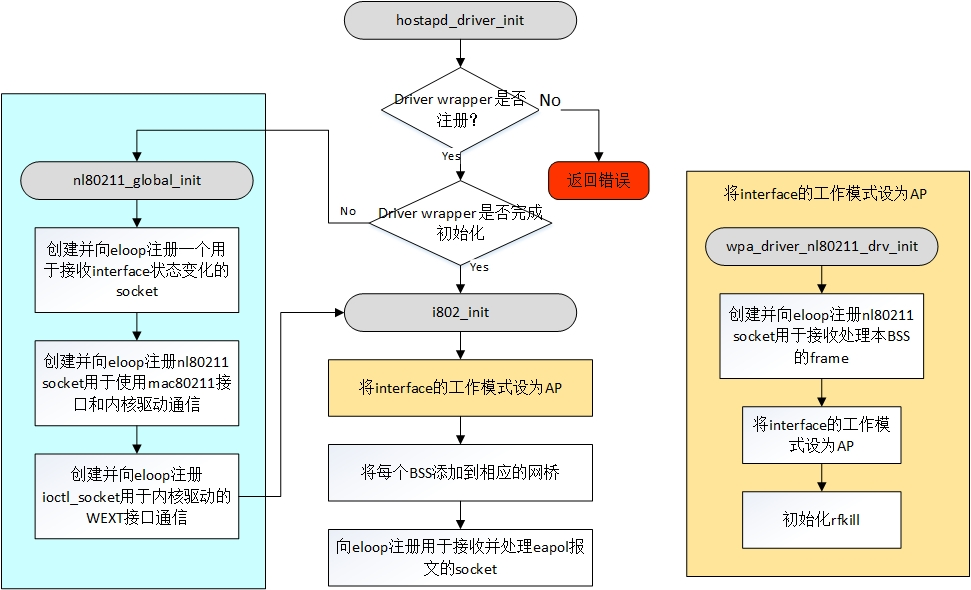

```c
/**
 * hostapd_driver_init - Preparate driver interface
 */
static int hostapd_driver_init(struct hostapd_iface *iface)
{
	struct wpa_init_params params;
	size_t i;
	struct hostapd_data *hapd = iface->bss[0];
	struct hostapd_bss_config *conf = hapd->conf;
	u8 *b = conf->bssid;
	struct wpa_driver_capa capa;

	if (hapd->driver == NULL || hapd->driver->hapd_init == NULL) {
		wpa_printf(MSG_ERROR, "No hostapd driver wrapper available");
		return -1;
	}
```

既然是对接口的驱动进行初始化，首先需要检测该接口所对应的驱动是否已经注册。和接口名称类似，接口对应的驱动也被保存在第一个BSS对象中。什么时候保存的呢？这一点在介绍配置文件解析时没有深入。前文介绍的配置选项[driver](#p_4driver)可以被用来指定接口对应的驱动。解析到的结果首先被保存在hostapd_config对象中，接着在hostapd_alloc_bss_data中被复制到每一个BSS对应的hostapd_data对象中。

通过这段代码我们可以发现wpa_drivers和global.drv_priv中的每一项都是按序号匹配的。另也能够发现，如果多个接口使用同样的驱动，global_init只会被执行一次。

```c
/* Initialize the driver interface */
if (!(b[0] | b[1] | b[2] | b[3] | b[4] | b[5]))
	b = NULL;

os_memset(&params, 0, sizeof(params));
for (i = 0; wpa_drivers[i]; i++) {
	if (wpa_drivers[i] != hapd->driver)
		continue;

	if (global.drv_priv[i] == NULL &&
		wpa_drivers[i]->global_init) {
		global.drv_priv[i] =
			wpa_drivers[i]->global_init(iface->interfaces);
		if (global.drv_priv[i] == NULL) {
			wpa_printf(MSG_ERROR, "Failed to initialize "
				   "driver '%s'",
				   wpa_drivers[i]->name);
			return -1;
		}
	}

	params.global_priv = global.drv_priv[i];
	break;
}
```

并不是所有类型的设备驱动都支持代码中的global_init。因此并不是所有类型的设备驱动都有global.drv_priv。nl80211类型的设备驱动具有global_init接口，因此我们就看看这种类型的驱动的初始化都干了什么。由于目前流行的设备驱动都是nl80211，后文涉及到设备驱动时默认都是该类型。

在hostapd代码中，nl80211类型的驱动对象是wpa_driver_nl80211_ops。在解析配置文件时，wpa_driver_nl80211_ops的成员name的值将拿来和配置选项[driver](#p_4driver)的值比较，如果这两个字符串的内容一样，则相应的驱动对象被选中。wpa_driver_nl80211_ops中global_init实际指向nl80211_global_init。nl80211_global_init完成以下初始化：

1. 创建驱动私有数据，该数据地址在函数返回后被保存到global.drv_priv。这里读者朋友如果去看nl80211_global_init的代码，会发现该数据对象的名称居然也是global 😅。
2. 创建netlink socket用来接收网络接口的create/delete/up/down 等事件。
3. 创建nl80211 socket用于使用mac80211接口和内核驱动通信。扫描、接入、信道切换、断连等事件都通过该socket接收。
4. 创建ioctl_socket用于内核驱动的WEXT接口通信。

设备驱动初始化完毕之后，但是hostapd_driver_init并未退出，它还想多做一点事情————将接口的工作模式改成AP。

```c
params.bssid = b;
params.ifname = hapd->conf->iface;
params.driver_params = hapd->iconf->driver_params;
params.use_pae_group_addr = hapd->conf->use_pae_group_addr;

params.num_bridge = hapd->iface->num_bss;
params.bridge = os_calloc(hapd->iface->num_bss, sizeof(char *));
if (params.bridge == NULL)
	return -1;
for (i = 0; i < hapd->iface->num_bss; i++) {
	struct hostapd_data *bss = hapd->iface->bss[i];
	if (bss->conf->bridge[0])
		params.bridge[i] = bss->conf->bridge;
}

params.own_addr = hapd->own_addr;

hapd->drv_priv = hapd->driver->hapd_init(hapd, &params);
os_free(params.bridge);
if (hapd->drv_priv == NULL) {
	wpa_printf(MSG_ERROR, "%s driver initialization failed.",
		   hapd->driver->name);
	hapd->driver = NULL;
	return -1;
}
```

这段代码前面的部分是准备初始化所用到的参数，这些参数都来自于配置文件。hapd_init完成具体的初始化，这是与具体驱动有关的接口。对于nl80211驱动，它的实例是i802_init。i802_init的代码比较长，在逻辑上分为三个部分：

1. 调用wpa_driver_nl80211_drv_init将接口的工作模式设置为AP。
2. 将已经初始化的个BSS添加到相应的网桥。
3. 创建并向eloop注册用于接收并处理eapol报文的socket。

其中第一部分的操作最复杂，被封装在wpa_driver_nl80211_drv_init之中。传入该函数的6个参数分别是：

1. BSS对象
2. 接口名称
3. 驱动私有数据
4. hostapd标识（hostapd中大部分代码与wpa-supplicant共享，该接口便是其中之一，1标识接下初始化的工作模式是AP）
5. MAC地址
6. 设备驱动相关的参数

wpa_driver_nl80211_drv_init完成的内容有：

1. 创建wpa_driver_nl80211_data和i802_bss两个对象，并对其进行初始化
2. 初始化第一个BSS。代码是调用nl80211_init_bss。该函数主要是向eloop注册nl80211 socket。主要处理的消息有： NL80211_CMD_FRAME、NL80211_CMD_FRAME_TX_STATUS、NL80211_CMD_UNEXPECTED_FRAME、NL80211_CMD_UNEXPECTED_4ADDR_FRAME、 NL80211_CMD_EXTERNAL_AUTH、NL80211_CMD_CONTROL_PORT_FRAME。不同于全局初始化时注册的nl80211 sckoet，此处的socket是针对特定接口的。而全局nl80211 socket上的消息是针对hostapd本身。
3. 调用wpa_driver_nl80211_finish_drv_init（建议读者朋友仔细研读这一部分代码）。该函数完成的内容比较多：
    - 查询接口所支持的能力 (通过向cfg80211发送查询命令NL80211_CMD_GET_PROTOCOL_FEATURES、NL80211_CMD_GET_WIPHY实现)。
    - 向kernel注册接口的MAC地址。
    - 如果配置中存在驱动参数，根据这些参数设置wpa_driver_nl80211_data对象中的相应flag。
    - 完成对接口工作模式的设置。
    - 初始化rfkill，仅p2p mode会处理相应的event。如果此时iface对应的RF被block，则需要向rfkill发送消息使能它。如果该接口为被rfkill去激活，则通过 通过SIOCGIFFLAGS操作设置指定网络接口的标志为up。
4. 如果设备支持NL80211_FEATURE_SK_TX_STATUS，则创建并向eloop注册socket以用于接收eapol报文的发送状态。
5. 将该网络接口对应的wpa_driver_nl80211_data实例挂在global.drv_priv[i]的相应链表上。

设置接口工作模式的函数是wpa_driver_nl80211_set_mode_impl。该函数会向cfg80211发送NL80211_CMD_SET_INTERFACE，cfg80211收到该命令之后再调用内核驱动注册的相关接口完成接口工作模式的设置。某些设备驱动不支持动态修改网络接口的工作模式，如果网络接口在创建时未将其工作模式设置成AP，wpa_driver_nl80211_set_mode_impl会返回失败从而导致hostapd无法成功启动。mac80211不允许网络接口UP时修改接口工作模式，因此第一次的NL80211_CMD_SET_INTERFACE可能会返回失败。只要返回的不是-ENODEV，wpa_driver_nl80211_set_mode_impl会尝试将接口down。如果接口无法被成功down，则接口当前的工作模式无法被改变，函数返回错误。至此在设备驱动这一层，接口已经工作在AP模式了。某些驱动支持WIPHY_FLAG_HAVE_AP_SME（hwsim和QCAwifi不支持），此时drv->device_ap_sme==1。如果设备驱动不支持AP_SME，则需要hostapd来处理一些管理帧，因此需要向cfg80211注册需要收到的管理帧，包括：

- authentication
- association
- reassociation
- disassociation
- deauthentication
- probe-request

另外还要注册接收一些action帧，包括：

- Public Action frames
- RRM Measurement Report
- RRM Link Measurement Report
- RRM Neighbor Report Request
- FT Action frames
- SA Query
- Protected Dual of Public Action
- WNM
- WMM
- Vendor-specific。

收到的这些帧将由process_bss_event处理。

待以上操作完成之后，接口的状态便可以重新设置为up。wpa_driver_nl80211_set_mode_impl便完成了所有的工作。

#### 启动AP（hostapd_setup_interface）

成功设置接口工作模式之后，便是启动AP。这便是hostapd_setup_interface完成的工作。

```c
int hostapd_setup_interface(struct hostapd_iface *iface)
{
	int ret;

	if (!iface->conf)
		return -1;
	ret = setup_interface(iface);
	if (ret) {
		wpa_printf(MSG_ERROR, "%s: Unable to setup interface.",
			   iface->conf->bss[0]->iface);
		return -1;
	}

	return 0;
}
```

hostapd_setup_interface实质上是对setup_interface的封装。该函数的调用过程比较复杂，先用一张流程图简单说明相关操作流程。整个流程涉及setup_interface2、hostapd_setup_interface_complete和hostapd_setup_interface_complete_sync三个函数，下面分别介绍。

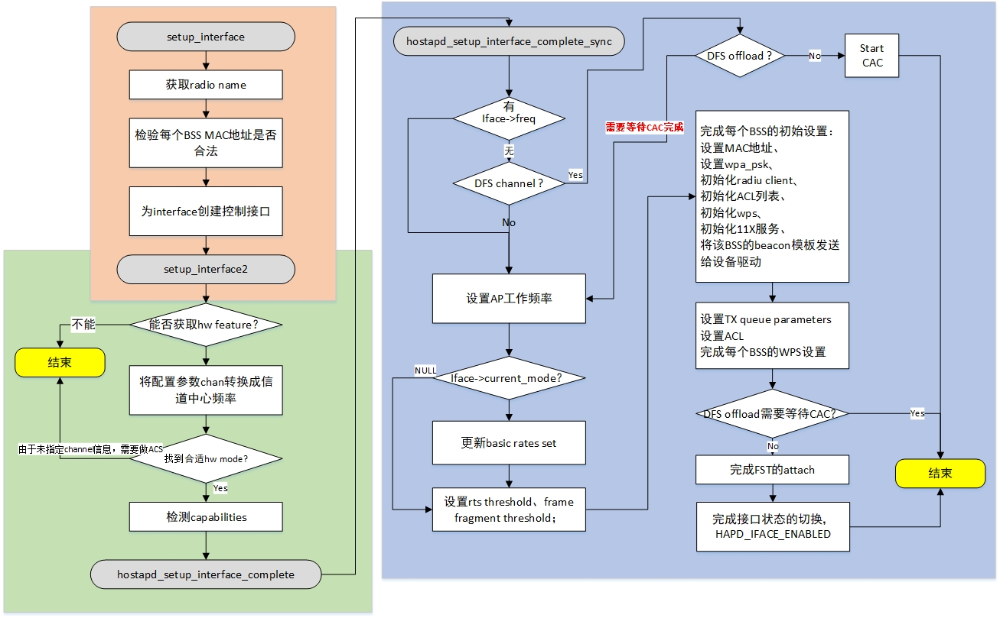

```c
static int setup_interface(struct hostapd_iface *iface)
{
	struct hostapd_data *hapd = iface->bss[0];
	size_t i;

	/*
	 * It is possible that setup_interface() is called after the interface
	 * was disabled etc., in which case driver_ap_teardown is possibly set
	 * to 1. Clear it here so any other key/station deletion, which is not
	 * part of a teardown flow, would also call the relevant driver
	 * callbacks.
	 */
	iface->driver_ap_teardown = 0;

	if (!iface->phy[0]) {
		const char *phy = hostapd_drv_get_radio_name(hapd);
		if (phy) {
			wpa_printf(MSG_DEBUG, "phy: %s", phy);
			os_strlcpy(iface->phy, phy, sizeof(iface->phy));
		}
	}
```

对于nl80211的驱动，hostapd_drv_get_radio_name最终调用nl80211_get_radio_name。radio_name做为接口的属性之一早已由wpa_driver_nl80211_finish_drv_init通过NL80211_CMD_GET_PROTOCOL_FEATURES向cfg80211获取，nl80211_get_radio_name此时将保存的NL80211_ATTR_WIPHY_NAME属性值返回。对比前文按BSS配置时使用的命令行参数，可知参数中的接口名并非用户空间通过ifconfig命令所看到的名称，而是cfg80211为该接口登记的名称。

```c
/*
 * Make sure that all BSSes get configured with a pointer to the same
 * driver interface.
 */
for (i = 1; i < iface->num_bss; i++) {
	iface->bss[i]->driver = hapd->driver;
	iface->bss[i]->drv_priv = hapd->drv_priv;
}

if (hostapd_validate_bssid_configuration(iface))
	return -1;
```

由于设备驱动是和interface关联的，因此同一个interface下所有的bss必须指向同样的设备驱动。以上这段代码便是做这样的检测，如何发现驱动有不一致的配置，则返回错误。

```text
/*
 * Initialize control interfaces early to allow external monitoring of
 * channel setup operations that may take considerable amount of time
 * especially for DFS cases.
 */
if (start_ctrl_iface(iface))
	return -1;
```

在main该函数中，启动eloop之前会根据命令行的-g选项创建全局控制接口。如果未使用该选项则不会创建全局控制接口。这里的代码是创建interface的控制接口。该控制接口对于每一个interface都是必须的，如果配置文件中未指明该控制接口所使用的socket文件，则不会创建该接口。start_ctrl_iface最终会调用hostapd_ctrl_iface_init。为避免多个interface使用相同的socket文件，配置选项ctrl_interface是该socket文件的存放目录，socket文件以该interface命名。socket文件成功创建后，hostapd_ctrl_iface_receive被注册到eloop以处理来自该控制接口的消息。

```c
	if (hapd->iconf->country[0] && hapd->iconf->country[1]) {
		char country[4], previous_country[4];

		hostapd_set_state(iface, HAPD_IFACE_COUNTRY_UPDATE);
		if (hostapd_get_country(hapd, previous_country) < 0)
			previous_country[0] = '\0';

		os_memcpy(country, hapd->iconf->country, 3);
		country[3] = '\0';
		if (hostapd_set_country(hapd, country) < 0) {
			wpa_printf(MSG_ERROR, "Failed to set country code");
			return -1;
		}

		wpa_printf(MSG_DEBUG, "Previous country code %s, new country code %s",
			   previous_country, country);

		if (os_strncmp(previous_country, country, 2) != 0) {
			wpa_printf(MSG_DEBUG, "Continue interface setup after channel list update");
			iface->wait_channel_update = 1;
			eloop_register_timeout(5, 0,
					       channel_list_update_timeout,
					       iface, NULL);
			return 0;
		}
	}
	return setup_interface2(iface);
}
```

最后，看配置文件中是否设置了国家码。如果配置文件中有国家码相关的选项，则需要向cfg80211发送NL80211_CMD_REQ_SET_REG设置新的国家码。如果配置文件中的国家码和cfg80211中当前国家码一致，则调用setup_interface2。否则需要等待cfg80211发回的国家码更新消息NL80211_CMD_WIPHY_REG_CHANGE。如果收到该消息则hostapd_channel_list_updated被调用；否则超时等待channel_list_update_timeout被调用。无论那个函数最终被调用，setup_interface2都会被调用。

setup_interface2说明有第二阶段的setup，毕竟第一部分仅仅做了三件事情。而这第二个阶段的处理就比较复杂了。首先，需要调用hostapd_get_hw_features获取该interface的特征。该操作并非所有类型的驱动都支持，对于nl80211型驱动，相关信息通过向cfg80211发送NL80211_CMD_GET_WIPHY命令获得。获得的数据由phy_info_handler解析并生成一个hostapd_hw_modes对象以保存该接口hw相关的信息。虽然interface当前已经是AP模式，但是它还没有开始工作。因为信道、带宽、物理层工作模式等参数尚未被指定。虽然配置文件中会设置相关的参数，但是需要确保这些参数可以使得当前interface能够正常工作，因此下一步就是要对相关的设置进行校正。既然是进行校正，便会有三种结果：

1. AP按照设置的参数工作；
2. AP虽然启动，但是模式和所设置的参数有些差异；
3. AP无法启动。

参数校正的第一步是将信道编号转换成中心频率（调用configured_fixed_chan_to_freq完成）。如果配置文件中未使用channel选项，或者指定的参数值为0。则说明未指定信道，则无需求该信道的中心频率。如果配置文件中使用了op_class选项，则需要根据该参数检验channel选项的参数是否合法，并在不同的operation class内计算相应的中心频点（具体参数可参看IEEE802.11相关的spec）。如果配置文件中未指定op_class，则根据配置文件中的hw_mode选项的值，在相应的hostapd_hw_modes（之前由NL80211_CMD_WIPHY_REG_CHANGE向cfg80211获取）内选取对应的信道并取其中心频点。最终用获得的中心频点更新hostapd_iface对象的freq属性。相关的代码很长，主要是80211标准中所支持的operation class和hw mode的数量很多的缘故。整个处理的流程的流程逻辑上还是比较简单的，如下图：

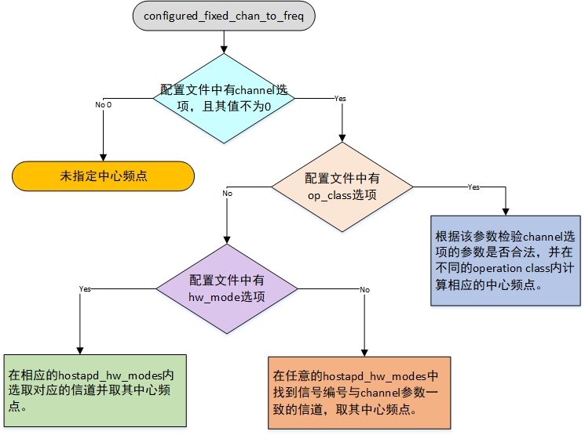

如果配置时指定了op_class，则需要根据op_class的值对he_oper_chwidth和vht_oper_chwidth进行校正。如果使用了6GHz的频段且带宽参数大于20MHz，则需要对副信道的参数进行校正。

接下来便是校验配置项中的hw_mode，并更新hostapd_iface对象的current_mode属性。2.4G频段的14信道比较特别，只能工作在11b模式下，首先需要对这种配置进行模式校正。接着使用当前信道中心频率在hw_feature中查找与之匹配的工作模式，并使用它更新iface->current_mode。如果配置时未指定hw_mode或者未指定channel，iface->current_mode将不会被更新。若iface->current_mode未被更新，则可能需要做ACS。接下来便要验证驱动ACS相关的设置是否正确。如果驱动ACS相关设置通过检验，则调用hostapd_check_chans。具体流程如下图：

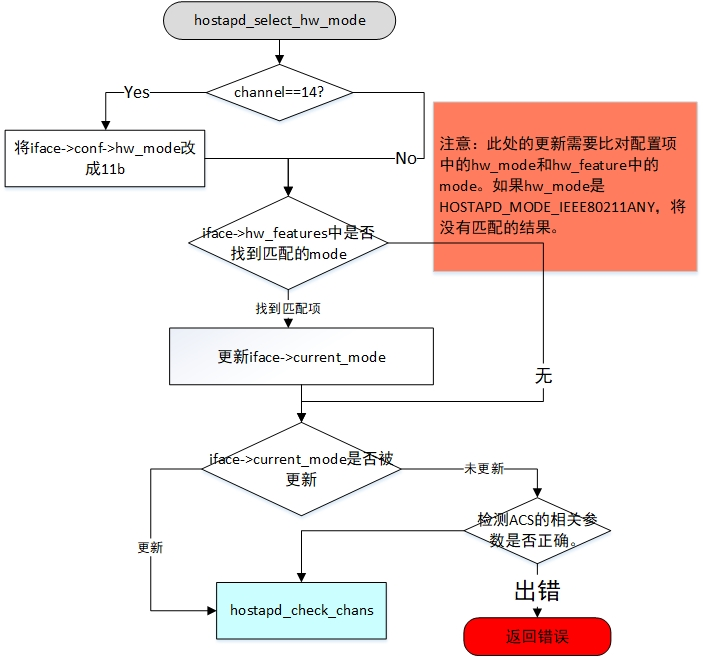

hostapd_check_chans是一个命名有二义性的函数。如果configured_fixed_chan_to_freq更新了iface->freq，则该函主要是检测这个中心频点在当前hw_mode下是否正确。如果iface->current_mode之前未被更新，该函数会调用hostapd_determine_mode更新它。检测当前信道是否可用时，首先检测主信道是否可用。如果配置了副信道，则需要检测相应的副信道是否可以。具体的信道是否可用，是由当前所在的regulatory domain决定的。如果iface->freq未被赋值，则说明需要通过ACS选择AP工作的信道。此时需要调用acs_init。如果interface对应的驱动支持ACS offload，则ACS将交由设备驱动完成, acs_init在发送向cfg80211发送完相应的vendor cmd之后返回。如果驱动不支持ACS offload则ACS的过程将由hostapd完成，acs_init将：

1. 清理所有缓存的survey信息；
2. 向设备驱动发起scan请求；
3. 将interface当前状态设为ACS。

在hw mode（如果需要ACS的化此时还是待定）确定之后，便是对capabilities的检测。检测的内容是将相关配置项的参数和从cfg80211获取的hw feature进行对比，待所有的检测通过之后，便调用hostapd_setup_interface_complete。hostapd_setup_interface_complete本质上是对hostapd_setup_interface_complete_sync的封装。原因是：如果有多个interface同时通过一个hostapd的实例管理时，它们的设置将先后完成。特别是在需要ACS的时候。如果有两个interface，其中一个在2.4GHz的频段ACS，另一个在5GHz频段ACS。由于2.4GHz的ACS将很快完成，如果不等待另外一个interface的ACS，则所有的station都将首先与该2.4GHz AP关联。未避免这种情况，hostapd_setup_interface_complete首先检测iface->need_to_start_in_sync标识。如果该标识置位，则表示有多个interface需要同步，此时进一步检测每一个interface的ready_to_start_in_sync标识。如果当前有多个interface尚未将该标识置上，则说明有多个interface还没有完成setup，当前interface将自身的ready_to_start_in_sync置上，等待后续的interface来调用hostapd_setup_interface_complete_sync。

hostapd_setup_interface_complete_sync负责完成interface setup最后的工作。如果不需要ACS，此时iface->freq和iface->current_mode都有有效的值。如果iface->freq对应的信道是5GHz频段的雷达信道，则需要做DFS。对于支持DFS offload的设备，DFS将交由设备驱动完成；否则hostapd将完成该工作。如果DFS offload，则后续的工作将在DFS完成后继续。如果不需要DFS或者DFS不是offload，则AP的工作频率将会被传给设备驱动（对于nl80211设备，则是通过NL80211_CMD_SET_CHANNEL命令完成）。接着更新iface->basic_rates，设置interface的RTS阈值、数据包分片阈值。然后按照interface下每个BSS的配置，逐个对BSS进行设置，内容有：设置MAC地址、设置wpa_psk、初始化radiu client、初始化ACL列表、初始化wps、初始化11X服务、将该BSS的beacon模板发送给设备驱动。最后完成TX queue参数设置、ACL设置、wps设置。至此interface的设置全部完成，如果不需要额外的扫描的化，interface已经工作在AP模式下了。如果需要ACS、相邻信道扫描或者DFS，则此时虽然函数正常返回，但是interface还没有完成设置，需要等到相应的回调函数在eloop中被调用时，interface的设置才算是最终完成。正如hostapd_setup_interface_complete注释中所描述：

```text
/**
 * hostapd_setup_interface_complete - Complete interface setup
 *
 * This function is called when previous steps in the interface setup has been
 * completed. This can also start operations, e.g., DFS, that will require
 * additional processing before interface is ready to be enabled. Such
 * operations will call this function from eloop callbacks when finished.
 */
```

#### ACS

如果配置项中未通过选项channel指定信道，则需要进行ACS。如果设备驱动支持ACS offload，则将ACS直接交由设备驱动完成。待设备驱动完成ACS之后，它会将选择好的信道信息上报给hostapd。大致流程如下图所示：

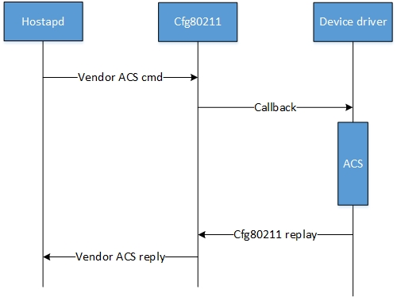

在调用hostapd_driver_init对设备驱动进行初始化时，创建了一个全局的nl80211 socket。ACS的结果便是通过该socket获取。待hostapd收到ACS的结果之后，更新interface实例中的freq、current_mode并同时跟新配置信息中的channel和acs。然后调用hostapd_acs_completed。

```c
int hostapd_acs_completed(struct hostapd_iface *iface, int err)
{
	int ret = -1;

	if (err)
		goto out;

	switch (hostapd_check_chans(iface)) {
	case HOSTAPD_CHAN_VALID:
		wpa_msg(iface->bss[0]->msg_ctx, MSG_INFO,
			ACS_EVENT_COMPLETED "freq=%d channel=%d",
			iface->freq, iface->conf->channel);
		break;
	case HOSTAPD_CHAN_ACS:
		wpa_printf(MSG_ERROR, "ACS error - reported complete, but no result available");
		wpa_msg(iface->bss[0]->msg_ctx, MSG_INFO, ACS_EVENT_FAILED);
		hostapd_notify_bad_chans(iface);
		goto out;
	case HOSTAPD_CHAN_INVALID:
	default:
		wpa_printf(MSG_ERROR, "ACS picked unusable channels");
		wpa_msg(iface->bss[0]->msg_ctx, MSG_INFO, ACS_EVENT_FAILED);
		hostapd_notify_bad_chans(iface);
		goto out;
	}

	ret = hostapd_check_ht_capab(iface);
	if (ret < 0)
		goto out;
	if (ret == 1) {
		wpa_printf(MSG_DEBUG, "Interface initialization will be completed in a callback");
		return 0;
	}

	ret = 0;
out:
	return hostapd_setup_interface_complete(iface, ret);
}
```

这里可以看到，之前由于缺失channel配置参数而未执行的代码，全部被补上了。

如果设备驱动不支持ACS offload，则ACS将由hostapd自己完成。hostapd首先要dump survey，此时需要的信息有：环境底噪的值、有无线信号的时间、信道忙的时间、设备处于接受的时间、设备处于发送的时间。选择Survey的信道时，需要考虑在当前Reg domain下该信道的最大发射功率是否满足要求。如果不能够满足要求，则无需在该信道上进行survey。Hostapd在每次的ACS scan之会后dump survey。Dump survey默认的次数是5，该参数额可以通过配置选项acs_num_scans修改。当ACS scan的次数达到acs_num_scans时，便可以利用所获得的数据进行ACS学习。需要注意的是，11b mode下，survey的数据不充分，因此无法计算信道干扰因子。某一信道Survey结果中必须存在的结果有：底噪、设备在该信道工作的时间、设备在该信道发送的时间、设备在该信道接收的时间。根据每次的结果计算本次survey所得干扰因子，计算公式如下：

信道最终的干扰因子是所有survey结果的平均值。需要注意的是，由于survey的对象是20MHz信道，因此这里计算所得是每个20MHz信道。

信道干扰因子计算完毕之后，便可以根据该因子对每个信道进行评级，选出干扰因子最小的信道。不过在做最终选择之前需要排除不满足带宽要求的信道。如果信道带宽超出20MHz，则该信道最终的干扰因子是其所包含的所有20MHz子信道的平均值。对于2.4GHz频段的信道，则需要考虑相邻信道的干扰，每个信道最终的干扰因子是和相邻信道的加权平均值。当前信道的加权值是1，相邻信道的加权值是0.85。最后如果配置选项acs_chan_bias为某一信道指定加权值，则该信道最终的干扰因子是与之相乘的结果。配置选项acs_chan_bias的格式是形如“1:0.8 6:0.8”的字符串，“:”将信道编号与其权重关联，每一组值之间由空字符隔开。通过该选项可以降低某些信道的干扰因子，进而提升某些信道被ACS选中的几率。如果未使用配置选项acs_chan_bias，则2.4GHz频段中为1、6、11特别准备了加权因子。这样做便使得这3个信道将优先被选择。

等选出合适的信道之后，hostapd_acs_completed将被调用，之前由于缺失channel配置参数而未执行的代码，也会全部被补上了。

#### DFS

与ACS类似，DFS也非为offload和非offload。两者的区别在于CAC完成的过程。如果驱动支持DFS offload，则整个CAC的过程由驱动完成，驱动会将CAC的状态通过nl80211 vendor事件上报给hostapd。如果驱动不支持DFS offload，则hostapd需要通过NL80211_CMD_RADAR_DETECT命令主动触发CAC，此后将会收到来自cfg80211的NL80211_CMD_RADAR_DETECT事件。实际代码中对于DFS实际上是两种不同的处理：

```c
static int hostapd_setup_interface_complete_sync(struct hostapd_iface *iface,
						 int err)
{
......
#ifdef NEED_AP_MLME
		/* Handle DFS only if it is not offloaded to the driver */
		if (!(iface->drv_flags & WPA_DRIVER_FLAGS_DFS_OFFLOAD)) {
			/* Check DFS */
			res = hostapd_handle_dfs(iface);
			if (res <= 0) {
				if (res < 0)
					goto fail;
				return res;
			}
		} else {
			/* If DFS is offloaded to the driver */
			res_dfs_offload = hostapd_handle_dfs_offload(iface);
			if (res_dfs_offload <= 0) {
				if (res_dfs_offload < 0)
					goto fail;
			} else {
				wpa_printf(MSG_DEBUG,
					   "Proceed with AP/channel setup");
				/*
				 * If this is a DFS channel, move to completing
				 * AP setup.
				 */
				if (res_dfs_offload == 1)
					goto dfs_offload;
				/* Otherwise fall through. */
			}
		}
#endif /* NEED_AP_MLME */
```

非offload使用hostapd_handle_dfs，DFS offload使用hostapd_handle_dfs_offload。如果目前信道不是雷达信道，则无需radar CAC。这两个函数等于进去便退出。如果当前信道是雷达信道，则两个接口的处理就不一样了。hostapd_handle_dfs的处理流程如下图：

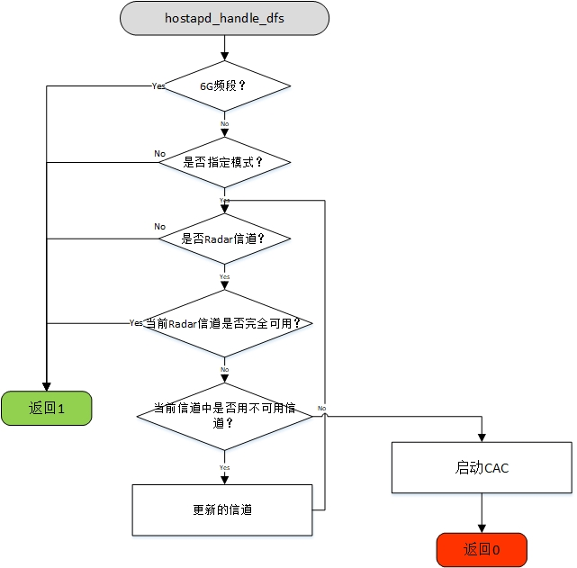

返回1说明当前指定的信道不需要CAC，setup_interface的过程将继续。返回0则终止该过程，直到收到NL80211_CMD_RADAR_DETECT事件。

对于DFS offload的驱动，CAC的过程不需要显示的启动。因为驱动在启动AP之前会主动检测信道是否是雷达信道。如果是雷达信道，则自动发起CAC的过程。hostapd不需要主动发送NL80211_CMD_RADAR_DETECT命令。hostapd只需要记住由于使用了DFS信道，驱动将花一定的时间完成CAC。因此interface的setup还不能够理解全部完成。FST的注册和interface的UP都需要等到CAC完成之后进行。未完成的部分将由hostapd_dfs_complete_cac调用hostapd_setup_interface_complete补上。两次调用执行的差异由iface->cac_started决定。在set_interface调用过程中，由于iface->cac_started的值为0，hostapd会将iface->freq传给驱动启动CAC。当hostapd收到驱动的EVENT_DFS_CAC_STARTED消息后，将iface->cac_started置为1。之后当hostapd收到驱动EVENT_DFS_CAC_FINISHED消息，hostapd_dfs_complete_cac被调用，再次进入hostapd_handle_dfs_offload时，iface->cac_started已经是1了，hostapd_handle_dfs_offload返回1，hostapd_setup_interface_complete_sync将补上前一个上下文中没有完成的工作。

#### beacon update

AP启动之后，将按照固定间隔周期性发送beacon。Hostapd可以指定AP所发送beacon的内容。hostapd通过调用ieee802_11_set_beacon将希望发送的beacon帧发送给设备驱动。由于beacon、probe resp、assoc resp有着相似的结构，因此它们将一起被传给设备驱动。相关参数由wpa_driver_ap_params对象保存。其中head、tail、beacon_ies用来记录beacon；proberesp、proberesp_ies用来记录probe resp；assocresp_ies用来记录assoc resp。这部分的代码在早期的设备驱动中可能非常重要，那时的设备驱动仅仅负责链路管理和数据发送，MAC层的部分功能由hostapd完成。于是组建这三种管理帧的任务便由hostapd完成。

Beacon、probe response和assoce response有着类似的结构：MAC header + fixed parameters + tagged parameters（IEs）。代码中 Beacon被分为了三个部分：head指向长度256字节固定长度的buffer，其中保存Beacon帧的MAC header、timestamp、beacon interval、supported rates、DSSS parameter。从目前代码可看出，tail和beacon_ies中有重复的内容，而两者之间的区别并非如代码注释中所说。大概随着wlan代码结构的演变，原先的设想已经被舍弃了。proberesp保存完整的probe response，这点与beacon不同。代码中不存在完整的assoce response，大概是因为assoc response拥有和其它两种管理帧类似的结构，可以复用部分数据。beacon_ies、proberesp_ies和assocresp_ies中保存着相应管理帧中会使用到的IE。

以上数据最终会以相同的组织结构传递给设备驱动，内核中对应的数据结构是struct cfg80211_beacon_data。由于目前的设备驱动多数已经将MAC层的功能完全offload，这样当驱动收到这些数据后，可能会忽略大部分的数据。譬如MAC header完全可以由设备驱动生成，Fixed parameters和多数的IEs也可以由设备驱动自行生成。不过vendor_elements并不会被设备驱动所忽略，因为某些应用可能需要在beacon中添加自定义的IE。

### ctrl interface

有两类控制接口：全局和interface。hostapd命令行-g选项指定全局控制接口的访问路径。全局控制接口由hostapd_global_ctrl_iface_init创建，从函数实现中我们可以看出：-g选项不是必须的，因此全局控制接口有可能不存在。 全局控制接口上的命令由hostapd_global_ctrl_iface_receive处理。每个interface都会有一个控制接口，由hostapd_ctrl_iface_init创建。通过源代码可以看到，该接口的访问路径可通过配置选项ctrl_interface指定。如果没有指定，则默认路径是/var/run/hostapd，每个interface对应的接口是该目录下与interface同名的socket文件。前台程序（例如：hostapd_cli)可以通过全局和interface控制接口和hostapd建立连接。

通过hostapd_global_ctrl_iface_receive，我们可以看到全局控制接口支持的命令有：

- **PING** 用于测试和hostapd连接是否成功
- **FLUSH** 刷新DPP缓存数据
- **ADD** 增加一个interface，其格式为ADD bss_config=<phy_name>:<bss_conf_file>
- **REMOVE** 删除一个interface，其格式为REMOVE <iface_name>
- **ATTACH** 将前端程序挂载到全局client链表
- **DETACH** 将前端程序从全局client链表移除
- **DUP_NETWORK** 将一个interface的某一个参数复制到另一个interface。 其格式为：DUP_NETWORK <src ifname> <dst ifname> <variable name> 。前支持的variable有：wpa、wpa_key_mgmt、wpa_pairwise、rsn_pairwise、wpa_passphrase、wpa_psk。
- **INTERFACES** 查询所有interface的配置信息
- **TERMINATE** 终止hostapd的运行

全局控制接口还可以将命令转发给具体的interface，命令的格式是：**IFNAME=**<iface> CMD <param1> <param2> ...。

interface控制接口上的命令是针对的是BSS。其格式与全局控制接口上的命令一样：CMD <param1> <param2> ...。由于使用了相同的命令格式，hostapd_global_ctrl_iface_receive和hostapd_ctrl_iface_receive对消息的处理步骤相同：首先检测消息头部的CMD；然后根据具体的CMD选择不同的处理函数。

对于具体的CMD，在涉及相关操作时，我再做详细介绍。本节希望大家能够对控制接口上的消息格式以及两个处理函数能有所了解。

### 底层通信的三条通道

hostapd 和 wpa_supplicant 处在"中间人"的位置：上方有 wpa_cli、NetworkManager 和各种脚本；下方是内核和无线固件；旁边还有对端 AP/STA 需要交换 EAPOL 帧。它同时维持着三种对话，每种走的通道都不一样。

#### 控制接口：UNIX 数据报套接字

在 `wpa_cli` 中敲一个 `status` 并回车，屏幕上就会返回结果。这条通道上传输的是纯文本命令，底层是一个 UNIX domain socket（默认数据报类型），路径由配置里的 `ctrl_interface=` 决定；接口级 socket 会带上接口名。

协议简单到近乎粗糙：客户端发一行命令，服务端回一行结果，`OK`/`FAIL` 是状态，其余是数据。若要接收事件推送，客户端须先发送 `ATTACH`，之后服务端会主动向该客户端推送事件行——`wpa_cli` 交互模式里那些 `<3>CTRL-EVENT-CONNECTED` 就是这么来的。

这里藏着一个不太起眼、但很关键的设计事实：控制接口没有认证机制。谁能连上这个 socket，谁就能指挥 wpa_supplicant（改配置、断连接、触发扫描）。所以它的权限完全靠文件系统权限和 socket 目录属主来兜底，这也是绝大多数发行版把它放在 `/run/wpa_supplicant` 并收紧访问的原因。这条边界的问题不小，在源码分析报告里单独成过一章，这里就不展开了。

#### netlink：与内核的命令和事件

真正让 WiFi 动起来的是 nl80211。用户态通过一个 netlink socket 向内核发送命令，内核用同一个 socket 返回响应，另外还会向多播组推送事件（扫描完成、认证结果、断开、雷达检测……）。

发送命令的公共出口是 `send_and_recv_glb()`（`src/drivers/driver_nl80211.c:640`）：

```c
int send_and_recv_glb(struct nl80211_global *global,
		      struct wpa_driver_nl80211_data *drv, /* may be NULL */
		      struct nl_sock *nl_handle, struct nl_msg *msg,
		      int (*valid_handler)(struct nl_msg *, void *),
		      void *valid_data,
		      int (*ack_handler_custom)(struct nl_msg *, void *),
		      void *ack_data,
		      struct nl80211_err_info *err_info)
```

函数名里的 `glb` 是有讲究的：有些命令属于"全局"（与具体接口无关，比如新建接口、注册帧），需要用全局 socket 发送；另一些命令则属于某个接口。hostap 中这两类命令共用这套收发逻辑，靠参数区分。

实际发送的动作在 `:683` 处的 `nl_send_auto_complete()`。注意 `auto_complete` 一词：libnl 会自动补全 netlink 头，包括序列号。而响应与命令的配对，正是靠这个序列号：发送时记录序号，接收时只认序号相同的回复，序号不匹配的一律按事件处理。

事件路径上还有个问题需要单独说一下。netlink 事件的回调在 socket 可读时触发，也就是在 eloop 的回调栈里执行；如果直接在回调中把事件交给上层处理，上层可能随即又发一条 netlink 命令，而这条命令的响应又会回到同一个 socket——构成重入。hostap 的解法是先把事件放入队列，再用零超时定时器"下一轮再放"：`nl80211_deliver_pending_events()`（`src/drivers/driver_nl80211.c:532`）配合 `pending_events` 链表，把事件推迟到主循环的下一次迭代。这套"推迟一轮"的机制，解决的是一个相当隐蔽的重入问题。绕过它的办法不止一种，这个算最省事的。

#### l2_packet：AF_PACKET 上的 EAPOL

WiFi 的安全握手需要交换 EAPOL 帧。这些帧是以太网帧（EtherType `0x888E`），在关联之前就得能够收发，而那时接口尚未"通"，不能使用普通 IP socket。因此 hostap 使用 `AF_PACKET` 原始套接字，抽象成 `l2_packet`，Linux 后端在 `src/l2_packet/l2_packet_linux.c`。

发送路径很短（`src/l2_packet/l2_packet_linux.c:115`）：

```c
int l2_packet_send(struct l2_packet_data *l2, const u8 *dst_addr, u16 proto,
		   const u8 *buf, size_t len)
{
	int ret;

	if (TEST_FAIL())
		return -1;
	if (l2 == NULL)
		return -1;
	if (l2->l2_hdr) {
		ret = send(l2->fd, buf, len, 0);
		...
```

`l2_hdr` 分支的含义是：缓冲区里已经带好以太网头就直接发送，否则自行拼一个 `sockaddr_ll` 再 `sendto`。看似琐碎的优化，实际是为不同调用方留的两种用法。

接收侧有一个容易忽略的时间点：套接字建好之后并不能立刻收到所有帧，得先主动加入多播组。这一步在 `l2_packet_notify_auth_start()`（`src/l2_packet/l2_packet_linux.c:479`），由关联完成的事件触发（`wpa_supplicant/events.c:5060`）。函数名里的 `auth_start` 含义是"马上要做认证了，准备接收 EAPOL"。

AP 侧和 STA 侧各有一套 `l2_packet`（`hapd->l2` 和 `wpa_s->l2`），preauth 还有一套独立的，彼此不复用。这不是浪费，因为它们要接收的帧、要添加的过滤规则并不一样。

<figure class="diagram">
<div class="diagram-box">
<svg style="max-width:100%;height:auto" id="fin1790155034056" xmlns="http://www.w3.org/2000/svg" class="flowchart" style="max-width: 925.375px;" viewBox="4 4 925.375 348.9166564941406" role="graphics-document document" aria-roledescription="flowchart-v2"><style>#fin1790155034056{font-family:"Recursive Variable",arial,sans-serif;font-size:14px;fill:#28253D;}@keyframes edge-animation-frame{from{stroke-dashoffset:0;}}@keyframes dash{to{stroke-dashoffset:0;}}#fin1790155034056 .edge-animation-slow{stroke-dasharray:9,5!important;stroke-dashoffset:900;animation:dash 50s linear infinite;stroke-linecap:round;}#fin1790155034056 .edge-animation-fast{stroke-dasharray:9,5!important;stroke-dashoffset:900;animation:dash 20s linear infinite;stroke-linecap:round;}#fin1790155034056 .error-icon{fill:#ffffff;}#fin1790155034056 .error-text{fill:#000000;stroke:#000000;}#fin1790155034056 .edge-thickness-normal{stroke-width:2px;}#fin1790155034056 .edge-thickness-thick{stroke-width:3.5px;}#fin1790155034056 .edge-pattern-solid{stroke-dasharray:0;}#fin1790155034056 .edge-thickness-invisible{stroke-width:0;fill:none;}#fin1790155034056 .edge-pattern-dashed{stroke-dasharray:3;}#fin1790155034056 .edge-pattern-dotted{stroke-dasharray:2;}#fin1790155034056 .marker{fill:#000000;stroke:#000000;}#fin1790155034056 .marker.cross{stroke:#000000;}#fin1790155034056 svg{font-family:"Recursive Variable",arial,sans-serif;font-size:14px;}#fin1790155034056 p{margin:0;}#fin1790155034056 [data-look="neo"][data-color-id="color-0"].cluster:not(.swimlane) rect{stroke:#E879F9;fill:#FDF4FF;}#fin1790155034056 [data-look="neo"][data-color-id="color-0"].cluster:not(.swimlane) path{stroke:#E879F9;fill:#FDF4FF;}#fin1790155034056 [data-look="neo"][data-color-id="color-0"].swimlane.cluster rect.swimlane-title,#fin1790155034056 [data-look="neo"][data-color-id="color-0"].swimlane.cluster rect.swimlane-body{stroke:#E879F9;fill:#FDF4FF;}#fin1790155034056 [data-look="neo"][data-color-id="color-0"].swimlane.cluster .swimlane-title path:nth-of-type(2),#fin1790155034056 [data-look="neo"][data-color-id="color-0"].swimlane.cluster .swimlane-body path:nth-of-type(2){stroke:#E879F9;}#fin1790155034056 [data-look="neo"][data-color-id="color-0"].swimlane.cluster .swimlane-title path:first-of-type,#fin1790155034056 [data-look="neo"][data-color-id="color-0"].swimlane.cluster .swimlane-body path:first-of-type{stroke:#FDF4FF;}#fin1790155034056 [data-look="neo"][data-color-id="color-0"].node .collapsed-group,#fin1790155034056 [data-look="neo"][data-color-id="color-0"].rough-node .collapsed-group,#fin1790155034056 [data-look="neo"][data-color-id="color-0"].node .collapsed-group path,#fin1790155034056 [data-look="neo"][data-color-id="color-0"].rough-node .collapsed-group path{stroke:#E879F9;fill:#FDF4FF;}#fin1790155034056 [data-look="neo"][data-color-id="color-0"].node .collapsed-indicator,#fin1790155034056 [data-look="neo"][data-color-id="color-0"].rough-node .collapsed-indicator{fill:#E879F9;}#fin1790155034056 [data-look="neo"][data-color-id="color-0"].node .collapsed-separator,#fin1790155034056 [data-look="neo"][data-color-id="color-0"].rough-node .collapsed-separator{stroke:#E879F9;}#fin1790155034056 [data-look="neo"][data-color-id="color-1"].cluster:not(.swimlane) rect{stroke:#2DD4BF;fill:#F0FDFA;}#fin1790155034056 [data-look="neo"][data-color-id="color-1"].cluster:not(.swimlane) path{stroke:#2DD4BF;fill:#F0FDFA;}#fin1790155034056 [data-look="neo"][data-color-id="color-1"].swimlane.cluster rect.swimlane-title,#fin1790155034056 [data-look="neo"][data-color-id="color-1"].swimlane.cluster rect.swimlane-body{stroke:#2DD4BF;fill:#F0FDFA;}#fin1790155034056 [data-look="neo"][data-color-id="color-1"].swimlane.cluster .swimlane-title path:nth-of-type(2),#fin1790155034056 [data-look="neo"][data-color-id="color-1"].swimlane.cluster .swimlane-body path:nth-of-type(2){stroke:#2DD4BF;}#fin1790155034056 [data-look="neo"][data-color-id="color-1"].swimlane.cluster .swimlane-title path:first-of-type,#fin1790155034056 [data-look="neo"][data-color-id="color-1"].swimlane.cluster .swimlane-body path:first-of-type{stroke:#F0FDFA;}#fin1790155034056 [data-look="neo"][data-color-id="color-1"].node .collapsed-group,#fin1790155034056 [data-look="neo"][data-color-id="color-1"].rough-node .collapsed-group,#fin1790155034056 [data-look="neo"][data-color-id="color-1"].node .collapsed-group path,#fin1790155034056 [data-look="neo"][data-color-id="color-1"].rough-node .collapsed-group path{stroke:#2DD4BF;fill:#F0FDFA;}#fin1790155034056 [data-look="neo"][data-color-id="color-1"].node .collapsed-indicator,#fin1790155034056 [data-look="neo"][data-color-id="color-1"].rough-node .collapsed-indicator{fill:#2DD4BF;}#fin1790155034056 [data-look="neo"][data-color-id="color-1"].node .collapsed-separator,#fin1790155034056 [data-look="neo"][data-color-id="color-1"].rough-node .collapsed-separator{stroke:#2DD4BF;}#fin1790155034056 [data-look="neo"][data-color-id="color-2"].cluster:not(.swimlane) rect{stroke:#FB923C;fill:#FFF7ED;}#fin1790155034056 [data-look="neo"][data-color-id="color-2"].cluster:not(.swimlane) path{stroke:#FB923C;fill:#FFF7ED;}#fin1790155034056 [data-look="neo"][data-color-id="color-2"].swimlane.cluster rect.swimlane-title,#fin1790155034056 [data-look="neo"][data-color-id="color-2"].swimlane.cluster rect.swimlane-body{stroke:#FB923C;fill:#FFF7ED;}#fin1790155034056 [data-look="neo"][data-color-id="color-2"].swimlane.cluster .swimlane-title path:nth-of-type(2),#fin1790155034056 [data-look="neo"][data-color-id="color-2"].swimlane.cluster .swimlane-body path:nth-of-type(2){stroke:#FB923C;}#fin1790155034056 [data-look="neo"][data-color-id="color-2"].swimlane.cluster .swimlane-title path:first-of-type,#fin1790155034056 [data-look="neo"][data-color-id="color-2"].swimlane.cluster .swimlane-body path:first-of-type{stroke:#FFF7ED;}#fin1790155034056 [data-look="neo"][data-color-id="color-2"].node .collapsed-group,#fin1790155034056 [data-look="neo"][data-color-id="color-2"].rough-node .collapsed-group,#fin1790155034056 [data-look="neo"][data-color-id="color-2"].node .collapsed-group path,#fin1790155034056 [data-look="neo"][data-color-id="color-2"].rough-node .collapsed-group path{stroke:#FB923C;fill:#FFF7ED;}#fin1790155034056 [data-look="neo"][data-color-id="color-2"].node .collapsed-indicator,#fin1790155034056 [data-look="neo"][data-color-id="color-2"].rough-node .collapsed-indicator{fill:#FB923C;}#fin1790155034056 [data-look="neo"][data-color-id="color-2"].node .collapsed-separator,#fin1790155034056 [data-look="neo"][data-color-id="color-2"].rough-node .collapsed-separator{stroke:#FB923C;}#fin1790155034056 [data-look="neo"][data-color-id="color-3"].cluster:not(.swimlane) rect{stroke:#22D3EE;fill:#ECFEFF;}#fin1790155034056 [data-look="neo"][data-color-id="color-3"].cluster:not(.swimlane) path{stroke:#22D3EE;fill:#ECFEFF;}#fin1790155034056 [data-look="neo"][data-color-id="color-3"].swimlane.cluster rect.swimlane-title,#fin1790155034056 [data-look="neo"][data-color-id="color-3"].swimlane.cluster rect.swimlane-body{stroke:#22D3EE;fill:#ECFEFF;}#fin1790155034056 [data-look="neo"][data-color-id="color-3"].swimlane.cluster .swimlane-title path:nth-of-type(2),#fin1790155034056 [data-look="neo"][data-color-id="color-3"].swimlane.cluster .swimlane-body path:nth-of-type(2){stroke:#22D3EE;}#fin1790155034056 [data-look="neo"][data-color-id="color-3"].swimlane.cluster .swimlane-title path:first-of-type,#fin1790155034056 [data-look="neo"][data-color-id="color-3"].swimlane.cluster .swimlane-body path:first-of-type{stroke:#ECFEFF;}#fin1790155034056 [data-look="neo"][data-color-id="color-3"].node .collapsed-group,#fin1790155034056 [data-look="neo"][data-color-id="color-3"].rough-node .collapsed-group,#fin1790155034056 [data-look="neo"][data-color-id="color-3"].node .collapsed-group path,#fin1790155034056 [data-look="neo"][data-color-id="color-3"].rough-node .collapsed-group path{stroke:#22D3EE;fill:#ECFEFF;}#fin1790155034056 [data-look="neo"][data-color-id="color-3"].node .collapsed-indicator,#fin1790155034056 [data-look="neo"][data-color-id="color-3"].rough-node .collapsed-indicator{fill:#22D3EE;}#fin1790155034056 [data-look="neo"][data-color-id="color-3"].node .collapsed-separator,#fin1790155034056 [data-look="neo"][data-color-id="color-3"].rough-node .collapsed-separator{stroke:#22D3EE;}#fin1790155034056 [data-look="neo"][data-color-id="color-4"].cluster:not(.swimlane) rect{stroke:#4ADE80;fill:#F0FDF4;}#fin1790155034056 [data-look="neo"][data-color-id="color-4"].cluster:not(.swimlane) path{stroke:#4ADE80;fill:#F0FDF4;}#fin1790155034056 [data-look="neo"][data-color-id="color-4"].swimlane.cluster rect.swimlane-title,#fin1790155034056 [data-look="neo"][data-color-id="color-4"].swimlane.cluster rect.swimlane-body{stroke:#4ADE80;fill:#F0FDF4;}#fin1790155034056 [data-look="neo"][data-color-id="color-4"].swimlane.cluster .swimlane-title path:nth-of-type(2),#fin1790155034056 [data-look="neo"][data-color-id="color-4"].swimlane.cluster .swimlane-body path:nth-of-type(2){stroke:#4ADE80;}#fin1790155034056 [data-look="neo"][data-color-id="color-4"].swimlane.cluster .swimlane-title path:first-of-type,#fin1790155034056 [data-look="neo"][data-color-id="color-4"].swimlane.cluster .swimlane-body path:first-of-type{stroke:#F0FDF4;}#fin1790155034056 [data-look="neo"][data-color-id="color-4"].node .collapsed-group,#fin1790155034056 [data-look="neo"][data-color-id="color-4"].rough-node .collapsed-group,#fin1790155034056 [data-look="neo"][data-color-id="color-4"].node .collapsed-group path,#fin1790155034056 [data-look="neo"][data-color-id="color-4"].rough-node .collapsed-group path{stroke:#4ADE80;fill:#F0FDF4;}#fin1790155034056 [data-look="neo"][data-color-id="color-4"].node .collapsed-indicator,#fin1790155034056 [data-look="neo"][data-color-id="color-4"].rough-node .collapsed-indicator{fill:#4ADE80;}#fin1790155034056 [data-look="neo"][data-color-id="color-4"].node .collapsed-separator,#fin1790155034056 [data-look="neo"][data-color-id="color-4"].rough-node .collapsed-separator{stroke:#4ADE80;}#fin1790155034056 [data-look="neo"][data-color-id="color-5"].cluster:not(.swimlane) rect{stroke:#A78BFA;fill:#F5F3FF;}#fin1790155034056 [data-look="neo"][data-color-id="color-5"].cluster:not(.swimlane) path{stroke:#A78BFA;fill:#F5F3FF;}#fin1790155034056 [data-look="neo"][data-color-id="color-5"].swimlane.cluster rect.swimlane-title,#fin1790155034056 [data-look="neo"][data-color-id="color-5"].swimlane.cluster rect.swimlane-body{stroke:#A78BFA;fill:#F5F3FF;}#fin1790155034056 [data-look="neo"][data-color-id="color-5"].swimlane.cluster .swimlane-title path:nth-of-type(2),#fin1790155034056 [data-look="neo"][data-color-id="color-5"].swimlane.cluster .swimlane-body path:nth-of-type(2){stroke:#A78BFA;}#fin1790155034056 [data-look="neo"][data-color-id="color-5"].swimlane.cluster .swimlane-title path:first-of-type,#fin1790155034056 [data-look="neo"][data-color-id="color-5"].swimlane.cluster .swimlane-body path:first-of-type{stroke:#F5F3FF;}#fin1790155034056 [data-look="neo"][data-color-id="color-5"].node .collapsed-group,#fin1790155034056 [data-look="neo"][data-color-id="color-5"].rough-node .collapsed-group,#fin1790155034056 [data-look="neo"][data-color-id="color-5"].node .collapsed-group path,#fin1790155034056 [data-look="neo"][data-color-id="color-5"].rough-node .collapsed-group path{stroke:#A78BFA;fill:#F5F3FF;}#fin1790155034056 [data-look="neo"][data-color-id="color-5"].node .collapsed-indicator,#fin1790155034056 [data-look="neo"][data-color-id="color-5"].rough-node .collapsed-indicator{fill:#A78BFA;}#fin1790155034056 [data-look="neo"][data-color-id="color-5"].node .collapsed-separator,#fin1790155034056 [data-look="neo"][data-color-id="color-5"].rough-node .collapsed-separator{stroke:#A78BFA;}#fin1790155034056 [data-look="neo"][data-color-id="color-6"].cluster:not(.swimlane) rect{stroke:#F87171;fill:#FEF2F2;}#fin1790155034056 [data-look="neo"][data-color-id="color-6"].cluster:not(.swimlane) path{stroke:#F87171;fill:#FEF2F2;}#fin1790155034056 [data-look="neo"][data-color-id="color-6"].swimlane.cluster rect.swimlane-title,#fin1790155034056 [data-look="neo"][data-color-id="color-6"].swimlane.cluster rect.swimlane-body{stroke:#F87171;fill:#FEF2F2;}#fin1790155034056 [data-look="neo"][data-color-id="color-6"].swimlane.cluster .swimlane-title path:nth-of-type(2),#fin1790155034056 [data-look="neo"][data-color-id="color-6"].swimlane.cluster .swimlane-body path:nth-of-type(2){stroke:#F87171;}#fin1790155034056 [data-look="neo"][data-color-id="color-6"].swimlane.cluster .swimlane-title path:first-of-type,#fin1790155034056 [data-look="neo"][data-color-id="color-6"].swimlane.cluster .swimlane-body path:first-of-type{stroke:#FEF2F2;}#fin1790155034056 [data-look="neo"][data-color-id="color-6"].node .collapsed-group,#fin1790155034056 [data-look="neo"][data-color-id="color-6"].rough-node .collapsed-group,#fin1790155034056 [data-look="neo"][data-color-id="color-6"].node .collapsed-group path,#fin1790155034056 [data-look="neo"][data-color-id="color-6"].rough-node .collapsed-group path{stroke:#F87171;fill:#FEF2F2;}#fin1790155034056 [data-look="neo"][data-color-id="color-6"].node .collapsed-indicator,#fin1790155034056 [data-look="neo"][data-color-id="color-6"].rough-node .collapsed-indicator{fill:#F87171;}#fin1790155034056 [data-look="neo"][data-color-id="color-6"].node .collapsed-separator,#fin1790155034056 [data-look="neo"][data-color-id="color-6"].rough-node .collapsed-separator{stroke:#F87171;}#fin1790155034056 [data-look="neo"][data-color-id="color-7"].cluster:not(.swimlane) rect{stroke:#FACC15;fill:#FEFCE8;}#fin1790155034056 [data-look="neo"][data-color-id="color-7"].cluster:not(.swimlane) path{stroke:#FACC15;fill:#FEFCE8;}#fin1790155034056 [data-look="neo"][data-color-id="color-7"].swimlane.cluster rect.swimlane-title,#fin1790155034056 [data-look="neo"][data-color-id="color-7"].swimlane.cluster rect.swimlane-body{stroke:#FACC15;fill:#FEFCE8;}#fin1790155034056 [data-look="neo"][data-color-id="color-7"].swimlane.cluster .swimlane-title path:nth-of-type(2),#fin1790155034056 [data-look="neo"][data-color-id="color-7"].swimlane.cluster .swimlane-body path:nth-of-type(2){stroke:#FACC15;}#fin1790155034056 [data-look="neo"][data-color-id="color-7"].swimlane.cluster .swimlane-title path:first-of-type,#fin1790155034056 [data-look="neo"][data-color-id="color-7"].swimlane.cluster .swimlane-body path:first-of-type{stroke:#FEFCE8;}#fin1790155034056 [data-look="neo"][data-color-id="color-7"].node .collapsed-group,#fin1790155034056 [data-look="neo"][data-color-id="color-7"].rough-node .collapsed-group,#fin1790155034056 [data-look="neo"][data-color-id="color-7"].node .collapsed-group path,#fin1790155034056 [data-look="neo"][data-color-id="color-7"].rough-node .collapsed-group path{stroke:#FACC15;fill:#FEFCE8;}#fin1790155034056 [data-look="neo"][data-color-id="color-7"].node .collapsed-indicator,#fin1790155034056 [data-look="neo"][data-color-id="color-7"].rough-node .collapsed-indicator{fill:#FACC15;}#fin1790155034056 [data-look="neo"][data-color-id="color-7"].node .collapsed-separator,#fin1790155034056 [data-look="neo"][data-color-id="color-7"].rough-node .collapsed-separator{stroke:#FACC15;}#fin1790155034056 [data-look="neo"][data-color-id="color-8"].cluster:not(.swimlane) rect{stroke:#818CF8;fill:#EEF2FF;}#fin1790155034056 [data-look="neo"][data-color-id="color-8"].cluster:not(.swimlane) path{stroke:#818CF8;fill:#EEF2FF;}#fin1790155034056 [data-look="neo"][data-color-id="color-8"].swimlane.cluster rect.swimlane-title,#fin1790155034056 [data-look="neo"][data-color-id="color-8"].swimlane.cluster rect.swimlane-body{stroke:#818CF8;fill:#EEF2FF;}#fin1790155034056 [data-look="neo"][data-color-id="color-8"].swimlane.cluster .swimlane-title path:nth-of-type(2),#fin1790155034056 [data-look="neo"][data-color-id="color-8"].swimlane.cluster .swimlane-body path:nth-of-type(2){stroke:#818CF8;}#fin1790155034056 [data-look="neo"][data-color-id="color-8"].swimlane.cluster .swimlane-title path:first-of-type,#fin1790155034056 [data-look="neo"][data-color-id="color-8"].swimlane.cluster .swimlane-body path:first-of-type{stroke:#EEF2FF;}#fin1790155034056 [data-look="neo"][data-color-id="color-8"].node .collapsed-group,#fin1790155034056 [data-look="neo"][data-color-id="color-8"].rough-node .collapsed-group,#fin1790155034056 [data-look="neo"][data-color-id="color-8"].node .collapsed-group path,#fin1790155034056 [data-look="neo"][data-color-id="color-8"].rough-node .collapsed-group path{stroke:#818CF8;fill:#EEF2FF;}#fin1790155034056 [data-look="neo"][data-color-id="color-8"].node .collapsed-indicator,#fin1790155034056 [data-look="neo"][data-color-id="color-8"].rough-node .collapsed-indicator{fill:#818CF8;}#fin1790155034056 [data-look="neo"][data-color-id="color-8"].node .collapsed-separator,#fin1790155034056 [data-look="neo"][data-color-id="color-8"].rough-node .collapsed-separator{stroke:#818CF8;}#fin1790155034056 [data-look="neo"][data-color-id="color-9"].cluster:not(.swimlane) rect{stroke:#A3E635;fill:#F7FEE7;}#fin1790155034056 [data-look="neo"][data-color-id="color-9"].cluster:not(.swimlane) path{stroke:#A3E635;fill:#F7FEE7;}#fin1790155034056 [data-look="neo"][data-color-id="color-9"].swimlane.cluster rect.swimlane-title,#fin1790155034056 [data-look="neo"][data-color-id="color-9"].swimlane.cluster rect.swimlane-body{stroke:#A3E635;fill:#F7FEE7;}#fin1790155034056 [data-look="neo"][data-color-id="color-9"].swimlane.cluster .swimlane-title path:nth-of-type(2),#fin1790155034056 [data-look="neo"][data-color-id="color-9"].swimlane.cluster .swimlane-body path:nth-of-type(2){stroke:#A3E635;}#fin1790155034056 [data-look="neo"][data-color-id="color-9"].swimlane.cluster .swimlane-title path:first-of-type,#fin1790155034056 [data-look="neo"][data-color-id="color-9"].swimlane.cluster .swimlane-body path:first-of-type{stroke:#F7FEE7;}#fin1790155034056 [data-look="neo"][data-color-id="color-9"].node .collapsed-group,#fin1790155034056 [data-look="neo"][data-color-id="color-9"].rough-node .collapsed-group,#fin1790155034056 [data-look="neo"][data-color-id="color-9"].node .collapsed-group path,#fin1790155034056 [data-look="neo"][data-color-id="color-9"].rough-node .collapsed-group path{stroke:#A3E635;fill:#F7FEE7;}#fin1790155034056 [data-look="neo"][data-color-id="color-9"].node .collapsed-indicator,#fin1790155034056 [data-look="neo"][data-color-id="color-9"].rough-node .collapsed-indicator{fill:#A3E635;}#fin1790155034056 [data-look="neo"][data-color-id="color-9"].node .collapsed-separator,#fin1790155034056 [data-look="neo"][data-color-id="color-9"].rough-node .collapsed-separator{stroke:#A3E635;}#fin1790155034056 [data-look="neo"][data-color-id="color-10"].cluster:not(.swimlane) rect{stroke:#38BDF8;fill:#F0F9FF;}#fin1790155034056 [data-look="neo"][data-color-id="color-10"].cluster:not(.swimlane) path{stroke:#38BDF8;fill:#F0F9FF;}#fin1790155034056 [data-look="neo"][data-color-id="color-10"].swimlane.cluster rect.swimlane-title,#fin1790155034056 [data-look="neo"][data-color-id="color-10"].swimlane.cluster rect.swimlane-body{stroke:#38BDF8;fill:#F0F9FF;}#fin1790155034056 [data-look="neo"][data-color-id="color-10"].swimlane.cluster .swimlane-title path:nth-of-type(2),#fin1790155034056 [data-look="neo"][data-color-id="color-10"].swimlane.cluster .swimlane-body path:nth-of-type(2){stroke:#38BDF8;}#fin1790155034056 [data-look="neo"][data-color-id="color-10"].swimlane.cluster .swimlane-title path:first-of-type,#fin1790155034056 [data-look="neo"][data-color-id="color-10"].swimlane.cluster .swimlane-body path:first-of-type{stroke:#F0F9FF;}#fin1790155034056 [data-look="neo"][data-color-id="color-10"].node .collapsed-group,#fin1790155034056 [data-look="neo"][data-color-id="color-10"].rough-node .collapsed-group,#fin1790155034056 [data-look="neo"][data-color-id="color-10"].node .collapsed-group path,#fin1790155034056 [data-look="neo"][data-color-id="color-10"].rough-node .collapsed-group path{stroke:#38BDF8;fill:#F0F9FF;}#fin1790155034056 [data-look="neo"][data-color-id="color-10"].node .collapsed-indicator,#fin1790155034056 [data-look="neo"][data-color-id="color-10"].rough-node .collapsed-indicator{fill:#38BDF8;}#fin1790155034056 [data-look="neo"][data-color-id="color-10"].node .collapsed-separator,#fin1790155034056 [data-look="neo"][data-color-id="color-10"].rough-node .collapsed-separator{stroke:#38BDF8;}#fin1790155034056 [data-look="neo"][data-color-id="color-11"].cluster:not(.swimlane) rect{stroke:#FB7185;fill:#FFF1F2;}#fin1790155034056 [data-look="neo"][data-color-id="color-11"].cluster:not(.swimlane) path{stroke:#FB7185;fill:#FFF1F2;}#fin1790155034056 [data-look="neo"][data-color-id="color-11"].swimlane.cluster rect.swimlane-title,#fin1790155034056 [data-look="neo"][data-color-id="color-11"].swimlane.cluster rect.swimlane-body{stroke:#FB7185;fill:#FFF1F2;}#fin1790155034056 [data-look="neo"][data-color-id="color-11"].swimlane.cluster .swimlane-title path:nth-of-type(2),#fin1790155034056 [data-look="neo"][data-color-id="color-11"].swimlane.cluster .swimlane-body path:nth-of-type(2){stroke:#FB7185;}#fin1790155034056 [data-look="neo"][data-color-id="color-11"].swimlane.cluster .swimlane-title path:first-of-type,#fin1790155034056 [data-look="neo"][data-color-id="color-11"].swimlane.cluster .swimlane-body path:first-of-type{stroke:#FFF1F2;}#fin1790155034056 [data-look="neo"][data-color-id="color-11"].node .collapsed-group,#fin1790155034056 [data-look="neo"][data-color-id="color-11"].rough-node .collapsed-group,#fin1790155034056 [data-look="neo"][data-color-id="color-11"].node .collapsed-group path,#fin1790155034056 [data-look="neo"][data-color-id="color-11"].rough-node .collapsed-group path{stroke:#FB7185;fill:#FFF1F2;}#fin1790155034056 [data-look="neo"][data-color-id="color-11"].node .collapsed-indicator,#fin1790155034056 [data-look="neo"][data-color-id="color-11"].rough-node .collapsed-indicator{fill:#FB7185;}#fin1790155034056 [data-look="neo"][data-color-id="color-11"].node .collapsed-separator,#fin1790155034056 [data-look="neo"][data-color-id="color-11"].rough-node .collapsed-separator{stroke:#FB7185;}#fin1790155034056 .label{font-family:"Recursive Variable",arial,sans-serif;color:#28253D;}#fin1790155034056 .cluster-label text{fill:#000000;}#fin1790155034056 .cluster-label span{color:#000000;}#fin1790155034056 .cluster-label span p{background-color:transparent;}#fin1790155034056 .label text,#fin1790155034056 span{fill:#28253D;color:#28253D;}#fin1790155034056 .node rect,#fin1790155034056 .node circle,#fin1790155034056 .node ellipse,#fin1790155034056 .node polygon,#fin1790155034056 .node path{fill:#ffffff;stroke:#28253D;stroke-width:2px;}#fin1790155034056 .rough-node .label text,#fin1790155034056 .node .label text,#fin1790155034056 .image-shape .label,#fin1790155034056 .icon-shape .label{text-anchor:middle;}#fin1790155034056 .node .katex path{fill:#000;stroke:#000;stroke-width:1px;}#fin1790155034056 .rough-node .label,#fin1790155034056 .node .label,#fin1790155034056 .image-shape .label,#fin1790155034056 .icon-shape .label{text-align:center;}#fin1790155034056 .node.clickable{cursor:pointer;}#fin1790155034056 .root .anchor path{fill:#000000!important;stroke-width:0;stroke:#000000;}#fin1790155034056 .arrowheadPath{fill:#000000;}#fin1790155034056 .edgePaths .path{stroke:#000000;stroke-width:2px;}#fin1790155034056 .flowchart-link{stroke:#000000;fill:none;}#fin1790155034056 .edgeLabel{background-color:hsl(-120, 0%, 80%);text-align:center;}#fin1790155034056 .edgeLabel p{background-color:hsl(-120, 0%, 80%);}#fin1790155034056 .edgeLabel rect{opacity:0.5;background-color:hsl(-120, 0%, 80%);fill:hsl(-120, 0%, 80%);}#fin1790155034056 .labelBkg{background-color:rgba(204, 204, 204, 0.5);}#fin1790155034056 .cluster rect{fill:#F9F9FB;stroke:#BDBCCC;stroke-width:1px;}#fin1790155034056 .cluster text{fill:#000000;}#fin1790155034056 .cluster span{color:#000000;}#fin1790155034056 .node .collapsed-indicator{fill:#BDBCCC;stroke:none;opacity:0.6;}#fin1790155034056 .node .collapsed-separator{stroke:#BDBCCC;stroke-width:0.75px;}#fin1790155034056 div.mermaidTooltip{position:absolute;text-align:center;max-width:200px;padding:2px;font-family:"Recursive Variable",arial,sans-serif;font-size:12px;background:#ffffff;border:1px solid hsl(0, 0%, 90%);border-radius:2px;pointer-events:none;z-index:100;}#fin1790155034056 .flowchartTitleText{text-anchor:middle;font-size:18px;fill:#28253D;}#fin1790155034056 rect.text{fill:none;stroke-width:0;}#fin1790155034056 .icon-shape,#fin1790155034056 .image-shape{background-color:hsl(-120, 0%, 80%);text-align:center;}#fin1790155034056 .icon-shape p,#fin1790155034056 .image-shape p{background-color:hsl(-120, 0%, 80%);padding:2px;}#fin1790155034056 .icon-shape .label rect,#fin1790155034056 .image-shape .label rect{opacity:0.5;background-color:hsl(-120, 0%, 80%);fill:hsl(-120, 0%, 80%);}#fin1790155034056 .label-icon{display:inline-block;height:1em;overflow:visible;vertical-align:-0.125em;}#fin1790155034056 .node .label-icon path{fill:currentColor;stroke:revert;stroke-width:revert;}#fin1790155034056 .node .neo-node{stroke:#28253D;}#fin1790155034056 [data-look="neo"].node rect,#fin1790155034056 [data-look="neo"].cluster rect,#fin1790155034056 [data-look="neo"].node polygon{stroke:#28253D;filter:url(#fin1790155034056-drop-shadow);}#fin1790155034056 [data-look="neo"].swimlane.cluster rect{filter:none;}#fin1790155034056 [data-look="neo"].node path{stroke:#28253D;stroke-width:2px;}#fin1790155034056 [data-look="neo"].node .outer-path{filter:url(#fin1790155034056-drop-shadow);}#fin1790155034056 [data-look="neo"].node .neo-line path{stroke:#28253D;filter:none;}#fin1790155034056 [data-look="neo"].node circle{stroke:#28253D;filter:url(#fin1790155034056-drop-shadow);}#fin1790155034056 [data-look="neo"].node circle .state-start{fill:#000000;}#fin1790155034056 [data-look="neo"].icon-shape .icon{fill:#28253D;filter:url(#fin1790155034056-drop-shadow);}#fin1790155034056 [data-look="neo"].icon-shape .icon-neo path{stroke:#28253D;filter:url(#fin1790155034056-drop-shadow);}#fin1790155034056 :root{--mermaid-font-family:"trebuchet ms",verdana,arial,sans-serif;}</style><g><marker id="fin1790155034056_flowchart-v2-pointEnd" class="marker flowchart-v2" viewBox="0 0 10 10" refX="5" refY="5" markerUnits="userSpaceOnUse" markerWidth="8" markerHeight="8" orient="auto"><path d="M 0 0 L 10 5 L 0 10 z" class="arrowMarkerPath" style="stroke-width: 1; stroke-dasharray: 1, 0;"></path></marker><marker id="fin1790155034056_flowchart-v2-pointStart" class="marker flowchart-v2" viewBox="0 0 10 10" refX="4.5" refY="5" markerUnits="userSpaceOnUse" markerWidth="8" markerHeight="8" orient="auto"><path d="M 0 5 L 10 10 L 10 0 z" class="arrowMarkerPath" style="stroke-width: 1; stroke-dasharray: 1, 0;"></path></marker><marker id="fin1790155034056_flowchart-v2-pointEnd-margin" class="marker flowchart-v2" viewBox="0 0 11.5 14" refX="11.5" refY="7" markerUnits="userSpaceOnUse" markerWidth="10.5" markerHeight="14" orient="auto"><path d="M 0 0 L 11.5 7 L 0 14 z" class="arrowMarkerPath" style="stroke-width: 0; stroke-dasharray: 1, 0;"></path></marker><marker id="fin1790155034056_flowchart-v2-pointStart-margin" class="marker flowchart-v2" viewBox="0 0 11.5 14" refX="1" refY="7" markerUnits="userSpaceOnUse" markerWidth="11.5" markerHeight="14" orient="auto"><polygon points="0,7 11.5,14 11.5,0" class="arrowMarkerPath" style="stroke-width: 0; stroke-dasharray: 1, 0;"></polygon></marker><marker id="fin1790155034056_flowchart-v2-circleEnd" class="marker flowchart-v2" viewBox="0 0 10 10" refX="11" refY="5" markerUnits="userSpaceOnUse" markerWidth="11" markerHeight="11" orient="auto"><circle cx="5" cy="5" r="5" class="arrowMarkerPath" style="stroke-width: 1; stroke-dasharray: 1, 0;"></circle></marker><marker id="fin1790155034056_flowchart-v2-circleStart" class="marker flowchart-v2" viewBox="0 0 10 10" refX="-1" refY="5" markerUnits="userSpaceOnUse" markerWidth="11" markerHeight="11" orient="auto"><circle cx="5" cy="5" r="5" class="arrowMarkerPath" style="stroke-width: 1; stroke-dasharray: 1, 0;"></circle></marker><marker id="fin1790155034056_flowchart-v2-circleEnd-margin" class="marker flowchart-v2" viewBox="0 0 10 10" refY="5" refX="12.25" markerUnits="userSpaceOnUse" markerWidth="14" markerHeight="14" orient="auto"><circle cx="5" cy="5" r="5" class="arrowMarkerPath" style="stroke-width: 0; stroke-dasharray: 1, 0;"></circle></marker><marker id="fin1790155034056_flowchart-v2-circleStart-margin" class="marker flowchart-v2" viewBox="0 0 10 10" refX="-2" refY="5" markerUnits="userSpaceOnUse" markerWidth="14" markerHeight="14" orient="auto"><circle cx="5" cy="5" r="5" class="arrowMarkerPath" style="stroke-width: 0; stroke-dasharray: 1, 0;"></circle></marker><marker id="fin1790155034056_flowchart-v2-crossEnd" class="marker cross flowchart-v2" viewBox="0 0 11 11" refX="12" refY="5.2" markerUnits="userSpaceOnUse" markerWidth="11" markerHeight="11" orient="auto"><path d="M 1,1 l 9,9 M 10,1 l -9,9" class="arrowMarkerPath" style="stroke-width: 2; stroke-dasharray: 1, 0;"></path></marker><marker id="fin1790155034056_flowchart-v2-crossStart" class="marker cross flowchart-v2" viewBox="0 0 11 11" refX="-1" refY="5.2" markerUnits="userSpaceOnUse" markerWidth="11" markerHeight="11" orient="auto"><path d="M 1,1 l 9,9 M 10,1 l -9,9" class="arrowMarkerPath" style="stroke-width: 2; stroke-dasharray: 1, 0;"></path></marker><marker id="fin1790155034056_flowchart-v2-crossEnd-margin" class="marker cross flowchart-v2" viewBox="0 0 15 15" refX="17.7" refY="7.5" markerUnits="userSpaceOnUse" markerWidth="12" markerHeight="12" orient="auto"><path d="M 1,1 L 14,14 M 1,14 L 14,1" class="arrowMarkerPath" style="stroke-width: 2.5;"></path></marker><marker id="fin1790155034056_flowchart-v2-crossStart-margin" class="marker cross flowchart-v2" viewBox="0 0 15 15" refX="-3.5" refY="7.5" markerUnits="userSpaceOnUse" markerWidth="12" markerHeight="12" orient="auto"><path d="M 1,1 L 14,14 M 1,14 L 14,1" class="arrowMarkerPath" style="stroke-width: 2.5; stroke-dasharray: 1, 0;"></path></marker><g class="root"><g class="clusters"></g><g class="edges edgePaths"><path d="M164,143.91666666666669L361.375,143.91666666666669" id="fin1790155034056-L_CLI_CORE_0" class=" edge-thickness-normal edge-pattern-solid edge-thickness-normal edge-pattern-solid flowchart-link" style="stroke-dasharray: 0 0 193.375 4; stroke-dashoffset: 0;;" data-edge="true" data-et="edge" data-id="L_CLI_CORE_0" data-points="W3sieCI6MTY0LCJ5IjoxNDMuOTE2NjY2NjY2NjY2Njl9LHsieCI6MzY1LjM3NSwieSI6MTQzLjkxNjY2NjY2NjY2NjY5fV0=" data-look="neo" marker-end="url(#fin1790155034056_flowchart-v2-pointEnd-margin)"></path><path d="M517.375,130.11666666666667L530.3039321881345,130.11666666666667Q537.375,130.11666666666667 537.375,123.0455988548012L537.375,40.571067811865476Q537.375,33.5 544.4460678118655,33.5L742.3039321881345,33.5Q749.375,33.5 749.375,40.571067811865476L749.375,46.76226552146786Q749.375,53.833333333333336 756.4460678118655,53.833333333333336L765.375,53.833333333333336" id="fin1790155034056-L_CORE_K_0" class=" edge-thickness-normal edge-pattern-solid edge-thickness-normal edge-pattern-solid flowchart-link" style="stroke-dasharray: 0 0 350.29345703125 4; stroke-dashoffset: 0;;" data-edge="true" data-et="edge" data-id="L_CORE_K_0" data-points="W3sieCI6NTE3LjM3NSwieSI6MTMwLjExNjY2NjY2NjY2NjY3fSx7IngiOjUzNy4zNzUsInkiOjEzMC4xMTY2NjY2NjY2NjY2N30seyJ4Ijo1MzcuMzc1LCJ5IjozMy41fSx7IngiOjc0OS4zNzUsInkiOjMzLjV9LHsieCI6NzQ5LjM3NSwieSI6NTMuODMzMzMzMzMzMzMzMzM2fSx7IngiOjc2OS4zNzUsInkiOjUzLjgzMzMzMzMzMzMzMzMzNn1d" data-look="neo" marker-end="url(#fin1790155034056_flowchart-v2-pointEnd-margin)"></path><path d="M769.375,76.16666666666666L756.4460678118655,76.16666666666666Q749.375,76.16666666666666 749.375,83.23773447853213L749.375,89.42893218813452Q749.375,96.5 742.3039321881345,96.5L564.4460678118655,96.5Q557.375,96.5 557.375,103.57106781186548L557.375,132.2455988548012Q557.375,139.31666666666666 550.3039321881345,139.31666666666666L521.375,139.31666666666666" id="fin1790155034056-L_K_CORE_0" class=" edge-thickness-normal edge-pattern-solid edge-thickness-normal edge-pattern-solid flowchart-link" style="stroke-dasharray: 0 0 296.49346923828125 4; stroke-dashoffset: 0;;" data-edge="true" data-et="edge" data-id="L_K_CORE_0" data-points="W3sieCI6NzY5LjM3NSwieSI6NzYuMTY2NjY2NjY2NjY2NjZ9LHsieCI6NzQ5LjM3NSwieSI6NzYuMTY2NjY2NjY2NjY2NjZ9LHsieCI6NzQ5LjM3NSwieSI6OTYuNX0seyJ4Ijo1NTcuMzc1LCJ5Ijo5Ni41fSx7IngiOjU1Ny4zNzUsInkiOjEzOS4zMTY2NjY2NjY2NjY2Nn0seyJ4Ijo1MTcuMzc1LCJ5IjoxMzkuMzE2NjY2NjY2NjY2NjZ9XQ==" data-look="neo" marker-end="url(#fin1790155034056_flowchart-v2-pointEnd-margin)"></path><path d="M521.375,148.51666666666668L550.3039321881345,148.51666666666668Q557.375,148.51666666666668 557.375,155.58773447853216L557.375,168.34559885480118Q557.375,175.41666666666666 564.4460678118655,175.41666666666666L765.375,175.41666666666666" id="fin1790155034056-L_CORE_PEER_0" class=" edge-thickness-normal edge-pattern-solid edge-thickness-normal edge-pattern-solid flowchart-link" style="stroke-dasharray: 0 4 257.57171630859375 4; stroke-dashoffset: 0;;" data-edge="true" data-et="edge" data-id="L_CORE_PEER_0" data-points="W3sieCI6NTE3LjM3NSwieSI6MTQ4LjUxNjY2NjY2NjY2NjY4fSx7IngiOjU1Ny4zNzUsInkiOjE0OC41MTY2NjY2NjY2NjY2OH0seyJ4Ijo1NTcuMzc1LCJ5IjoxNzUuNDE2NjY2NjY2NjY2NjZ9LHsieCI6NzY5LjM3NSwieSI6MTc1LjQxNjY2NjY2NjY2NjY2fV0=" data-look="neo" marker-start="url(#fin1790155034056_flowchart-v2-pointStart-margin)" marker-end="url(#fin1790155034056_flowchart-v2-pointEnd-margin)"></path><path d="M517.375,157.71666666666667L530.3039321881345,157.71666666666667Q537.375,157.71666666666667 537.375,164.78773447853214L537.375,283.8455988548012Q537.375,290.9166666666667 544.4460678118655,290.9166666666667L577.375,290.9166666666667" id="fin1790155034056-L_CORE_E_0" class=" edge-thickness-normal edge-pattern-solid edge-thickness-normal edge-pattern-solid flowchart-link" style="stroke-dasharray: 0 0 187.87171936035156 0; stroke-dashoffset: 0;;" data-edge="true" data-et="edge" data-id="L_CORE_E_0" data-points="W3sieCI6NTE3LjM3NSwieSI6MTU3LjcxNjY2NjY2NjY2NjY3fSx7IngiOjUzNy4zNzUsInkiOjE1Ny43MTY2NjY2NjY2NjY2N30seyJ4Ijo1MzcuMzc1LCJ5IjoyOTAuOTE2NjY2NjY2NjY2N30seyJ4Ijo1NzcuMzc1LCJ5IjoyOTAuOTE2NjY2NjY2NjY2N31d" data-look="neo"></path></g><g class="edgeLabels"><g class="edgeLabel" transform="translate(264.6875, 143.41666666666669)"><g class="label" data-id="L_CLI_CORE_0" transform="translate(-60.6875, -21)"><foreignObject height="42"><div xmlns="http://www.w3.org/1999/xhtml" class="labelBkg" style="display: table-cell; white-space: nowrap; line-height: 1.5; max-width: 200px; text-align: center;"><span class="edgeLabel "><p>文本命令<br/>UNIX dgram socket</p></span></div></foreignObject></g></g><g class="edgeLabel" transform="translate(653.375, 33)"><g class="label" data-id="L_CORE_K_0" transform="translate(-55.4453125, -21)"><foreignObject width="110.890625" height="42"><div xmlns="http://www.w3.org/1999/xhtml" class="labelBkg" style="display: table-cell; white-space: nowrap; line-height: 1.5; max-width: 200px; text-align: center;"><span class="edgeLabel "><p>nl80211 命令<br/>netlink + seq 配对</p></span></div></foreignObject></g></g><g class="edgeLabel" transform="translate(653.375, 96)"><g class="label" data-id="L_K_CORE_0" transform="translate(-35, -21)"><foreignObject width="70" height="42"><div xmlns="http://www.w3.org/1999/xhtml" class="labelBkg" style="display: table-cell; white-space: nowrap; line-height: 1.5; max-width: 200px; text-align: center;"><span class="edgeLabel "><p>多播事件<br/>排队后重放</p></span></div></foreignObject></g></g><g class="edgeLabel" transform="translate(653.375, 174.91666666666666)"><g class="label" data-id="L_CORE_PEER_0" transform="translate(-65.890625, -21)"><foreignObject width="131.78125" height="42"><div xmlns="http://www.w3.org/1999/xhtml" class="labelBkg" style="display: table-cell; white-space: nowrap; line-height: 1.5; max-width: 200px; text-align: center;"><span class="edgeLabel "><p>EAPOL 帧<br/>AF_PACKET 0x888E</p></span></div></foreignObject></g></g></g><g class="nodes"><g class="node default  " id="fin1790155034056-flowchart-CLI-0" data-look="neo" transform="translate(88, 143.91666666666669)"><rect class="basic label-container" style="" x="-76" y="-43.5" width="152" height="87"></rect><g class="label" style="" transform="translate(-60, -31.5)"><rect></rect><foreignObject width="120" height="63"><div xmlns="http://www.w3.org/1999/xhtml" style="display: table; white-space: break-spaces; line-height: 1.5; max-width: 120px; text-align: center; width: 120px;"><span class="nodeLabel "><p>wpa_cli / hostapd_cli /<br/>NetworkManager</p></span></div></foreignObject></g></g><g class="node default  " id="fin1790155034056-flowchart-CORE-1" data-look="neo" transform="translate(441.375, 143.91666666666669)"><rect class="basic label-container" style="" x="-76" y="-33" width="152" height="66"></rect><g class="label" style="" transform="translate(-60, -21)"><rect></rect><foreignObject width="120" height="42"><div xmlns="http://www.w3.org/1999/xhtml" style="display: table; white-space: nowrap; line-height: 1.5; max-width: 120px; text-align: center; width: 120px;"><span class="nodeLabel "><p>hostapd /<br/>wpa_supplicant</p></span></div></foreignObject></g></g><g class="node default  " id="fin1790155034056-flowchart-K-3" data-look="neo" transform="translate(845.375, 65)"><rect class="basic label-container" style="" x="-76" y="-43.5" width="152" height="87"></rect><g class="label" style="" transform="translate(-60, -31.5)"><rect></rect><foreignObject width="120" height="63"><div xmlns="http://www.w3.org/1999/xhtml" style="display: table; white-space: break-spaces; line-height: 1.5; max-width: 120px; text-align: center; width: 120px;"><span class="nodeLabel "><p>内核<br/>cfg80211 / mac80211</p></span></div></foreignObject></g></g><g class="node default  " id="fin1790155034056-flowchart-PEER-7" data-look="neo" transform="translate(845.375, 175.41666666666666)"><rect class="basic label-container" style="" x="-76" y="-22.5" width="152" height="45"></rect><g class="label" style="" transform="translate(-60, -10.5)"><rect></rect><foreignObject width="120" height="21"><div xmlns="http://www.w3.org/1999/xhtml" style="display: table; white-space: nowrap; line-height: 1.5; max-width: 120px; text-align: center; width: 120px;"><span class="nodeLabel "><p>对端 AP / STA</p></span></div></foreignObject></g></g><g class="node default  " id="fin1790155034056-flowchart-E-9" data-look="neo" transform="translate(653.375, 290.91666666666663)"><rect class="basic label-container" style="" x="-76" y="-54" width="152" height="108"></rect><g class="label" style="" transform="translate(-60, -42)"><rect></rect><foreignObject width="120" height="84"><div xmlns="http://www.w3.org/1999/xhtml" style="display: table; white-space: break-spaces; line-height: 1.5; max-width: 120px; text-align: center; width: 120px;"><span class="nodeLabel "><p>eloop：所有 socket 都注册在这里<br/>src/utils/eloop.c</p></span></div></foreignObject></g></g></g></g></g><defs><filter id="fin1790155034056-drop-shadow" height="130%" width="130%"><feDropShadow dx="4" dy="4" stdDeviation="0" flood-opacity="0.06" flood-color="#000000"></feDropShadow></filter></defs><defs><filter id="fin1790155034056-drop-shadow-small" height="150%" width="150%"><feDropShadow dx="2" dy="2" stdDeviation="0" flood-opacity="0.06" flood-color="#000000"></feDropShadow></filter></defs></svg>
</div>
<figcaption>图 2　三条通信通道：控制接口、netlink（内核）、EAPOL（对端）</figcaption>
</figure>

三条通道的共同点是都"注册进 eloop，由回调驱动"。区别在受众：控制接口给人看，协议松散、可脚本化；netlink 给内核看，配对严格、错误码齐全；二层通道给对端看，帧格式由 802.11/802.1X 标准定死。

调试时按这三条通道划分，通常不会迷路：命令没有生效就查控制接口，动作没有下发就查 netlink（`nl80211` 相关的 debug 日志会打出命令名），握手没有走完就抓 EAPOL。

### 设备接入

STA接入一个BSS的过程如下图。如果是open的BSS，则无需红色4步握手这一过程。

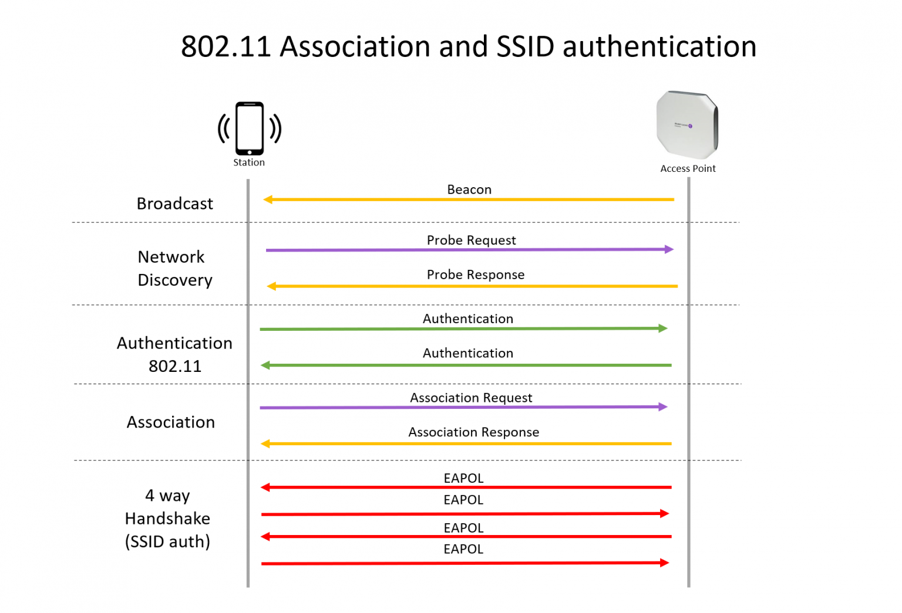

802.11管理帧的处理有两种方式：由设备驱动处理、由hostapd处理。当需要由hostapd处理时，cfg80211会通过NL80211_CMD_FRAME将该管理帧上报到用户空间。如果设备驱动本身能够处理管理帧，则设备驱动会另cfg80211将相应的事件上报用户空间。

前文介绍驱动初始化时，看到nl80211_init_bss会向eloop注册一个nl80211 socket，其对应的接收处理函数是process_bss_event。process_bss_event一个功能便是负责处理收到各种802.11管理帧。cfg80211会将设备驱动收到的802.11管理帧通过NL80211_CMD_FRAME事件发送到用户空间，而此时hostapd正在等待该事件。确切点是：eloop模块会被唤醒，并根据具体的socket调用相应的处理函数。对于NL80211_CMD_FRAME，则是process_bss_event会被调用。这个函数不长，我把它贴在下面：

```c
int process_bss_event(struct nl_msg *msg, void *arg)
{
	struct i802_bss *bss = arg;
	struct genlmsghdr *gnlh = nlmsg_data(nlmsg_hdr(msg));
	struct nlattr *tb[NL80211_ATTR_MAX + 1];

	nla_parse(tb, NL80211_ATTR_MAX, genlmsg_attrdata(gnlh, 0),
		  genlmsg_attrlen(gnlh, 0), NULL);

	wpa_printf(MSG_DEBUG, "nl80211: BSS Event %d (%s) received for %s",
		   gnlh->cmd, nl80211_command_to_string(gnlh->cmd),
		   bss->ifname);

	switch (gnlh->cmd) {
	case NL80211_CMD_FRAME:
	case NL80211_CMD_FRAME_TX_STATUS:
		mlme_event(bss, gnlh->cmd, tb[NL80211_ATTR_FRAME],
			   tb[NL80211_ATTR_MAC], tb[NL80211_ATTR_TIMED_OUT],
			   tb[NL80211_ATTR_WIPHY_FREQ], tb[NL80211_ATTR_ACK],
			   tb[NL80211_ATTR_COOKIE],
			   tb[NL80211_ATTR_RX_SIGNAL_DBM],
			   tb[NL80211_ATTR_STA_WME], NULL);
		break;
	case NL80211_CMD_UNEXPECTED_FRAME:
		nl80211_spurious_frame(bss, tb, 0);
		break;
	case NL80211_CMD_UNEXPECTED_4ADDR_FRAME:
		nl80211_spurious_frame(bss, tb, 1);
		break;
	case NL80211_CMD_EXTERNAL_AUTH:
		nl80211_external_auth(bss->drv, tb);
		break;
	case NL80211_CMD_CONTROL_PORT_FRAME:
		nl80211_control_port_frame(bss->drv, tb);
		break;
	default:
		wpa_printf(MSG_DEBUG, "nl80211: Ignored unknown event "
			   "(cmd=%d)", gnlh->cmd);
		break;
	}

	return NL_SKIP;
}
```

这里tb[NL80211_ATTR_FRAME]就是收到的管理帧。注意到这里执行的上下文是在driver wrapper，具体到以上代码是nl80211驱动。由于hostapd支持不同种类的驱动，因此驱动事件需要转义成wpa supplicant事件。这里NL80211_CMD_FRAME会被转换成EVENT_RX_MGMT。

```c
static void mlme_event_mgmt(struct i802_bss *bss,
			    struct nlattr *freq, struct nlattr *sig,
			    const u8 *frame, size_t len)
{
	struct wpa_driver_nl80211_data *drv = bss->drv;
	const struct ieee80211_mgmt *mgmt;
	union wpa_event_data event;
	u16 fc, stype;
	int ssi_signal = 0;
	int rx_freq = 0;

	wpa_printf(MSG_MSGDUMP, "nl80211: Frame event");
	mgmt = (const struct ieee80211_mgmt *) frame;
	if (len < 24) {
		wpa_printf(MSG_DEBUG, "nl80211: Too short management frame");
		return;
	}

	fc = le_to_host16(mgmt->frame_control);
	stype = WLAN_FC_GET_STYPE(fc);

	if (sig)
		ssi_signal = (s32) nla_get_u32(sig);

	os_memset(&event, 0, sizeof(event));
	if (freq) {
		event.rx_mgmt.freq = nla_get_u32(freq);
		rx_freq = drv->last_mgmt_freq = event.rx_mgmt.freq;
	}
	wpa_printf(MSG_DEBUG,
		   "nl80211: RX frame da=" MACSTR " sa=" MACSTR " bssid=" MACSTR
		   " freq=%d ssi_signal=%d fc=0x%x seq_ctrl=0x%x stype=%u (%s) len=%u",
		   MAC2STR(mgmt->da), MAC2STR(mgmt->sa), MAC2STR(mgmt->bssid),
		   rx_freq, ssi_signal, fc,
		   le_to_host16(mgmt->seq_ctrl), stype, fc2str(fc),
		   (unsigned int) len);
	event.rx_mgmt.frame = frame;
	event.rx_mgmt.frame_len = len;
	event.rx_mgmt.ssi_signal = ssi_signal;
	event.rx_mgmt.drv_priv = bss;
	wpa_supplicant_event(drv->ctx, EVENT_RX_MGMT, &event);
}
```

需要注意的是nl80211驱动wrapper的私有数据被保存在event.rx_mgmt.drv_priv，以wpa supplicant事件的方式转交wpa 模块处理。在wpa_supplicant_event中，我们会发现此时编译宏NEED_AP_MLME应该被定义，否则hostapd将仅处理Action帧。如果使能了NEED_AP_MLME，则收到的管理帧将由hostapd_mgmt_rx处理。hostapd_mgmt_rx代码不长，而且比较好理解，这里仅贴出需要注意的地方。

```c
static int hostapd_mgmt_rx(struct hostapd_data *hapd, struct rx_mgmt *rx_mgmt)
{
......
	os_memset(&fi, 0, sizeof(fi));
	fi.freq = rx_mgmt->freq;
	fi.datarate = rx_mgmt->datarate;
	fi.ssi_signal = rx_mgmt->ssi_signal;

	if (hapd == HAPD_BROADCAST) { // 需要找到相同类型的设备驱动
		size_t i;

		ret = 0;
		for (i = 0; i < iface->num_bss; i++) {
			/* if bss is set, driver will call this function for
			 * each bss individually. */
			if (rx_mgmt->drv_priv &&
			    (iface->bss[i]->drv_priv != rx_mgmt->drv_priv))
				continue;

			if (ieee802_11_mgmt(iface->bss[i], rx_mgmt->frame,
					    rx_mgmt->frame_len, &fi) > 0)
				ret = 1;
		}
	} else
		ret = ieee802_11_mgmt(hapd, rx_mgmt->frame, rx_mgmt->frame_len,
				      &fi);

	random_add_randomness(&fi, sizeof(fi));  // 为random池增加熵

	return ret;
}
```

第一点需要注意的是：如果收到广播帧，则它应该被该interface下的BSS共享。注意这里不是所有的BSS，而是使用相同驱动实例的BSS。这很好理解：同一inerface下使用不同驱动的BSS，对于管理帧处理的方式不同。

第二点需要注意的是：由于接收带管理帧是一个随机事件，因此可以使用相关数据为随机数池子增加熵。

通过以上的分析，我们可以看出ieee802_11_mgmt是每个BSS对管理帧的处理。如果在配置文件中使能了notify_mgmt_frames，则收到的管理帧会在该函数中被打印出来。这个函数处理beacon、probe request、authentication request、association request、reassociation request、disassociation request、deauthentication request、action frame。相关代码的流程都比较清晰：通常首先检验帧的合法性进行检测，无法通过检测的帧将被丢弃；接着解析相应的帧；最后如果需要发送响应，则会根据配置参数以及从设备驱动获得的相关信息组建响应帧。不同帧组建的细节大家可以参看源代码和802.11协议标准，这里就不赘述了。

对管理帧的处理独立于具体驱动。响应帧的发送是通过hostapd_drv_send_mlme完成。

```c
int hostapd_drv_send_mlme(struct hostapd_data *hapd,
			  const void *msg, size_t len, int noack,
			  const u16 *csa_offs, size_t csa_offs_len,
			  int no_encrypt)
{
	if (!hapd->driver || !hapd->driver->send_mlme || !hapd->drv_priv)
		return 0;
	return hapd->driver->send_mlme(hapd->drv_priv, msg, len, noack, 0,
				       csa_offs, csa_offs_len, no_encrypt, 0);
}
```

从以上代码可见，待发送的管理帧最终交由BSS对应的驱动。对于nl80211的驱动，管理帧最终由nl80211_send_frame_cmd发送。通过代码，我们会看到待发送的管理帧会被打包成NL80211_CMD_FRAME的参数，交由cfg80211派发给设备驱动。

probe request frame处理流程中涉及到的函数调用关系如下图：

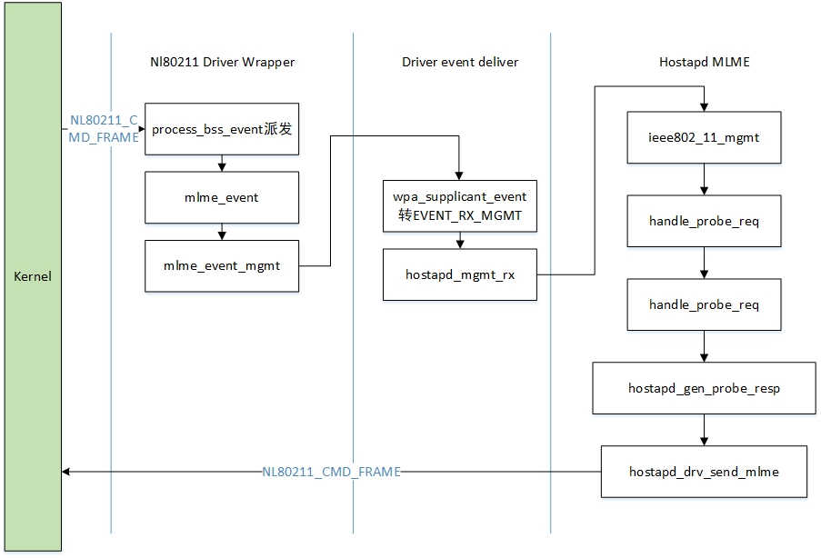

对于authentication request，hostapd首先要检验当前的配置是否满足Authetication frame中算法的要求。hostapd目前支持的Authentication算法有：OPEN、SHARED KEY、FT、SAE、FILS_SK、FILS_SK_PFS、FILS_PK、PASN、LEAP。接着检验STA是否被ACL拒绝。如果STA的Auth请求没有被拒绝，当前BSS的STA hash表（hostapd_data->sta_hash)中将会增添一个新的成员（struct sta_info实例）。如果该STA之前和由hostapd管理的另一个BSS关联，则将其从另一个BSS移除。接下不同的认证算法会有不同的处理，细节我们留在介绍具体加密认证方式时在详述。待设备驱动将Auth response发送后，它将会向hostapd返回NL80211_CMD_NEW_STATION事件，确认整个认证流程结束。整个过程如下图所示：

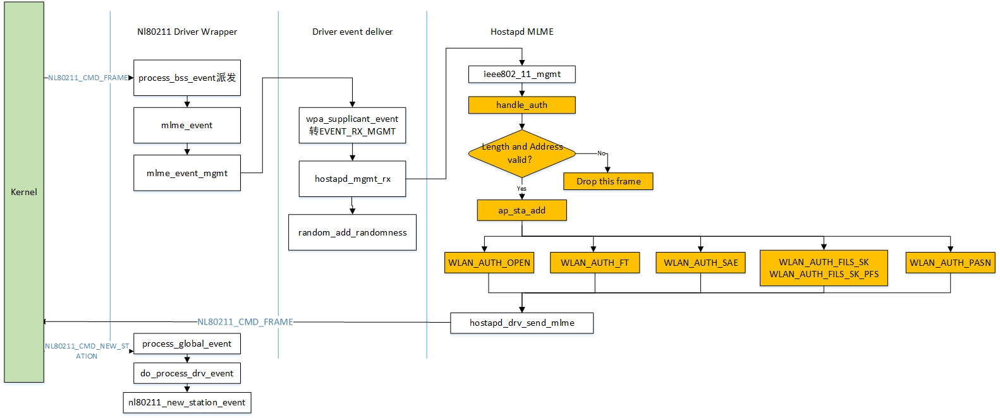

在认证结束之后，Hostapd会收到assoc request。handle_assoc负责相应处理。首先检测帧长度是否正确；然后检测认证是否完成；丢弃重复的assoc request；接下来是解析assoc request帧中相关的参数，并进行判断，如果相关参数不能满足，则本次assoc request将被拒绝。如果本次Assoc request被接受，hostapd则会将STA的状态位WLAN_STA_ASSOC置并通知内核Assoc成功（对于nl80211驱动，则是发送NL80211_CMD_SET_STATION命令）。最后发送Assoc response。整个过程如下图所示：

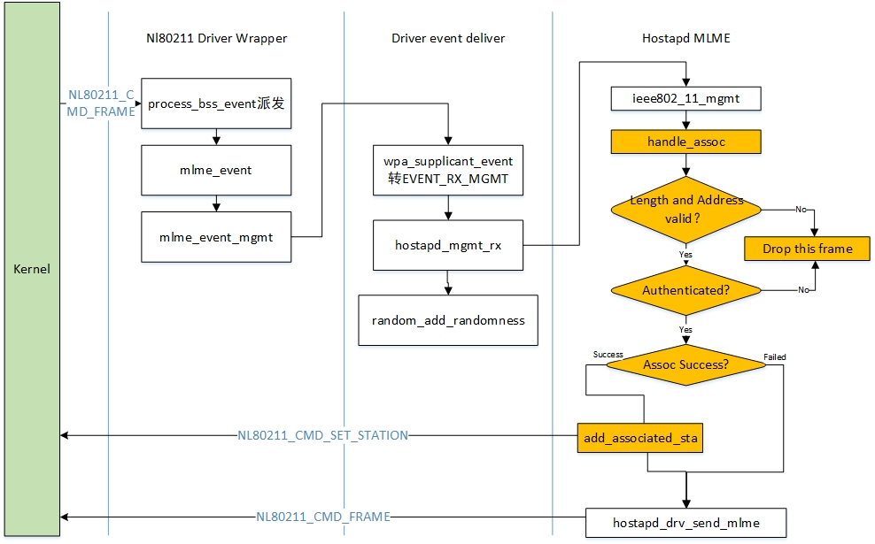

当hostapd收到cfg80211的TX status事件之后，如果不需要做4步握手，则此时STA已经成功的接入BSS。否则需要通过四步握手完成密钥的分发。Assoc response TX status的处理流程如下图所示：

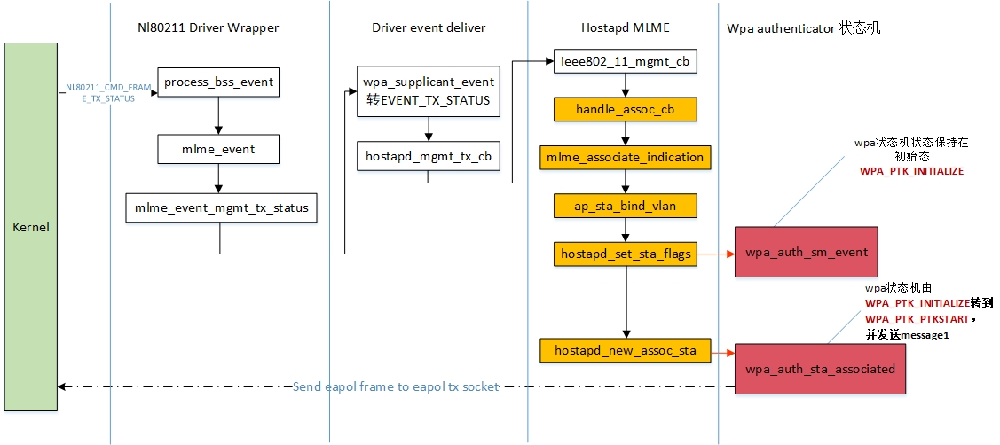

在处理TX status过程中如果需要启动WPA autenticator状态机（**注意：不是所有的Auth算法都需要WPA authenticator**），则MLME模块会两次触发状态机进行状态切换。wpa authenticator状态机在wpa_auth.c中实现，数据结构struct wpa_state_machine用于描述wpa authenticator状态机。从定义中可以看到WPA authenticator有两个状态机：WPA_PTK和WPA_PTK_GROUP。为了使用统一的状态机模板，此处STATE_MACHINE_DATA的实例即为struct wpa_state_machine。函数wpa_sm_step为状态机的主体。该函数的主体是一个循环，WPA_PTK和WPA_PTK_GROUP两个状态机的状态在循环中不断的迁移，直到某一稳定的状态（sm->changed、sm->wpa_auth->group->changed均为false）。

```c
static int wpa_sm_step(struct wpa_state_machine *sm)
{
	if (!sm)
		return 0;

	if (sm->in_step_loop) {
		/* This should not happen, but if it does, make sure we do not
		 * end up freeing the state machine too early by exiting the
		 * recursive call. */
		wpa_printf(MSG_ERROR, "WPA: wpa_sm_step() called recursively");
		return 0;
	}

	sm->in_step_loop = 1;
	do {
		if (sm->pending_deinit)
			break;

		sm->changed = false;
		sm->wpa_auth->group->changed = false;

		SM_STEP_RUN(WPA_PTK);
		if (sm->pending_deinit)
			break;
		SM_STEP_RUN(WPA_PTK_GROUP);
		if (sm->pending_deinit)
			break;
		wpa_group_sm_step(sm->wpa_auth, sm->group);
	} while (sm->changed || sm->wpa_auth->group->changed);
	sm->in_step_loop = 0;

	if (sm->pending_deinit) {
		wpa_printf(MSG_DEBUG,
			   "WPA: Completing pending STA state machine deinit for "
			   MACSTR, MAC2STR(sm->addr));
		wpa_free_sta_sm(sm);
		return 1;
	}
	return 0;
}
```

宏SM_STEP_RUN在前文已经介绍过，它调用已定义的step函数（该函数为状态机进入某一状态时，需要执行的操作）。

WPA_PTK的状态转移在函数SM_STEP(WPA_PTK)中实现。前文已经介绍过宏SM_STEP是用来定义一个函数，这里定义的函数是sm_WPA_PTK_Step(struct wpa_state_machine *sm)。该状态机的状态转移如下图所示：

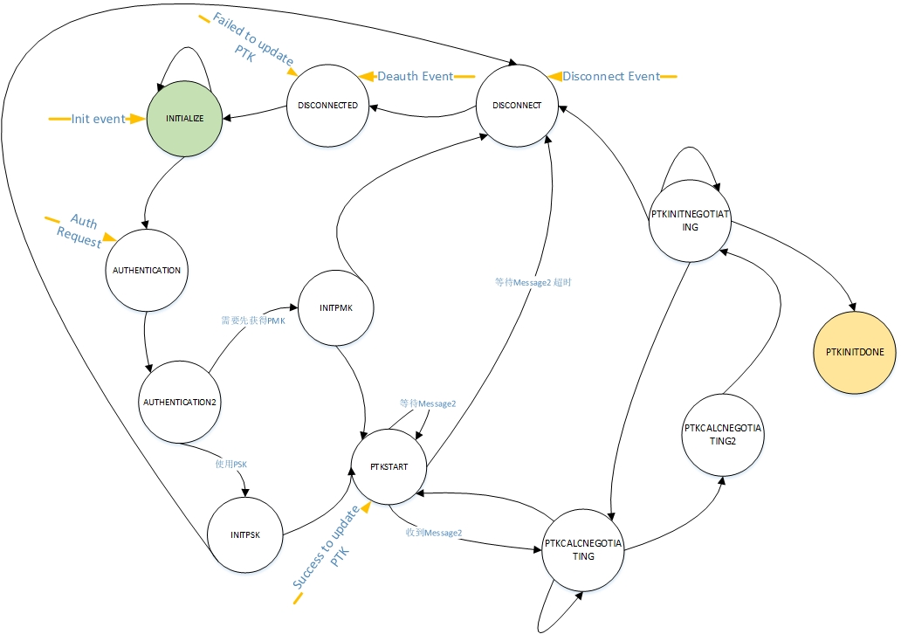

WPA_PTK_GROUP的状态转移在函数SM_STEP(WPA_PTK_GROUP)中实现。这里定义的函数是sm_WPA_PTK_GROUP_Step(struct wpa_state_machine *sm)。该状态机的状态转移如下图所示：

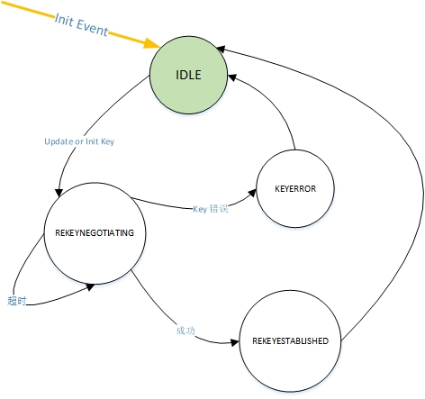

WPA_PTK和WPA_PTK_GROUP两个状态机的状态可以自动转移，也可以在外部事件的作用下转移到指定的状态。第一次是调用wpa_auth_sm_event发送WPA_ASSOC事件，从以上状态转移图中可见该事件并不会触发两个状态机的状态切换。wpa_auth_sta_associated会向状态机发送Init和Auth Request。Init事件会使得WPA PTK状态机进入INITIALIZE状态，而WPA_PTK_GROUP状态机则进入IDLE状态。WPA_PTK_GROUP不会响应后续的Auth Request事件，而WPA_PTK状态机则会由Auth Request事件触发一连串的状态迁移。在AUTHENTICATION2状态时，会生成ANonce；在PTKSTART状态发送4步握手的消息一。此时状态机将停留在PTKSTART状态，等待对方发来的4步握手的消息二。

在message 1/4发送完毕之后，eapol authenticator的状态机也需要更新相关的状态。关于eapol authenticator状态机，我们将留在后面再介绍。如果长时间没有收到supplicant的message 2/4，或者eapol frame中replay counter无法和message 1/4匹配，则wpa_send_eapol_timeout会触发，WPA_TPK状态机将再次进入PTKSTART状态并重发发送eapol message 1/4。如果超时次数大于wpa_pairwise_update_count（默认值是4，可以通过配置选项修改）则4步握手以失败告终，而WPA_PTK状态机将转入DISCONNECT状态。当收到message 2/4之后，WPA_PTK状态机将发生状态迁移。整个过程的代码执行流程如下图：

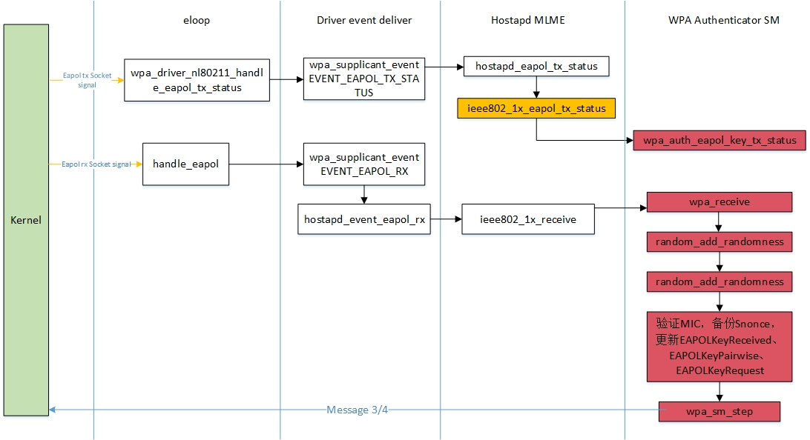

WPA_PTK状态机状态切换的过程是这样的：在等待message 2/4时，状态机处于PTKSTART。当收到message 2/4，并且replay counter是正确的，则状态转为PTKCALCNEGOTIATING。此时需要验证收到的eapol报文，如果报文有误则返回PTKSTART状态，重传message 1/4；否则进入PTKCALCNEGOTIATING2状态。在PTKCALCNEGOTIATING2状态时，WPA_PTK状态机将超时计数清零，然后转向PTKINITNEGOTIATING状态，在该状态WPA_PTK状态机将发送message 3/4并转到PTKINITNEGOTIATING状态。WPA_PTK状态机在PTKINITNEGOTIATING状态，将等待message 4/4，如果一直收不到该消息（超时4次）则转到DISCONNECT状态，如果收到了该消息则转入PTKINITDONE状态，在该状态下install key，整个4步握手的过程成功完成。

到这里，hostapd 对设备接入的处理就完整了。下面把视角拉回连接本身，以 STA 侧为主线，把从扫描到密钥安装的完整过程再走一遍——两边合起来，才是「连上 WiFi 的那几秒」的全貌。

### 连接的建立：从扫描到四次握手

#### 扫描、选网、认证与关联

先是扫描。`wpa_supplicant_req_scan()` 只负责排定时器，真正组装参数、下发扫描的是 `wpa_supplicant_scan()`，结果回来后进 BSS 表。

然后是选网：`wpa_supplicant_select_bss()` 在 BSS 表里挑一个符合当前 network 配置的条目，SSID、安全类型、优先级、BSSID 限制都参与筛选。

接着进 SME 做认证和关联，入口是 `sme_send_authentication()`（`wpa_supplicant/sme.c:1485`）。这个函数 800 多行，因为 OPEN / SAE / FT / DPP / OWE 各种分支都得塞进来。进去之后，状态机把 `wpa_s` 推进到 `WPA_AUTHENTICATING`（`wpa_supplicant/sme.c:2286`），随后就是认证帧、关联帧的往返。这一步失败的话，状态机退回扫描（`wpa_supplicant/scan.c:260` 那段处理的就是"扫描失败时回到之前的状态"）。

关联成功后，AP 与 STA 之间便有了一条能够传输数据帧的链路——但还不能传数据，因为尚未安装密钥。接下来的几毫秒，是整条链路上最精密的一段。

#### 四次握手：四条消息各司其职

WPA/WPA2 的四次握手在 STA 侧对应四个函数，函数名可以直接对上：

| 消息 | STA 侧入口 | 作用 |
|---|---|---|
| 1/4 | `wpa_supplicant_process_1_of_4()`（`src/rsn_supp/wpa.c:956`） | 收到 AP 的 ANonce，生成自己的 SNonce，算出 PTK，回 2/4 |
| 2/4 | `wpa_supplicant_send_2_of_4()`（`src/rsn_supp/wpa.c:526`） | 把 SNonce 交给 AP，并带上一个 MIC 证明自己知道 PMK |
| 3/4 | `wpa_supplicant_process_3_of_4()`（`src/rsn_supp/wpa.c:2836`） | 校验 AP 的 MIC、装 PTK、解出并安装 GTK，回 4/4 |
| 4/4 | `wpa_supplicant_send_4_of_4()`（`src/rsn_supp/wpa.c:2391`） | 确认。发完这条，加密链路才算建立 |

为什么是四条消息？当成一句对话就好懂了。

1/4，AP 说："这是我的随机数 ANonce，你拿它计算密钥。"STA 手里有 PMK（由口令或 802.1X 认证得来）、有双方 MAC，现在又有了 ANonce，再自行生成一个 SNonce，就能用 PRF 算出 PTK。注意：**PTK 是双方各自独立算出来的**，从来没有在链路上传输过——这是整套握手机制的关键所在。

2/4，STA 回话："这是我的 SNonce"，外加一个用 PTK 中 KCK 算出的 MIC。AP 收到 SNonce 后自己也能算出同一个 PTK，一验 MIC 就知道对方确实知道 PMK——而不是随便什么设备在胡乱发帧。

3/4，AP 说："我也知道 PMK（同样用 MIC 证明），另外这是组密钥 GTK，你装上。"这条消息把 PTK 安装与 GTK 分发挤在一起，`wpa_supplicant_process_3_of_4()` 光开头就要处理一堆前置判断：

```c
static void wpa_supplicant_process_3_of_4(struct wpa_sm *sm,
					  const struct wpa_eapol_key *key,
					  u16 ver, const u8 *key_data,
					  size_t key_data_len)
{
	u16 key_info, keylen;
	struct wpa_eapol_ie_parse ie;
	bool mlo = sm->mlo.valid_links;
	int i;

	wpa_sm_set_state(sm, WPA_4WAY_HANDSHAKE);
	wpa_dbg(sm->ctx->msg_ctx, MSG_DEBUG,
		"RSN: RX message 3 of 4-Way Handshake from " MACSTR
		" (ver=%d)%s", MAC2STR(sm->bssid), ver, mlo ? " (MLO)" : "");
```

其中 `mlo` 变量就是 Wi-Fi 7 留下的痕迹：多链路场景下，一条链路完成握手后，密钥要装到所有链路上去，KDE 的校验也因此多了一层。

4/4，STA 最后确认一句"收到"。它本身不带新信息，作用是让 AP 确认 STA 已经就绪，可以正式开启加密。

#### 超时与重传

握手是会丢包的，所以 AP 侧每条消息发出后都要挂一个定时器。该逻辑在 `wpa_send_eapol()`（`src/ap/wpa_auth.c:2365`）：

```c
static void wpa_send_eapol(struct wpa_authenticator *wpa_auth,
			   struct wpa_state_machine *sm, int key_info,
			   const u8 *key_rsc, const u8 *nonce,
			   const u8 *kde, size_t kde_len,
			   int keyidx, int encr)
{
	int timeout_ms;
	int pairwise = key_info & WPA_KEY_INFO_KEY_TYPE;
	u32 ctr;

	if (!sm)
		return;

	ctr = pairwise ? sm->TimeoutCtr : sm->GTimeoutCtr;
```

其中 `TimeoutCtr` 是重传计数，`pairwise` 区分成对密钥与组密钥——两者的重传策略、超时长度都不一样（代码里还有"STA 数量超过 100 就换用另一套超时"这种来自实战经验的分支）。

STA 侧也有一个不那么直觉的分支。在 `wpa_supplicant_process_1_of_4()` 里，如果 `wpa_supplicant_get_pmk()` 返回 `-2`，代码会**故意不回复** 1/4，而是要求走一次完整的 EAP 认证再重新开始握手。原因很实在：没有 PMK 就没法算 PTK，硬回一条 2/4 只会让 AP 反复重传。这种"沉默即拒绝"的语义在 RFC 里没有写，但代码里到处都是——读协议栈，这类"文档之外的行为约定"往往才是重点。

#### 密钥的安装

算出来的 PTK 不是摆着看的，要按顺序装进驱动。顺序有讲究：AP 侧所有密钥安装都走同一个出口 `wpa_auth_set_key()`（`src/ap/wpa_auth.c:292`），实参里带 `WPA_ALG_*` 和 key index。把它的调用点列出来，握手的时间线就清晰了：

- 发 3/4 之前，先给这条链路装 TK 的接收方向（`:5110`）和下一个索引（`:5122`）
- 收到 4/4 之后，再把 TK 切成收发双向（`:5485`、`:5489`）
- 组密钥 GTK / IGTK / BIGTK 在另一条路径上装（`:6305`、`:6316`、`:6343`）

先装接收、后装发送，是为了避免"自己发的帧自己解不开"的窗口期。这类顺序约束在密码学代码里通常不会写在注释里，但改错了就会出各种诡异的丢包。

<figure class="diagram">
<div class="diagram-box">
<svg style="max-width:100%;height:auto" id="fin1790155035084" xmlns="http://www.w3.org/2000/svg" style="max-width: 630.5px;" viewBox="-92 -10 630.5 685" role="graphics-document document" aria-roledescription="sequence"><g><rect x="288" y="554" fill="#eaeaea" stroke="#666" height="80" name="A" rx="6" ry="6" class="actor actor-bottom" data-look="neo" filter="url(#fin1790155035084-drop-shadow)" style="stroke: rgb(45, 212, 191); fill: rgb(240, 253, 250);"></rect><text x="379" y="594" dominant-baseline="central" alignment-baseline="central" class="actor actor-box" style="text-anchor: middle; font-size: 16px; font-weight: 400;"><tspan x="379" dy="0">AP (认证器 wpa_auth)</tspan></text></g><g><rect x="0" y="554" fill="#eaeaea" stroke="#666" width="150" height="80" name="S" rx="6" ry="6" class="actor actor-bottom" data-look="neo" filter="url(#fin1790155035084-drop-shadow)" style="stroke: rgb(232, 121, 249); fill: rgb(253, 244, 255);"></rect><text x="75" y="594" dominant-baseline="central" alignment-baseline="central" class="actor actor-box" style="text-anchor: middle; font-size: 16px; font-weight: 400;"><tspan x="75" dy="0">STA (wpa_sm)</tspan></text></g><g><line id="actor25" x1="379" y1="80" x2="379" y2="554" class="actor-line 200" stroke-width="0.5px" stroke="#999" name="A" data-et="life-line" data-id="A"></line><g id="root-25" data-look="neo" data-et="participant" data-type="participant" data-id="A"><rect x="288" y="0" fill="#eaeaea" stroke="#666" width="182" height="80" name="A" rx="6" ry="6" class="actor actor-top" data-look="neo" filter="url(#fin1790155035084-drop-shadow)" style="stroke: rgb(45, 212, 191); fill: rgb(240, 253, 250);"></rect><text x="379" y="40" dominant-baseline="central" alignment-baseline="central" class="actor actor-box" style="text-anchor: middle; font-size: 16px; font-weight: 400;"><tspan x="379" dy="0">AP (认证器 wpa_auth)</tspan></text></g></g><g><line id="actor24" x1="75" y1="80" x2="75" y2="554" class="actor-line 200" stroke-width="0.5px" stroke="#999" name="S" data-et="life-line" data-id="S"></line><g id="root-24" data-look="neo" data-et="participant" data-type="participant" data-id="S"><rect x="0" y="0" fill="#eaeaea" stroke="#666" width="150" height="80" name="S" rx="6" ry="6" class="actor actor-top" data-look="neo" filter="url(#fin1790155035084-drop-shadow)" style="stroke: rgb(232, 121, 249); fill: rgb(253, 244, 255);"></rect><text x="75" y="40" dominant-baseline="central" alignment-baseline="central" class="actor actor-box" style="text-anchor: middle; font-size: 16px; font-weight: 400;"><tspan x="75" dy="0">STA (wpa_sm)</tspan></text></g></g><style>#fin1790155035084{font-family:"Recursive Variable",arial,sans-serif;font-size:14px;fill:#28253D;}@keyframes edge-animation-frame{from{stroke-dashoffset:0;}}@keyframes dash{to{stroke-dashoffset:0;}}#fin1790155035084 .edge-animation-slow{stroke-dasharray:9,5!important;stroke-dashoffset:900;animation:dash 50s linear infinite;stroke-linecap:round;}#fin1790155035084 .edge-animation-fast{stroke-dasharray:9,5!important;stroke-dashoffset:900;animation:dash 20s linear infinite;stroke-linecap:round;}#fin1790155035084 .error-icon{fill:#ffffff;}#fin1790155035084 .error-text{fill:#000000;stroke:#000000;}#fin1790155035084 .edge-thickness-normal{stroke-width:2px;}#fin1790155035084 .edge-thickness-thick{stroke-width:3.5px;}#fin1790155035084 .edge-pattern-solid{stroke-dasharray:0;}#fin1790155035084 .edge-thickness-invisible{stroke-width:0;fill:none;}#fin1790155035084 .edge-pattern-dashed{stroke-dasharray:3;}#fin1790155035084 .edge-pattern-dotted{stroke-dasharray:2;}#fin1790155035084 .marker{fill:#000000;stroke:#000000;}#fin1790155035084 .marker.cross{stroke:#000000;}#fin1790155035084 svg{font-family:"Recursive Variable",arial,sans-serif;font-size:14px;}#fin1790155035084 p{margin:0;}#fin1790155035084 .actor{stroke:#28253D;fill:#ffffff;stroke-width:2;}#fin1790155035084 rect.actor.outer-path[data-look="neo"]{filter:url(#drop-shadow);}#fin1790155035084 rect.note[data-look="neo"]{stroke:#FACC15;fill:#fff5ad;filter:url(#drop-shadow);}#fin1790155035084 text.actor>tspan{fill:#28253D;stroke:none;}#fin1790155035084 .actor-line{stroke:#28253D;}#fin1790155035084 .innerArc{stroke-width:1.5;stroke-dasharray:none;}#fin1790155035084 .messageLine0{stroke-width:1.5;stroke-dasharray:none;stroke:#28253D;}#fin1790155035084 .messageLine1{stroke-width:1.5;stroke-dasharray:2,2;stroke:#28253D;}#fin1790155035084 [id$="-arrowhead"] path{fill:#28253D;stroke:#28253D;}#fin1790155035084 .sequenceNumber{fill:#ffffff;}#fin1790155035084 [id$="-sequencenumber"]{fill:#28253D;}#fin1790155035084 [id$="-crosshead"] path{fill:#28253D;stroke:#28253D;}#fin1790155035084 .messageText{fill:#28253D;stroke:none;}#fin1790155035084 .labelBox{stroke:#28253D;fill:#ffffff;filter:url(#drop-shadow);}#fin1790155035084 .labelText,#fin1790155035084 .labelText>tspan{fill:#28253D;stroke:none;}#fin1790155035084 .loopText,#fin1790155035084 .loopText>tspan{fill:#28253D;stroke:none;}#fin1790155035084 .sectionTitle,#fin1790155035084 .sectionTitle>tspan{fill:#28253D;stroke:none;}#fin1790155035084 .loopLine{stroke-width:2px;stroke-dasharray:2,2;stroke:#28253D;fill:#28253D;}#fin1790155035084 .note{stroke:#FACC15;fill:#fff5ad;}#fin1790155035084 .noteText,#fin1790155035084 .noteText>tspan{fill:#28253D;stroke:none;}#fin1790155035084 .activation0{fill:hsl(-120, 0%, 80%);stroke:hsl(-120, 0%, 70%);}#fin1790155035084 .activation1{fill:hsl(-120, 0%, 80%);stroke:hsl(-120, 0%, 70%);}#fin1790155035084 .activation2{fill:hsl(-120, 0%, 80%);stroke:hsl(-120, 0%, 70%);}#fin1790155035084 .actorPopupMenu{position:absolute;}#fin1790155035084 .actorPopupMenuPanel{position:absolute;fill:#ffffff;box-shadow:0px 8px 16px 0px rgba(0,0,0,0.2);filter:drop-shadow(3px 5px 2px rgb(0 0 0 / 0.4));}#fin1790155035084 .actor-man circle,#fin1790155035084 line{fill:#ffffff;stroke-width:2px;}#fin1790155035084 g rect.rect{filter:url(#drop-shadow);stroke:#28253D;}#fin1790155035084 .node .neo-node{stroke:#28253D;}#fin1790155035084 [data-look="neo"].node rect,#fin1790155035084 [data-look="neo"].cluster rect,#fin1790155035084 [data-look="neo"].node polygon{stroke:#28253D;filter:url(#fin1790155035084-drop-shadow);}#fin1790155035084 [data-look="neo"].swimlane.cluster rect{filter:none;}#fin1790155035084 [data-look="neo"].node path{stroke:#28253D;stroke-width:2px;}#fin1790155035084 [data-look="neo"].node .outer-path{filter:url(#fin1790155035084-drop-shadow);}#fin1790155035084 [data-look="neo"].node .neo-line path{stroke:#28253D;filter:none;}#fin1790155035084 [data-look="neo"].node circle{stroke:#28253D;filter:url(#fin1790155035084-drop-shadow);}#fin1790155035084 [data-look="neo"].node circle .state-start{fill:#000000;}#fin1790155035084 [data-look="neo"].icon-shape .icon{fill:#28253D;filter:url(#fin1790155035084-drop-shadow);}#fin1790155035084 [data-look="neo"].icon-shape .icon-neo path{stroke:#28253D;filter:url(#fin1790155035084-drop-shadow);}#fin1790155035084 :root{--mermaid-font-family:"trebuchet ms",verdana,arial,sans-serif;}</style><g></g><defs><symbol id="fin1790155035084-computer" width="24" height="24"><path transform="scale(.5)" d="M2 2v13h20v-13h-20zm18 11h-16v-9h16v9zm-10.228 6l.466-1h3.524l.467 1h-4.457zm14.228 3h-24l2-6h2.104l-1.33 4h18.45l-1.297-4h2.073l2 6zm-5-10h-14v-7h14v7z"></path></symbol></defs><defs><symbol id="fin1790155035084-database" fill-rule="evenodd" clip-rule="evenodd"><path transform="scale(.5)" d="M12.258.001l.256.004.255.005.253.008.251.01.249.012.247.015.246.016.242.019.241.02.239.023.236.024.233.027.231.028.229.031.225.032.223.034.22.036.217.038.214.04.211.041.208.043.205.045.201.046.198.048.194.05.191.051.187.053.183.054.18.056.175.057.172.059.168.06.163.061.16.063.155.064.15.066.074.033.073.033.071.034.07.034.069.035.068.035.067.035.066.035.064.036.064.036.062.036.06.036.06.037.058.037.058.037.055.038.055.038.053.038.052.038.051.039.05.039.048.039.047.039.045.04.044.04.043.04.041.04.04.041.039.041.037.041.036.041.034.041.033.042.032.042.03.042.029.042.027.042.026.043.024.043.023.043.021.043.02.043.018.044.017.043.015.044.013.044.012.044.011.045.009.044.007.045.006.045.004.045.002.045.001.045v17l-.001.045-.002.045-.004.045-.006.045-.007.045-.009.044-.011.045-.012.044-.013.044-.015.044-.017.043-.018.044-.02.043-.021.043-.023.043-.024.043-.026.043-.027.042-.029.042-.03.042-.032.042-.033.042-.034.041-.036.041-.037.041-.039.041-.04.041-.041.04-.043.04-.044.04-.045.04-.047.039-.048.039-.05.039-.051.039-.052.038-.053.038-.055.038-.055.038-.058.037-.058.037-.06.037-.06.036-.062.036-.064.036-.064.036-.066.035-.067.035-.068.035-.069.035-.07.034-.071.034-.073.033-.074.033-.15.066-.155.064-.16.063-.163.061-.168.06-.172.059-.175.057-.18.056-.183.054-.187.053-.191.051-.194.05-.198.048-.201.046-.205.045-.208.043-.211.041-.214.04-.217.038-.22.036-.223.034-.225.032-.229.031-.231.028-.233.027-.236.024-.239.023-.241.02-.242.019-.246.016-.247.015-.249.012-.251.01-.253.008-.255.005-.256.004-.258.001-.258-.001-.256-.004-.255-.005-.253-.008-.251-.01-.249-.012-.247-.015-.245-.016-.243-.019-.241-.02-.238-.023-.236-.024-.234-.027-.231-.028-.228-.031-.226-.032-.223-.034-.22-.036-.217-.038-.214-.04-.211-.041-.208-.043-.204-.045-.201-.046-.198-.048-.195-.05-.19-.051-.187-.053-.184-.054-.179-.056-.176-.057-.172-.059-.167-.06-.164-.061-.159-.063-.155-.064-.151-.066-.074-.033-.072-.033-.072-.034-.07-.034-.069-.035-.068-.035-.067-.035-.066-.035-.064-.036-.063-.036-.062-.036-.061-.036-.06-.037-.058-.037-.057-.037-.056-.038-.055-.038-.053-.038-.052-.038-.051-.039-.049-.039-.049-.039-.046-.039-.046-.04-.044-.04-.043-.04-.041-.04-.04-.041-.039-.041-.037-.041-.036-.041-.034-.041-.033-.042-.032-.042-.03-.042-.029-.042-.027-.042-.026-.043-.024-.043-.023-.043-.021-.043-.02-.043-.018-.044-.017-.043-.015-.044-.013-.044-.012-.044-.011-.045-.009-.044-.007-.045-.006-.045-.004-.045-.002-.045-.001-.045v-17l.001-.045.002-.045.004-.045.006-.045.007-.045.009-.044.011-.045.012-.044.013-.044.015-.044.017-.043.018-.044.02-.043.021-.043.023-.043.024-.043.026-.043.027-.042.029-.042.03-.042.032-.042.033-.042.034-.041.036-.041.037-.041.039-.041.04-.041.041-.04.043-.04.044-.04.046-.04.046-.039.049-.039.049-.039.051-.039.052-.038.053-.038.055-.038.056-.038.057-.037.058-.037.06-.037.061-.036.062-.036.063-.036.064-.036.066-.035.067-.035.068-.035.069-.035.07-.034.072-.034.072-.033.074-.033.151-.066.155-.064.159-.063.164-.061.167-.06.172-.059.176-.057.179-.056.184-.054.187-.053.19-.051.195-.05.198-.048.201-.046.204-.045.208-.043.211-.041.214-.04.217-.038.22-.036.223-.034.226-.032.228-.031.231-.028.234-.027.236-.024.238-.023.241-.02.243-.019.245-.016.247-.015.249-.012.251-.01.253-.008.255-.005.256-.004.258-.001.258.001zm-9.258 20.499v.01l.001.021.003.021.004.022.005.021.006.022.007.022.009.023.01.022.011.023.012.023.013.023.015.023.016.024.017.023.018.024.019.024.021.024.022.025.023.024.024.025.052.049.056.05.061.051.066.051.07.051.075.051.079.052.084.052.088.052.092.052.097.052.102.051.105.052.11.052.114.051.119.051.123.051.127.05.131.05.135.05.139.048.144.049.147.047.152.047.155.047.16.045.163.045.167.043.171.043.176.041.178.041.183.039.187.039.19.037.194.035.197.035.202.033.204.031.209.03.212.029.216.027.219.025.222.024.226.021.23.02.233.018.236.016.24.015.243.012.246.01.249.008.253.005.256.004.259.001.26-.001.257-.004.254-.005.25-.008.247-.011.244-.012.241-.014.237-.016.233-.018.231-.021.226-.021.224-.024.22-.026.216-.027.212-.028.21-.031.205-.031.202-.034.198-.034.194-.036.191-.037.187-.039.183-.04.179-.04.175-.042.172-.043.168-.044.163-.045.16-.046.155-.046.152-.047.148-.048.143-.049.139-.049.136-.05.131-.05.126-.05.123-.051.118-.052.114-.051.11-.052.106-.052.101-.052.096-.052.092-.052.088-.053.083-.051.079-.052.074-.052.07-.051.065-.051.06-.051.056-.05.051-.05.023-.024.023-.025.021-.024.02-.024.019-.024.018-.024.017-.024.015-.023.014-.024.013-.023.012-.023.01-.023.01-.022.008-.022.006-.022.006-.022.004-.022.004-.021.001-.021.001-.021v-4.127l-.077.055-.08.053-.083.054-.085.053-.087.052-.09.052-.093.051-.095.05-.097.05-.1.049-.102.049-.105.048-.106.047-.109.047-.111.046-.114.045-.115.045-.118.044-.12.043-.122.042-.124.042-.126.041-.128.04-.13.04-.132.038-.134.038-.135.037-.138.037-.139.035-.142.035-.143.034-.144.033-.147.032-.148.031-.15.03-.151.03-.153.029-.154.027-.156.027-.158.026-.159.025-.161.024-.162.023-.163.022-.165.021-.166.02-.167.019-.169.018-.169.017-.171.016-.173.015-.173.014-.175.013-.175.012-.177.011-.178.01-.179.008-.179.008-.181.006-.182.005-.182.004-.184.003-.184.002h-.37l-.184-.002-.184-.003-.182-.004-.182-.005-.181-.006-.179-.008-.179-.008-.178-.01-.176-.011-.176-.012-.175-.013-.173-.014-.172-.015-.171-.016-.17-.017-.169-.018-.167-.019-.166-.02-.165-.021-.163-.022-.162-.023-.161-.024-.159-.025-.157-.026-.156-.027-.155-.027-.153-.029-.151-.03-.15-.03-.148-.031-.146-.032-.145-.033-.143-.034-.141-.035-.14-.035-.137-.037-.136-.037-.134-.038-.132-.038-.13-.04-.128-.04-.126-.041-.124-.042-.122-.042-.12-.044-.117-.043-.116-.045-.113-.045-.112-.046-.109-.047-.106-.047-.105-.048-.102-.049-.1-.049-.097-.05-.095-.05-.093-.052-.09-.051-.087-.052-.085-.053-.083-.054-.08-.054-.077-.054v4.127zm0-5.654v.011l.001.021.003.021.004.021.005.022.006.022.007.022.009.022.01.022.011.023.012.023.013.023.015.024.016.023.017.024.018.024.019.024.021.024.022.024.023.025.024.024.052.05.056.05.061.05.066.051.07.051.075.052.079.051.084.052.088.052.092.052.097.052.102.052.105.052.11.051.114.051.119.052.123.05.127.051.131.05.135.049.139.049.144.048.147.048.152.047.155.046.16.045.163.045.167.044.171.042.176.042.178.04.183.04.187.038.19.037.194.036.197.034.202.033.204.032.209.03.212.028.216.027.219.025.222.024.226.022.23.02.233.018.236.016.24.014.243.012.246.01.249.008.253.006.256.003.259.001.26-.001.257-.003.254-.006.25-.008.247-.01.244-.012.241-.015.237-.016.233-.018.231-.02.226-.022.224-.024.22-.025.216-.027.212-.029.21-.03.205-.032.202-.033.198-.035.194-.036.191-.037.187-.039.183-.039.179-.041.175-.042.172-.043.168-.044.163-.045.16-.045.155-.047.152-.047.148-.048.143-.048.139-.05.136-.049.131-.05.126-.051.123-.051.118-.051.114-.052.11-.052.106-.052.101-.052.096-.052.092-.052.088-.052.083-.052.079-.052.074-.051.07-.052.065-.051.06-.05.056-.051.051-.049.023-.025.023-.024.021-.025.02-.024.019-.024.018-.024.017-.024.015-.023.014-.023.013-.024.012-.022.01-.023.01-.023.008-.022.006-.022.006-.022.004-.021.004-.022.001-.021.001-.021v-4.139l-.077.054-.08.054-.083.054-.085.052-.087.053-.09.051-.093.051-.095.051-.097.05-.1.049-.102.049-.105.048-.106.047-.109.047-.111.046-.114.045-.115.044-.118.044-.12.044-.122.042-.124.042-.126.041-.128.04-.13.039-.132.039-.134.038-.135.037-.138.036-.139.036-.142.035-.143.033-.144.033-.147.033-.148.031-.15.03-.151.03-.153.028-.154.028-.156.027-.158.026-.159.025-.161.024-.162.023-.163.022-.165.021-.166.02-.167.019-.169.018-.169.017-.171.016-.173.015-.173.014-.175.013-.175.012-.177.011-.178.009-.179.009-.179.007-.181.007-.182.005-.182.004-.184.003-.184.002h-.37l-.184-.002-.184-.003-.182-.004-.182-.005-.181-.007-.179-.007-.179-.009-.178-.009-.176-.011-.176-.012-.175-.013-.173-.014-.172-.015-.171-.016-.17-.017-.169-.018-.167-.019-.166-.02-.165-.021-.163-.022-.162-.023-.161-.024-.159-.025-.157-.026-.156-.027-.155-.028-.153-.028-.151-.03-.15-.03-.148-.031-.146-.033-.145-.033-.143-.033-.141-.035-.14-.036-.137-.036-.136-.037-.134-.038-.132-.039-.13-.039-.128-.04-.126-.041-.124-.042-.122-.043-.12-.043-.117-.044-.116-.044-.113-.046-.112-.046-.109-.046-.106-.047-.105-.048-.102-.049-.1-.049-.097-.05-.095-.051-.093-.051-.09-.051-.087-.053-.085-.052-.083-.054-.08-.054-.077-.054v4.139zm0-5.666v.011l.001.02.003.022.004.021.005.022.006.021.007.022.009.023.01.022.011.023.012.023.013.023.015.023.016.024.017.024.018.023.019.024.021.025.022.024.023.024.024.025.052.05.056.05.061.05.066.051.07.051.075.052.079.051.084.052.088.052.092.052.097.052.102.052.105.051.11.052.114.051.119.051.123.051.127.05.131.05.135.05.139.049.144.048.147.048.152.047.155.046.16.045.163.045.167.043.171.043.176.042.178.04.183.04.187.038.19.037.194.036.197.034.202.033.204.032.209.03.212.028.216.027.219.025.222.024.226.021.23.02.233.018.236.017.24.014.243.012.246.01.249.008.253.006.256.003.259.001.26-.001.257-.003.254-.006.25-.008.247-.01.244-.013.241-.014.237-.016.233-.018.231-.02.226-.022.224-.024.22-.025.216-.027.212-.029.21-.03.205-.032.202-.033.198-.035.194-.036.191-.037.187-.039.183-.039.179-.041.175-.042.172-.043.168-.044.163-.045.16-.045.155-.047.152-.047.148-.048.143-.049.139-.049.136-.049.131-.051.126-.05.123-.051.118-.052.114-.051.11-.052.106-.052.101-.052.096-.052.092-.052.088-.052.083-.052.079-.052.074-.052.07-.051.065-.051.06-.051.056-.05.051-.049.023-.025.023-.025.021-.024.02-.024.019-.024.018-.024.017-.024.015-.023.014-.024.013-.023.012-.023.01-.022.01-.023.008-.022.006-.022.006-.022.004-.022.004-.021.001-.021.001-.021v-4.153l-.077.054-.08.054-.083.053-.085.053-.087.053-.09.051-.093.051-.095.051-.097.05-.1.049-.102.048-.105.048-.106.048-.109.046-.111.046-.114.046-.115.044-.118.044-.12.043-.122.043-.124.042-.126.041-.128.04-.13.039-.132.039-.134.038-.135.037-.138.036-.139.036-.142.034-.143.034-.144.033-.147.032-.148.032-.15.03-.151.03-.153.028-.154.028-.156.027-.158.026-.159.024-.161.024-.162.023-.163.023-.165.021-.166.02-.167.019-.169.018-.169.017-.171.016-.173.015-.173.014-.175.013-.175.012-.177.01-.178.01-.179.009-.179.007-.181.006-.182.006-.182.004-.184.003-.184.001-.185.001-.185-.001-.184-.001-.184-.003-.182-.004-.182-.006-.181-.006-.179-.007-.179-.009-.178-.01-.176-.01-.176-.012-.175-.013-.173-.014-.172-.015-.171-.016-.17-.017-.169-.018-.167-.019-.166-.02-.165-.021-.163-.023-.162-.023-.161-.024-.159-.024-.157-.026-.156-.027-.155-.028-.153-.028-.151-.03-.15-.03-.148-.032-.146-.032-.145-.033-.143-.034-.141-.034-.14-.036-.137-.036-.136-.037-.134-.038-.132-.039-.13-.039-.128-.041-.126-.041-.124-.041-.122-.043-.12-.043-.117-.044-.116-.044-.113-.046-.112-.046-.109-.046-.106-.048-.105-.048-.102-.048-.1-.05-.097-.049-.095-.051-.093-.051-.09-.052-.087-.052-.085-.053-.083-.053-.08-.054-.077-.054v4.153zm8.74-8.179l-.257.004-.254.005-.25.008-.247.011-.244.012-.241.014-.237.016-.233.018-.231.021-.226.022-.224.023-.22.026-.216.027-.212.028-.21.031-.205.032-.202.033-.198.034-.194.036-.191.038-.187.038-.183.04-.179.041-.175.042-.172.043-.168.043-.163.045-.16.046-.155.046-.152.048-.148.048-.143.048-.139.049-.136.05-.131.05-.126.051-.123.051-.118.051-.114.052-.11.052-.106.052-.101.052-.096.052-.092.052-.088.052-.083.052-.079.052-.074.051-.07.052-.065.051-.06.05-.056.05-.051.05-.023.025-.023.024-.021.024-.02.025-.019.024-.018.024-.017.023-.015.024-.014.023-.013.023-.012.023-.01.023-.01.022-.008.022-.006.023-.006.021-.004.022-.004.021-.001.021-.001.021.001.021.001.021.004.021.004.022.006.021.006.023.008.022.01.022.01.023.012.023.013.023.014.023.015.024.017.023.018.024.019.024.02.025.021.024.023.024.023.025.051.05.056.05.06.05.065.051.07.052.074.051.079.052.083.052.088.052.092.052.096.052.101.052.106.052.11.052.114.052.118.051.123.051.126.051.131.05.136.05.139.049.143.048.148.048.152.048.155.046.16.046.163.045.168.043.172.043.175.042.179.041.183.04.187.038.191.038.194.036.198.034.202.033.205.032.21.031.212.028.216.027.22.026.224.023.226.022.231.021.233.018.237.016.241.014.244.012.247.011.25.008.254.005.257.004.26.001.26-.001.257-.004.254-.005.25-.008.247-.011.244-.012.241-.014.237-.016.233-.018.231-.021.226-.022.224-.023.22-.026.216-.027.212-.028.21-.031.205-.032.202-.033.198-.034.194-.036.191-.038.187-.038.183-.04.179-.041.175-.042.172-.043.168-.043.163-.045.16-.046.155-.046.152-.048.148-.048.143-.048.139-.049.136-.05.131-.05.126-.051.123-.051.118-.051.114-.052.11-.052.106-.052.101-.052.096-.052.092-.052.088-.052.083-.052.079-.052.074-.051.07-.052.065-.051.06-.05.056-.05.051-.05.023-.025.023-.024.021-.024.02-.025.019-.024.018-.024.017-.023.015-.024.014-.023.013-.023.012-.023.01-.023.01-.022.008-.022.006-.023.006-.021.004-.022.004-.021.001-.021.001-.021-.001-.021-.001-.021-.004-.021-.004-.022-.006-.021-.006-.023-.008-.022-.01-.022-.01-.023-.012-.023-.013-.023-.014-.023-.015-.024-.017-.023-.018-.024-.019-.024-.02-.025-.021-.024-.023-.024-.023-.025-.051-.05-.056-.05-.06-.05-.065-.051-.07-.052-.074-.051-.079-.052-.083-.052-.088-.052-.092-.052-.096-.052-.101-.052-.106-.052-.11-.052-.114-.052-.118-.051-.123-.051-.126-.051-.131-.05-.136-.05-.139-.049-.143-.048-.148-.048-.152-.048-.155-.046-.16-.046-.163-.045-.168-.043-.172-.043-.175-.042-.179-.041-.183-.04-.187-.038-.191-.038-.194-.036-.198-.034-.202-.033-.205-.032-.21-.031-.212-.028-.216-.027-.22-.026-.224-.023-.226-.022-.231-.021-.233-.018-.237-.016-.241-.014-.244-.012-.247-.011-.25-.008-.254-.005-.257-.004-.26-.001-.26.001z"></path></symbol></defs><defs><symbol id="fin1790155035084-clock" width="24" height="24"><path transform="scale(.5)" d="M12 2c5.514 0 10 4.486 10 10s-4.486 10-10 10-10-4.486-10-10 4.486-10 10-10zm0-2c-6.627 0-12 5.373-12 12s5.373 12 12 12 12-5.373 12-12-5.373-12-12-12zm5.848 12.459c.202.038.202.333.001.372-1.907.361-6.045 1.111-6.547 1.111-.719 0-1.301-.582-1.301-1.301 0-.512.77-5.447 1.125-7.445.034-.192.312-.181.343.014l.985 6.238 5.394 1.011z"></path></symbol></defs><defs><marker id="fin1790155035084-arrowhead" refX="7.9" refY="5" markerUnits="userSpaceOnUse" markerWidth="12" markerHeight="12" orient="auto-start-reverse"><path d="M -1 0 L 10 5 L 0 10 z"></path></marker></defs><defs><marker id="fin1790155035084-crosshead" markerWidth="15" markerHeight="8" orient="auto" refX="4" refY="4.5"><path fill="none" stroke="#000000" stroke-width="1pt" d="M 1,2 L 6,7 M 6,2 L 1,7" style="stroke-dasharray: 0, 0;"></path></marker></defs><defs><marker id="fin1790155035084-filled-head" refX="15.5" refY="7" markerWidth="20" markerHeight="28" orient="auto"><path d="M 18,7 L9,13 L14,7 L9,1 Z"></path></marker></defs><defs><marker id="fin1790155035084-sequencenumber" refX="15" refY="15" markerWidth="60" markerHeight="40" orient="auto"><circle cx="15" cy="15" r="6"></circle></marker></defs><defs><marker id="fin1790155035084-solidTopArrowHead" refX="7.9" refY="7.25" markerUnits="userSpaceOnUse" markerWidth="12" markerHeight="12" orient="auto-start-reverse"><path d="M 0 0 L 10 8 L 0 8 z"></path></marker></defs><defs><marker id="fin1790155035084-solidBottomArrowHead" refX="7.9" refY="0.75" markerUnits="userSpaceOnUse" markerWidth="12" markerHeight="12" orient="auto-start-reverse"><path d="M 0 0 L 10 0 L 0 8 z"></path></marker></defs><defs><marker id="fin1790155035084-stickTopArrowHead" refX="7.5" refY="7" markerUnits="userSpaceOnUse" markerWidth="12" markerHeight="12" orient="auto-start-reverse"><path d="M 0 0 L 7 7" stroke="black" stroke-width="1.5" fill="none"></path></marker></defs><defs><marker id="fin1790155035084-stickBottomArrowHead" refX="7.5" refY="0" markerUnits="userSpaceOnUse" markerWidth="12" markerHeight="12" orient="auto-start-reverse"><path d="M 0 7 L 7 0" stroke="black" stroke-width="1.5" fill="none"></path></marker></defs><defs><filter id="fin1790155035084-drop-shadow" height="130%" width="130%"><feDropShadow dx="4" dy="4" stdDeviation="0" flood-opacity="0.06" flood-color="#000000"></feDropShadow></filter></defs><g data-et="note" data-id="i2"><rect x="-42" y="148" fill="#EDF2AE" stroke="#666" width="234" height="54" class="note" data-look="neo"></rect><text x="75" y="153" text-anchor="middle" dominant-baseline="middle" alignment-baseline="middle" class="noteText" dy="1em" style="font-size: 16px; font-weight: 400;"><tspan x="75">"生成 SNonce，独立算出 PTK</tspan></text><text x="75" y="170" text-anchor="middle" dominant-baseline="middle" alignment-baseline="middle" class="noteText" dy="1em" style="font-size: 16px; font-weight: 400;"><tspan x="75">src/rsn_supp/wpa.c:956"</tspan></text></g><g data-et="note" data-id="i4"><rect x="269.5" y="270" fill="#EDF2AE" stroke="#666" width="219" height="37" class="note" data-look="neo"></rect><text x="379" y="275" text-anchor="middle" dominant-baseline="middle" alignment-baseline="middle" class="noteText" dy="1em" style="font-size: 16px; font-weight: 400;"><tspan x="379">"用 MIC 验证对方知道 PMK"</tspan></text></g><g data-et="note" data-id="i6"><rect x="-32.5" y="375" fill="#EDF2AE" stroke="#666" width="215" height="54" class="note" data-look="neo"></rect><text x="75" y="380" text-anchor="middle" dominant-baseline="middle" alignment-baseline="middle" class="noteText" dy="1em" style="font-size: 16px; font-weight: 400;"><tspan x="75">"校验 → 装 PTK → 装 GTK</tspan></text><text x="75" y="397" text-anchor="middle" dominant-baseline="middle" alignment-baseline="middle" class="noteText" dy="1em" style="font-size: 16px; font-weight: 400;"><tspan x="75">src/rsn_supp/wpa.c:2836"</tspan></text></g><g data-et="note" data-id="i8"><rect x="50" y="497" fill="#EDF2AE" stroke="#666" width="354" height="37" class="note" data-look="neo"></rect><text x="227" y="502" text-anchor="middle" dominant-baseline="middle" alignment-baseline="middle" class="noteText" dy="1em" style="font-size: 16px; font-weight: 400;"><tspan x="227">"双方各自算出的同一把 PTK 生效，数据帧开始加密"</tspan></text></g><text x="230" y="95" text-anchor="middle" dominant-baseline="middle" alignment-baseline="middle" class="messageText" dy="1em" style="font-size: 16px; font-weight: 400;">"1/4 EAPOL-Key: ANonce"</text><line x1="384" y1="138" x2="82" y2="138" class="messageLine0" data-et="message" data-id="i1" data-from="A" data-to="S" stroke-width="2" stroke="none" marker-end="url(#fin1790155035084-arrowhead)" style="fill: none;"></line><line x1="379" y1="138" x2="379" y2="138" stroke-width="0" marker-start="url(#fin1790155035084-sequencenumber)"></line><text x="379" y="142" font-family="sans-serif" font-size="12px" text-anchor="middle" class="sequenceNumber">1</text><text x="224" y="217" text-anchor="middle" dominant-baseline="middle" alignment-baseline="middle" class="messageText" dy="1em" style="font-size: 16px; font-weight: 400;">"2/4 EAPOL-Key: SNonce + MIC"</text><line x1="82" y1="260" x2="372" y2="260" class="messageLine0" data-et="message" data-id="i3" data-from="S" data-to="A" stroke-width="2" stroke="none" marker-end="url(#fin1790155035084-arrowhead)" style="fill: none;"></line><line x1="75" y1="260" x2="75" y2="260" stroke-width="0" marker-start="url(#fin1790155035084-sequencenumber)"></line><text x="75" y="264" font-family="sans-serif" font-size="12px" text-anchor="middle" class="sequenceNumber">2</text><text x="230" y="322" text-anchor="middle" dominant-baseline="middle" alignment-baseline="middle" class="messageText" dy="1em" style="font-size: 16px; font-weight: 400;">"3/4 EAPOL-Key: MIC + GTK"</text><line x1="384" y1="365" x2="82" y2="365" class="messageLine0" data-et="message" data-id="i5" data-from="A" data-to="S" stroke-width="2" stroke="none" marker-end="url(#fin1790155035084-arrowhead)" style="fill: none;"></line><line x1="379" y1="365" x2="379" y2="365" stroke-width="0" marker-start="url(#fin1790155035084-sequencenumber)"></line><text x="379" y="369" font-family="sans-serif" font-size="12px" text-anchor="middle" class="sequenceNumber">3</text><text x="224" y="444" text-anchor="middle" dominant-baseline="middle" alignment-baseline="middle" class="messageText" dy="1em" style="font-size: 16px; font-weight: 400;">"4/4 EAPOL-Key: 确认"</text><line x1="82" y1="487" x2="372" y2="487" class="messageLine0" data-et="message" data-id="i7" data-from="S" data-to="A" stroke-width="2" stroke="none" marker-end="url(#fin1790155035084-arrowhead)" style="fill: none;"></line><line x1="75" y1="487" x2="75" y2="487" stroke-width="0" marker-start="url(#fin1790155035084-sequencenumber)"></line><text x="75" y="491" font-family="sans-serif" font-size="12px" text-anchor="middle" class="sequenceNumber">4</text></svg>
</div>
<figcaption>图 3　四次握手：ANonce → SNonce → GTK → 确认，PTK 由双方各自算出</figcaption>
</figure>

握手完成后，`wpa_s` 的状态从 `WPA_4WAY_HANDSHAKE` 走到 `WPA_COMPLETED`。日志里那行 `CTRL-EVENT-CONNECTED`，就是在这个时刻打出来的。

## 全流程回顾

回过头看，那几秒钟实际是这样度过的：

<figure class="diagram">
<div class="diagram-box">
<svg style="max-width:100%;height:auto" id="fin1790155035110" xmlns="http://www.w3.org/2000/svg" style="max-width: 1312px;" viewBox="-50 -10 1312 1115" role="graphics-document document" aria-roledescription="sequence"><g><rect x="1062" y="984" fill="#eaeaea" stroke="#666" height="80" name="A" rx="6" ry="6" class="actor actor-bottom" data-look="neo" filter="url(#fin1790155035110-drop-shadow)" style="stroke: rgb(34, 211, 238); fill: rgb(236, 254, 255);"></rect><text x="1137" y="1024" dominant-baseline="central" alignment-baseline="central" class="actor actor-box" style="text-anchor: middle; font-size: 16px; font-weight: 400;"><tspan x="1137" dy="0">AP</tspan></text></g><g><rect x="862" y="984" fill="#eaeaea" stroke="#666" width="150" height="80" name="K" rx="6" ry="6" class="actor actor-bottom" data-look="neo" filter="url(#fin1790155035110-drop-shadow)" style="stroke: rgb(251, 146, 60); fill: rgb(255, 247, 237);"></rect><text x="937" y="1024" dominant-baseline="central" alignment-baseline="central" class="actor actor-box" style="text-anchor: middle; font-size: 16px; font-weight: 400;"><tspan x="937" dy="0">内核 (nl80211)</tspan></text></g><g><rect x="355" y="984" fill="#eaeaea" stroke="#666" width="150" height="80" name="W" rx="6" ry="6" class="actor actor-bottom" data-look="neo" filter="url(#fin1790155035110-drop-shadow)" style="stroke: rgb(45, 212, 191); fill: rgb(240, 253, 250);"></rect><text x="430" y="1024" dominant-baseline="central" alignment-baseline="central" class="actor actor-box" style="text-anchor: middle; font-size: 16px; font-weight: 400;"><tspan x="430" dy="0">wpa_supplicant</tspan></text></g><g><rect x="0" y="984" fill="#eaeaea" stroke="#666" width="150" height="80" name="U" rx="6" ry="6" class="actor actor-bottom" data-look="neo" filter="url(#fin1790155035110-drop-shadow)" style="stroke: rgb(232, 121, 249); fill: rgb(253, 244, 255);"></rect><text x="75" y="1024" dominant-baseline="central" alignment-baseline="central" class="actor actor-box" style="text-anchor: middle; font-size: 16px; font-weight: 400;"><tspan x="75" dy="0">用户 / wpa_cli</tspan></text></g><g><line id="actor29" x1="1137" y1="80" x2="1137" y2="984" class="actor-line 200" stroke-width="0.5px" stroke="#999" name="A" data-et="life-line" data-id="A"></line><g id="root-29" data-look="neo" data-et="participant" data-type="participant" data-id="A"><rect x="1062" y="0" fill="#eaeaea" stroke="#666" width="150" height="80" name="A" rx="6" ry="6" class="actor actor-top" data-look="neo" filter="url(#fin1790155035110-drop-shadow)" style="stroke: rgb(34, 211, 238); fill: rgb(236, 254, 255);"></rect><text x="1137" y="40" dominant-baseline="central" alignment-baseline="central" class="actor actor-box" style="text-anchor: middle; font-size: 16px; font-weight: 400;"><tspan x="1137" dy="0">AP</tspan></text></g></g><g><line id="actor28" x1="937" y1="80" x2="937" y2="984" class="actor-line 200" stroke-width="0.5px" stroke="#999" name="K" data-et="life-line" data-id="K"></line><g id="root-28" data-look="neo" data-et="participant" data-type="participant" data-id="K"><rect x="862" y="0" fill="#eaeaea" stroke="#666" width="150" height="80" name="K" rx="6" ry="6" class="actor actor-top" data-look="neo" filter="url(#fin1790155035110-drop-shadow)" style="stroke: rgb(251, 146, 60); fill: rgb(255, 247, 237);"></rect><text x="937" y="40" dominant-baseline="central" alignment-baseline="central" class="actor actor-box" style="text-anchor: middle; font-size: 16px; font-weight: 400;"><tspan x="937" dy="0">内核 (nl80211)</tspan></text></g></g><g><line id="actor27" x1="430" y1="80" x2="430" y2="984" class="actor-line 200" stroke-width="0.5px" stroke="#999" name="W" data-et="life-line" data-id="W"></line><g id="root-27" data-look="neo" data-et="participant" data-type="participant" data-id="W"><rect x="355" y="0" fill="#eaeaea" stroke="#666" width="150" height="80" name="W" rx="6" ry="6" class="actor actor-top" data-look="neo" filter="url(#fin1790155035110-drop-shadow)" style="stroke: rgb(45, 212, 191); fill: rgb(240, 253, 250);"></rect><text x="430" y="40" dominant-baseline="central" alignment-baseline="central" class="actor actor-box" style="text-anchor: middle; font-size: 16px; font-weight: 400;"><tspan x="430" dy="0">wpa_supplicant</tspan></text></g></g><g><line id="actor26" x1="75" y1="80" x2="75" y2="984" class="actor-line 200" stroke-width="0.5px" stroke="#999" name="U" data-et="life-line" data-id="U"></line><g id="root-26" data-look="neo" data-et="participant" data-type="participant" data-id="U"><rect x="0" y="0" fill="#eaeaea" stroke="#666" width="150" height="80" name="U" rx="6" ry="6" class="actor actor-top" data-look="neo" filter="url(#fin1790155035110-drop-shadow)" style="stroke: rgb(232, 121, 249); fill: rgb(253, 244, 255);"></rect><text x="75" y="40" dominant-baseline="central" alignment-baseline="central" class="actor actor-box" style="text-anchor: middle; font-size: 16px; font-weight: 400;"><tspan x="75" dy="0">用户 / wpa_cli</tspan></text></g></g><style>#fin1790155035110{font-family:"Recursive Variable",arial,sans-serif;font-size:14px;fill:#28253D;}@keyframes edge-animation-frame{from{stroke-dashoffset:0;}}@keyframes dash{to{stroke-dashoffset:0;}}#fin1790155035110 .edge-animation-slow{stroke-dasharray:9,5!important;stroke-dashoffset:900;animation:dash 50s linear infinite;stroke-linecap:round;}#fin1790155035110 .edge-animation-fast{stroke-dasharray:9,5!important;stroke-dashoffset:900;animation:dash 20s linear infinite;stroke-linecap:round;}#fin1790155035110 .error-icon{fill:#ffffff;}#fin1790155035110 .error-text{fill:#000000;stroke:#000000;}#fin1790155035110 .edge-thickness-normal{stroke-width:2px;}#fin1790155035110 .edge-thickness-thick{stroke-width:3.5px;}#fin1790155035110 .edge-pattern-solid{stroke-dasharray:0;}#fin1790155035110 .edge-thickness-invisible{stroke-width:0;fill:none;}#fin1790155035110 .edge-pattern-dashed{stroke-dasharray:3;}#fin1790155035110 .edge-pattern-dotted{stroke-dasharray:2;}#fin1790155035110 .marker{fill:#000000;stroke:#000000;}#fin1790155035110 .marker.cross{stroke:#000000;}#fin1790155035110 svg{font-family:"Recursive Variable",arial,sans-serif;font-size:14px;}#fin1790155035110 p{margin:0;}#fin1790155035110 .actor{stroke:#28253D;fill:#ffffff;stroke-width:2;}#fin1790155035110 rect.actor.outer-path[data-look="neo"]{filter:url(#drop-shadow);}#fin1790155035110 rect.note[data-look="neo"]{stroke:#FACC15;fill:#fff5ad;filter:url(#drop-shadow);}#fin1790155035110 text.actor>tspan{fill:#28253D;stroke:none;}#fin1790155035110 .actor-line{stroke:#28253D;}#fin1790155035110 .innerArc{stroke-width:1.5;stroke-dasharray:none;}#fin1790155035110 .messageLine0{stroke-width:1.5;stroke-dasharray:none;stroke:#28253D;}#fin1790155035110 .messageLine1{stroke-width:1.5;stroke-dasharray:2,2;stroke:#28253D;}#fin1790155035110 [id$="-arrowhead"] path{fill:#28253D;stroke:#28253D;}#fin1790155035110 .sequenceNumber{fill:#ffffff;}#fin1790155035110 [id$="-sequencenumber"]{fill:#28253D;}#fin1790155035110 [id$="-crosshead"] path{fill:#28253D;stroke:#28253D;}#fin1790155035110 .messageText{fill:#28253D;stroke:none;}#fin1790155035110 .labelBox{stroke:#28253D;fill:#ffffff;filter:url(#drop-shadow);}#fin1790155035110 .labelText,#fin1790155035110 .labelText>tspan{fill:#28253D;stroke:none;}#fin1790155035110 .loopText,#fin1790155035110 .loopText>tspan{fill:#28253D;stroke:none;}#fin1790155035110 .sectionTitle,#fin1790155035110 .sectionTitle>tspan{fill:#28253D;stroke:none;}#fin1790155035110 .loopLine{stroke-width:2px;stroke-dasharray:2,2;stroke:#28253D;fill:#28253D;}#fin1790155035110 .note{stroke:#FACC15;fill:#fff5ad;}#fin1790155035110 .noteText,#fin1790155035110 .noteText>tspan{fill:#28253D;stroke:none;}#fin1790155035110 .activation0{fill:hsl(-120, 0%, 80%);stroke:hsl(-120, 0%, 70%);}#fin1790155035110 .activation1{fill:hsl(-120, 0%, 80%);stroke:hsl(-120, 0%, 70%);}#fin1790155035110 .activation2{fill:hsl(-120, 0%, 80%);stroke:hsl(-120, 0%, 70%);}#fin1790155035110 .actorPopupMenu{position:absolute;}#fin1790155035110 .actorPopupMenuPanel{position:absolute;fill:#ffffff;box-shadow:0px 8px 16px 0px rgba(0,0,0,0.2);filter:drop-shadow(3px 5px 2px rgb(0 0 0 / 0.4));}#fin1790155035110 .actor-man circle,#fin1790155035110 line{fill:#ffffff;stroke-width:2px;}#fin1790155035110 g rect.rect{filter:url(#drop-shadow);stroke:#28253D;}#fin1790155035110 .node .neo-node{stroke:#28253D;}#fin1790155035110 [data-look="neo"].node rect,#fin1790155035110 [data-look="neo"].cluster rect,#fin1790155035110 [data-look="neo"].node polygon{stroke:#28253D;filter:url(#fin1790155035110-drop-shadow);}#fin1790155035110 [data-look="neo"].swimlane.cluster rect{filter:none;}#fin1790155035110 [data-look="neo"].node path{stroke:#28253D;stroke-width:2px;}#fin1790155035110 [data-look="neo"].node .outer-path{filter:url(#fin1790155035110-drop-shadow);}#fin1790155035110 [data-look="neo"].node .neo-line path{stroke:#28253D;filter:none;}#fin1790155035110 [data-look="neo"].node circle{stroke:#28253D;filter:url(#fin1790155035110-drop-shadow);}#fin1790155035110 [data-look="neo"].node circle .state-start{fill:#000000;}#fin1790155035110 [data-look="neo"].icon-shape .icon{fill:#28253D;filter:url(#fin1790155035110-drop-shadow);}#fin1790155035110 [data-look="neo"].icon-shape .icon-neo path{stroke:#28253D;filter:url(#fin1790155035110-drop-shadow);}#fin1790155035110 :root{--mermaid-font-family:"trebuchet ms",verdana,arial,sans-serif;}</style><g></g><defs><symbol id="fin1790155035110-computer" width="24" height="24"><path transform="scale(.5)" d="M2 2v13h20v-13h-20zm18 11h-16v-9h16v9zm-10.228 6l.466-1h3.524l.467 1h-4.457zm14.228 3h-24l2-6h2.104l-1.33 4h18.45l-1.297-4h2.073l2 6zm-5-10h-14v-7h14v7z"></path></symbol></defs><defs><symbol id="fin1790155035110-database" fill-rule="evenodd" clip-rule="evenodd"><path transform="scale(.5)" d="M12.258.001l.256.004.255.005.253.008.251.01.249.012.247.015.246.016.242.019.241.02.239.023.236.024.233.027.231.028.229.031.225.032.223.034.22.036.217.038.214.04.211.041.208.043.205.045.201.046.198.048.194.05.191.051.187.053.183.054.18.056.175.057.172.059.168.06.163.061.16.063.155.064.15.066.074.033.073.033.071.034.07.034.069.035.068.035.067.035.066.035.064.036.064.036.062.036.06.036.06.037.058.037.058.037.055.038.055.038.053.038.052.038.051.039.05.039.048.039.047.039.045.04.044.04.043.04.041.04.04.041.039.041.037.041.036.041.034.041.033.042.032.042.03.042.029.042.027.042.026.043.024.043.023.043.021.043.02.043.018.044.017.043.015.044.013.044.012.044.011.045.009.044.007.045.006.045.004.045.002.045.001.045v17l-.001.045-.002.045-.004.045-.006.045-.007.045-.009.044-.011.045-.012.044-.013.044-.015.044-.017.043-.018.044-.02.043-.021.043-.023.043-.024.043-.026.043-.027.042-.029.042-.03.042-.032.042-.033.042-.034.041-.036.041-.037.041-.039.041-.04.041-.041.04-.043.04-.044.04-.045.04-.047.039-.048.039-.05.039-.051.039-.052.038-.053.038-.055.038-.055.038-.058.037-.058.037-.06.037-.06.036-.062.036-.064.036-.064.036-.066.035-.067.035-.068.035-.069.035-.07.034-.071.034-.073.033-.074.033-.15.066-.155.064-.16.063-.163.061-.168.06-.172.059-.175.057-.18.056-.183.054-.187.053-.191.051-.194.05-.198.048-.201.046-.205.045-.208.043-.211.041-.214.04-.217.038-.22.036-.223.034-.225.032-.229.031-.231.028-.233.027-.236.024-.239.023-.241.02-.242.019-.246.016-.247.015-.249.012-.251.01-.253.008-.255.005-.256.004-.258.001-.258-.001-.256-.004-.255-.005-.253-.008-.251-.01-.249-.012-.247-.015-.245-.016-.243-.019-.241-.02-.238-.023-.236-.024-.234-.027-.231-.028-.228-.031-.226-.032-.223-.034-.22-.036-.217-.038-.214-.04-.211-.041-.208-.043-.204-.045-.201-.046-.198-.048-.195-.05-.19-.051-.187-.053-.184-.054-.179-.056-.176-.057-.172-.059-.167-.06-.164-.061-.159-.063-.155-.064-.151-.066-.074-.033-.072-.033-.072-.034-.07-.034-.069-.035-.068-.035-.067-.035-.066-.035-.064-.036-.063-.036-.062-.036-.061-.036-.06-.037-.058-.037-.057-.037-.056-.038-.055-.038-.053-.038-.052-.038-.051-.039-.049-.039-.049-.039-.046-.039-.046-.04-.044-.04-.043-.04-.041-.04-.04-.041-.039-.041-.037-.041-.036-.041-.034-.041-.033-.042-.032-.042-.03-.042-.029-.042-.027-.042-.026-.043-.024-.043-.023-.043-.021-.043-.02-.043-.018-.044-.017-.043-.015-.044-.013-.044-.012-.044-.011-.045-.009-.044-.007-.045-.006-.045-.004-.045-.002-.045-.001-.045v-17l.001-.045.002-.045.004-.045.006-.045.007-.045.009-.044.011-.045.012-.044.013-.044.015-.044.017-.043.018-.044.02-.043.021-.043.023-.043.024-.043.026-.043.027-.042.029-.042.03-.042.032-.042.033-.042.034-.041.036-.041.037-.041.039-.041.04-.041.041-.04.043-.04.044-.04.046-.04.046-.039.049-.039.049-.039.051-.039.052-.038.053-.038.055-.038.056-.038.057-.037.058-.037.06-.037.061-.036.062-.036.063-.036.064-.036.066-.035.067-.035.068-.035.069-.035.07-.034.072-.034.072-.033.074-.033.151-.066.155-.064.159-.063.164-.061.167-.06.172-.059.176-.057.179-.056.184-.054.187-.053.19-.051.195-.05.198-.048.201-.046.204-.045.208-.043.211-.041.214-.04.217-.038.22-.036.223-.034.226-.032.228-.031.231-.028.234-.027.236-.024.238-.023.241-.02.243-.019.245-.016.247-.015.249-.012.251-.01.253-.008.255-.005.256-.004.258-.001.258.001zm-9.258 20.499v.01l.001.021.003.021.004.022.005.021.006.022.007.022.009.023.01.022.011.023.012.023.013.023.015.023.016.024.017.023.018.024.019.024.021.024.022.025.023.024.024.025.052.049.056.05.061.051.066.051.07.051.075.051.079.052.084.052.088.052.092.052.097.052.102.051.105.052.11.052.114.051.119.051.123.051.127.05.131.05.135.05.139.048.144.049.147.047.152.047.155.047.16.045.163.045.167.043.171.043.176.041.178.041.183.039.187.039.19.037.194.035.197.035.202.033.204.031.209.03.212.029.216.027.219.025.222.024.226.021.23.02.233.018.236.016.24.015.243.012.246.01.249.008.253.005.256.004.259.001.26-.001.257-.004.254-.005.25-.008.247-.011.244-.012.241-.014.237-.016.233-.018.231-.021.226-.021.224-.024.22-.026.216-.027.212-.028.21-.031.205-.031.202-.034.198-.034.194-.036.191-.037.187-.039.183-.04.179-.04.175-.042.172-.043.168-.044.163-.045.16-.046.155-.046.152-.047.148-.048.143-.049.139-.049.136-.05.131-.05.126-.05.123-.051.118-.052.114-.051.11-.052.106-.052.101-.052.096-.052.092-.052.088-.053.083-.051.079-.052.074-.052.07-.051.065-.051.06-.051.056-.05.051-.05.023-.024.023-.025.021-.024.02-.024.019-.024.018-.024.017-.024.015-.023.014-.024.013-.023.012-.023.01-.023.01-.022.008-.022.006-.022.006-.022.004-.022.004-.021.001-.021.001-.021v-4.127l-.077.055-.08.053-.083.054-.085.053-.087.052-.09.052-.093.051-.095.05-.097.05-.1.049-.102.049-.105.048-.106.047-.109.047-.111.046-.114.045-.115.045-.118.044-.12.043-.122.042-.124.042-.126.041-.128.04-.13.04-.132.038-.134.038-.135.037-.138.037-.139.035-.142.035-.143.034-.144.033-.147.032-.148.031-.15.03-.151.03-.153.029-.154.027-.156.027-.158.026-.159.025-.161.024-.162.023-.163.022-.165.021-.166.02-.167.019-.169.018-.169.017-.171.016-.173.015-.173.014-.175.013-.175.012-.177.011-.178.01-.179.008-.179.008-.181.006-.182.005-.182.004-.184.003-.184.002h-.37l-.184-.002-.184-.003-.182-.004-.182-.005-.181-.006-.179-.008-.179-.008-.178-.01-.176-.011-.176-.012-.175-.013-.173-.014-.172-.015-.171-.016-.17-.017-.169-.018-.167-.019-.166-.02-.165-.021-.163-.022-.162-.023-.161-.024-.159-.025-.157-.026-.156-.027-.155-.027-.153-.029-.151-.03-.15-.03-.148-.031-.146-.032-.145-.033-.143-.034-.141-.035-.14-.035-.137-.037-.136-.037-.134-.038-.132-.038-.13-.04-.128-.04-.126-.041-.124-.042-.122-.042-.12-.044-.117-.043-.116-.045-.113-.045-.112-.046-.109-.047-.106-.047-.105-.048-.102-.049-.1-.049-.097-.05-.095-.05-.093-.052-.09-.051-.087-.052-.085-.053-.083-.054-.08-.054-.077-.054v4.127zm0-5.654v.011l.001.021.003.021.004.021.005.022.006.022.007.022.009.022.01.022.011.023.012.023.013.023.015.024.016.023.017.024.018.024.019.024.021.024.022.024.023.025.024.024.052.05.056.05.061.05.066.051.07.051.075.052.079.051.084.052.088.052.092.052.097.052.102.052.105.052.11.051.114.051.119.052.123.05.127.051.131.05.135.049.139.049.144.048.147.048.152.047.155.046.16.045.163.045.167.044.171.042.176.042.178.04.183.04.187.038.19.037.194.036.197.034.202.033.204.032.209.03.212.028.216.027.219.025.222.024.226.022.23.02.233.018.236.016.24.014.243.012.246.01.249.008.253.006.256.003.259.001.26-.001.257-.003.254-.006.25-.008.247-.01.244-.012.241-.015.237-.016.233-.018.231-.02.226-.022.224-.024.22-.025.216-.027.212-.029.21-.03.205-.032.202-.033.198-.035.194-.036.191-.037.187-.039.183-.039.179-.041.175-.042.172-.043.168-.044.163-.045.16-.045.155-.047.152-.047.148-.048.143-.048.139-.05.136-.049.131-.05.126-.051.123-.051.118-.051.114-.052.11-.052.106-.052.101-.052.096-.052.092-.052.088-.052.083-.052.079-.052.074-.051.07-.052.065-.051.06-.05.056-.051.051-.049.023-.025.023-.024.021-.025.02-.024.019-.024.018-.024.017-.024.015-.023.014-.023.013-.024.012-.022.01-.023.01-.023.008-.022.006-.022.006-.022.004-.021.004-.022.001-.021.001-.021v-4.139l-.077.054-.08.054-.083.054-.085.052-.087.053-.09.051-.093.051-.095.051-.097.05-.1.049-.102.049-.105.048-.106.047-.109.047-.111.046-.114.045-.115.044-.118.044-.12.044-.122.042-.124.042-.126.041-.128.04-.13.039-.132.039-.134.038-.135.037-.138.036-.139.036-.142.035-.143.033-.144.033-.147.033-.148.031-.15.03-.151.03-.153.028-.154.028-.156.027-.158.026-.159.025-.161.024-.162.023-.163.022-.165.021-.166.02-.167.019-.169.018-.169.017-.171.016-.173.015-.173.014-.175.013-.175.012-.177.011-.178.009-.179.009-.179.007-.181.007-.182.005-.182.004-.184.003-.184.002h-.37l-.184-.002-.184-.003-.182-.004-.182-.005-.181-.007-.179-.007-.179-.009-.178-.009-.176-.011-.176-.012-.175-.013-.173-.014-.172-.015-.171-.016-.17-.017-.169-.018-.167-.019-.166-.02-.165-.021-.163-.022-.162-.023-.161-.024-.159-.025-.157-.026-.156-.027-.155-.028-.153-.028-.151-.03-.15-.03-.148-.031-.146-.033-.145-.033-.143-.033-.141-.035-.14-.036-.137-.036-.136-.037-.134-.038-.132-.039-.13-.039-.128-.04-.126-.041-.124-.042-.122-.043-.12-.043-.117-.044-.116-.044-.113-.046-.112-.046-.109-.046-.106-.047-.105-.048-.102-.049-.1-.049-.097-.05-.095-.051-.093-.051-.09-.051-.087-.053-.085-.052-.083-.054-.08-.054-.077-.054v4.139zm0-5.666v.011l.001.02.003.022.004.021.005.022.006.021.007.022.009.023.01.022.011.023.012.023.013.023.015.023.016.024.017.024.018.023.019.024.021.025.022.024.023.024.024.025.052.05.056.05.061.05.066.051.07.051.075.052.079.051.084.052.088.052.092.052.097.052.102.052.105.051.11.052.114.051.119.051.123.051.127.05.131.05.135.05.139.049.144.048.147.048.152.047.155.046.16.045.163.045.167.043.171.043.176.042.178.04.183.04.187.038.19.037.194.036.197.034.202.033.204.032.209.03.212.028.216.027.219.025.222.024.226.021.23.02.233.018.236.017.24.014.243.012.246.01.249.008.253.006.256.003.259.001.26-.001.257-.003.254-.006.25-.008.247-.01.244-.013.241-.014.237-.016.233-.018.231-.02.226-.022.224-.024.22-.025.216-.027.212-.029.21-.03.205-.032.202-.033.198-.035.194-.036.191-.037.187-.039.183-.039.179-.041.175-.042.172-.043.168-.044.163-.045.16-.045.155-.047.152-.047.148-.048.143-.049.139-.049.136-.049.131-.051.126-.05.123-.051.118-.052.114-.051.11-.052.106-.052.101-.052.096-.052.092-.052.088-.052.083-.052.079-.052.074-.052.07-.051.065-.051.06-.051.056-.05.051-.049.023-.025.023-.025.021-.024.02-.024.019-.024.018-.024.017-.024.015-.023.014-.024.013-.023.012-.023.01-.022.01-.023.008-.022.006-.022.006-.022.004-.022.004-.021.001-.021.001-.021v-4.153l-.077.054-.08.054-.083.053-.085.053-.087.053-.09.051-.093.051-.095.051-.097.05-.1.049-.102.048-.105.048-.106.048-.109.046-.111.046-.114.046-.115.044-.118.044-.12.043-.122.043-.124.042-.126.041-.128.04-.13.039-.132.039-.134.038-.135.037-.138.036-.139.036-.142.034-.143.034-.144.033-.147.032-.148.032-.15.03-.151.03-.153.028-.154.028-.156.027-.158.026-.159.024-.161.024-.162.023-.163.023-.165.021-.166.02-.167.019-.169.018-.169.017-.171.016-.173.015-.173.014-.175.013-.175.012-.177.01-.178.01-.179.009-.179.007-.181.006-.182.006-.182.004-.184.003-.184.001-.185.001-.185-.001-.184-.001-.184-.003-.182-.004-.182-.006-.181-.006-.179-.007-.179-.009-.178-.01-.176-.01-.176-.012-.175-.013-.173-.014-.172-.015-.171-.016-.17-.017-.169-.018-.167-.019-.166-.02-.165-.021-.163-.023-.162-.023-.161-.024-.159-.024-.157-.026-.156-.027-.155-.028-.153-.028-.151-.03-.15-.03-.148-.032-.146-.032-.145-.033-.143-.034-.141-.034-.14-.036-.137-.036-.136-.037-.134-.038-.132-.039-.13-.039-.128-.041-.126-.041-.124-.041-.122-.043-.12-.043-.117-.044-.116-.044-.113-.046-.112-.046-.109-.046-.106-.048-.105-.048-.102-.048-.1-.05-.097-.049-.095-.051-.093-.051-.09-.052-.087-.052-.085-.053-.083-.053-.08-.054-.077-.054v4.153zm8.74-8.179l-.257.004-.254.005-.25.008-.247.011-.244.012-.241.014-.237.016-.233.018-.231.021-.226.022-.224.023-.22.026-.216.027-.212.028-.21.031-.205.032-.202.033-.198.034-.194.036-.191.038-.187.038-.183.04-.179.041-.175.042-.172.043-.168.043-.163.045-.16.046-.155.046-.152.048-.148.048-.143.048-.139.049-.136.05-.131.05-.126.051-.123.051-.118.051-.114.052-.11.052-.106.052-.101.052-.096.052-.092.052-.088.052-.083.052-.079.052-.074.051-.07.052-.065.051-.06.05-.056.05-.051.05-.023.025-.023.024-.021.024-.02.025-.019.024-.018.024-.017.023-.015.024-.014.023-.013.023-.012.023-.01.023-.01.022-.008.022-.006.023-.006.021-.004.022-.004.021-.001.021-.001.021.001.021.001.021.004.021.004.022.006.021.006.023.008.022.01.022.01.023.012.023.013.023.014.023.015.024.017.023.018.024.019.024.02.025.021.024.023.024.023.025.051.05.056.05.06.05.065.051.07.052.074.051.079.052.083.052.088.052.092.052.096.052.101.052.106.052.11.052.114.052.118.051.123.051.126.051.131.05.136.05.139.049.143.048.148.048.152.048.155.046.16.046.163.045.168.043.172.043.175.042.179.041.183.04.187.038.191.038.194.036.198.034.202.033.205.032.21.031.212.028.216.027.22.026.224.023.226.022.231.021.233.018.237.016.241.014.244.012.247.011.25.008.254.005.257.004.26.001.26-.001.257-.004.254-.005.25-.008.247-.011.244-.012.241-.014.237-.016.233-.018.231-.021.226-.022.224-.023.22-.026.216-.027.212-.028.21-.031.205-.032.202-.033.198-.034.194-.036.191-.038.187-.038.183-.04.179-.041.175-.042.172-.043.168-.043.163-.045.16-.046.155-.046.152-.048.148-.048.143-.048.139-.049.136-.05.131-.05.126-.051.123-.051.118-.051.114-.052.11-.052.106-.052.101-.052.096-.052.092-.052.088-.052.083-.052.079-.052.074-.051.07-.052.065-.051.06-.05.056-.05.051-.05.023-.025.023-.024.021-.024.02-.025.019-.024.018-.024.017-.023.015-.024.014-.023.013-.023.012-.023.01-.023.01-.022.008-.022.006-.023.006-.021.004-.022.004-.021.001-.021.001-.021-.001-.021-.001-.021-.004-.021-.004-.022-.006-.021-.006-.023-.008-.022-.01-.022-.01-.023-.012-.023-.013-.023-.014-.023-.015-.024-.017-.023-.018-.024-.019-.024-.02-.025-.021-.024-.023-.024-.023-.025-.051-.05-.056-.05-.06-.05-.065-.051-.07-.052-.074-.051-.079-.052-.083-.052-.088-.052-.092-.052-.096-.052-.101-.052-.106-.052-.11-.052-.114-.052-.118-.051-.123-.051-.126-.051-.131-.05-.136-.05-.139-.049-.143-.048-.148-.048-.152-.048-.155-.046-.16-.046-.163-.045-.168-.043-.172-.043-.175-.042-.179-.041-.183-.04-.187-.038-.191-.038-.194-.036-.198-.034-.202-.033-.205-.032-.21-.031-.212-.028-.216-.027-.22-.026-.224-.023-.226-.022-.231-.021-.233-.018-.237-.016-.241-.014-.244-.012-.247-.011-.25-.008-.254-.005-.257-.004-.26-.001-.26.001z"></path></symbol></defs><defs><symbol id="fin1790155035110-clock" width="24" height="24"><path transform="scale(.5)" d="M12 2c5.514 0 10 4.486 10 10s-4.486 10-10 10-10-4.486-10-10 4.486-10 10-10zm0-2c-6.627 0-12 5.373-12 12s5.373 12 12 12 12-5.373 12-12-5.373-12-12-12zm5.848 12.459c.202.038.202.333.001.372-1.907.361-6.045 1.111-6.547 1.111-.719 0-1.301-.582-1.301-1.301 0-.512.77-5.447 1.125-7.445.034-.192.312-.181.343.014l.985 6.238 5.394 1.011z"></path></symbol></defs><defs><marker id="fin1790155035110-arrowhead" refX="7.9" refY="5" markerUnits="userSpaceOnUse" markerWidth="12" markerHeight="12" orient="auto-start-reverse"><path d="M -1 0 L 10 5 L 0 10 z"></path></marker></defs><defs><marker id="fin1790155035110-crosshead" markerWidth="15" markerHeight="8" orient="auto" refX="4" refY="4.5"><path fill="none" stroke="#000000" stroke-width="1pt" d="M 1,2 L 6,7 M 6,2 L 1,7" style="stroke-dasharray: 0, 0;"></path></marker></defs><defs><marker id="fin1790155035110-filled-head" refX="15.5" refY="7" markerWidth="20" markerHeight="28" orient="auto"><path d="M 18,7 L9,13 L14,7 L9,1 Z"></path></marker></defs><defs><marker id="fin1790155035110-sequencenumber" refX="15" refY="15" markerWidth="60" markerHeight="40" orient="auto"><circle cx="15" cy="15" r="6"></circle></marker></defs><defs><marker id="fin1790155035110-solidTopArrowHead" refX="7.9" refY="7.25" markerUnits="userSpaceOnUse" markerWidth="12" markerHeight="12" orient="auto-start-reverse"><path d="M 0 0 L 10 8 L 0 8 z"></path></marker></defs><defs><marker id="fin1790155035110-solidBottomArrowHead" refX="7.9" refY="0.75" markerUnits="userSpaceOnUse" markerWidth="12" markerHeight="12" orient="auto-start-reverse"><path d="M 0 0 L 10 0 L 0 8 z"></path></marker></defs><defs><marker id="fin1790155035110-stickTopArrowHead" refX="7.5" refY="7" markerUnits="userSpaceOnUse" markerWidth="12" markerHeight="12" orient="auto-start-reverse"><path d="M 0 0 L 7 7" stroke="black" stroke-width="1.5" fill="none"></path></marker></defs><defs><marker id="fin1790155035110-stickBottomArrowHead" refX="7.5" refY="0" markerUnits="userSpaceOnUse" markerWidth="12" markerHeight="12" orient="auto-start-reverse"><path d="M 0 7 L 7 0" stroke="black" stroke-width="1.5" fill="none"></path></marker></defs><defs><filter id="fin1790155035110-drop-shadow" height="130%" width="130%"><feDropShadow dx="4" dy="4" stdDeviation="0" flood-opacity="0.06" flood-color="#000000"></feDropShadow></filter></defs><g data-et="note" data-id="i2"><rect x="278" y="148" fill="#EDF2AE" stroke="#666" width="304" height="54" class="note" data-look="neo"></rect><text x="430" y="153" text-anchor="middle" dominant-baseline="middle" alignment-baseline="middle" class="noteText" dy="1em" style="font-size: 16px; font-weight: 400;"><tspan x="430">"main → init → add_iface → init_iface</tspan></text><text x="430" y="170" text-anchor="middle" dominant-baseline="middle" alignment-baseline="middle" class="noteText" dy="1em" style="font-size: 16px; font-weight: 400;"><tspan x="430">驱动 init、ctrl_iface 上线、BSS 表建立"</tspan></text></g><g data-et="note" data-id="i6"><rect x="317" y="416" fill="#EDF2AE" stroke="#666" width="226" height="37" class="note" data-look="neo"></rect><text x="430" y="421" text-anchor="middle" dominant-baseline="middle" alignment-baseline="middle" class="noteText" dy="1em" style="font-size: 16px; font-weight: 400;"><tspan x="430">"BSS 表更新 → 选网 → SME"</tspan></text></g><g data-et="note" data-id="i14"><rect x="317.5" y="869" fill="#EDF2AE" stroke="#666" width="225" height="37" class="note" data-look="neo"></rect><text x="430" y="874" text-anchor="middle" dominant-baseline="middle" alignment-baseline="middle" class="noteText" dy="1em" style="font-size: 16px; font-weight: 400;"><tspan x="430">"状态 → WPA_COMPLETED"</tspan></text></g><text x="250" y="95" text-anchor="middle" dominant-baseline="middle" alignment-baseline="middle" class="messageText" dy="1em" style="font-size: 16px; font-weight: 400;">"启动进程（配置文件 / 命令行）"</text><line x1="82" y1="138" x2="423" y2="138" class="messageLine0" data-et="message" data-id="i1" data-from="U" data-to="W" stroke-width="2" stroke="none" marker-end="url(#fin1790155035110-arrowhead)" style="fill: none;"></line><line x1="75" y1="138" x2="75" y2="138" stroke-width="0" marker-start="url(#fin1790155035110-sequencenumber)"></line><text x="75" y="142" font-family="sans-serif" font-size="12px" text-anchor="middle" class="sequenceNumber">1</text><text x="431" y="217" text-anchor="middle" dominant-baseline="middle" alignment-baseline="middle" class="messageText" dy="1em" style="font-size: 16px; font-weight: 400;">"首次扫描排到 eloop 定时器（错开 100ms）"</text><path d="M 431,260 C 491,250 491,290 431,280" class="messageLine0" data-et="message" data-id="i3" data-from="W" data-to="W" stroke-width="2" stroke="none" marker-end="url(#fin1790155035110-arrowhead)" x1="437" style="fill: none;"></path><line x1="430" y1="260" x2="430" y2="260" stroke-width="0" marker-start="url(#fin1790155035110-sequencenumber)"></line><text x="430" y="264" font-family="sans-serif" font-size="12px" text-anchor="middle" class="sequenceNumber">2</text><text x="681" y="305" text-anchor="middle" dominant-baseline="middle" alignment-baseline="middle" class="messageText" dy="1em" style="font-size: 16px; font-weight: 400;">"NL80211_CMD_TRIGGER_SCAN"</text><line x1="437" y1="348" x2="930" y2="348" class="messageLine0" data-et="message" data-id="i4" data-from="W" data-to="K" stroke-width="2" stroke="none" marker-end="url(#fin1790155035110-arrowhead)" style="fill: none;"></line><line x1="430" y1="348" x2="430" y2="348" stroke-width="0" marker-start="url(#fin1790155035110-sequencenumber)"></line><text x="430" y="352" font-family="sans-serif" font-size="12px" text-anchor="middle" class="sequenceNumber">3</text><text x="687" y="363" text-anchor="middle" dominant-baseline="middle" alignment-baseline="middle" class="messageText" dy="1em" style="font-size: 16px; font-weight: 400;">"扫描结果事件（排队后重放）"</text><line x1="942" y1="406" x2="437" y2="406" class="messageLine1" data-et="message" data-id="i5" data-from="K" data-to="W" stroke-width="2" stroke="none" marker-end="url(#fin1790155035110-arrowhead)" style="stroke-dasharray: 3, 3; fill: none;"></line><line x1="937" y1="406" x2="937" y2="406" stroke-width="0" marker-start="url(#fin1790155035110-sequencenumber)"></line><text x="937" y="410" font-family="sans-serif" font-size="12px" text-anchor="middle" class="sequenceNumber">4</text><text x="781" y="468" text-anchor="middle" dominant-baseline="middle" alignment-baseline="middle" class="messageText" dy="1em" style="font-size: 16px; font-weight: 400;">"认证 / 关联（管理帧）"</text><line x1="437" y1="511" x2="1130" y2="511" class="messageLine0" data-et="message" data-id="i7" data-from="W" data-to="A" stroke-width="2" stroke="none" marker-end="url(#fin1790155035110-arrowhead)" style="fill: none;"></line><line x1="430" y1="511" x2="430" y2="511" stroke-width="0" marker-start="url(#fin1790155035110-sequencenumber)"></line><text x="430" y="515" font-family="sans-serif" font-size="12px" text-anchor="middle" class="sequenceNumber">5</text><text x="787" y="526" text-anchor="middle" dominant-baseline="middle" alignment-baseline="middle" class="messageText" dy="1em" style="font-size: 16px; font-weight: 400;">"关联成功"</text><line x1="1142" y1="569" x2="437" y2="569" class="messageLine1" data-et="message" data-id="i8" data-from="A" data-to="W" stroke-width="2" stroke="none" marker-end="url(#fin1790155035110-arrowhead)" style="stroke-dasharray: 3, 3; fill: none;"></line><line x1="1137" y1="569" x2="1137" y2="569" stroke-width="0" marker-start="url(#fin1790155035110-sequencenumber)"></line><text x="1137" y="573" font-family="sans-serif" font-size="12px" text-anchor="middle" class="sequenceNumber">6</text><text x="787" y="584" text-anchor="middle" dominant-baseline="middle" alignment-baseline="middle" class="messageText" dy="1em" style="font-size: 16px; font-weight: 400;">"EAPOL-Key 1/4（ANonce）"</text><line x1="1142" y1="627" x2="437" y2="627" class="messageLine0" data-et="message" data-id="i9" data-from="A" data-to="W" stroke-width="2" stroke="none" marker-end="url(#fin1790155035110-arrowhead)" style="fill: none;"></line><line x1="1137" y1="627" x2="1137" y2="627" stroke-width="0" marker-start="url(#fin1790155035110-sequencenumber)"></line><text x="1137" y="631" font-family="sans-serif" font-size="12px" text-anchor="middle" class="sequenceNumber">7</text><text x="781" y="642" text-anchor="middle" dominant-baseline="middle" alignment-baseline="middle" class="messageText" dy="1em" style="font-size: 16px; font-weight: 400;">"EAPOL-Key 2/4（SNonce + MIC）"</text><line x1="437" y1="685" x2="1130" y2="685" class="messageLine0" data-et="message" data-id="i10" data-from="W" data-to="A" stroke-width="2" stroke="none" marker-end="url(#fin1790155035110-arrowhead)" style="fill: none;"></line><line x1="430" y1="685" x2="430" y2="685" stroke-width="0" marker-start="url(#fin1790155035110-sequencenumber)"></line><text x="430" y="689" font-family="sans-serif" font-size="12px" text-anchor="middle" class="sequenceNumber">8</text><text x="787" y="700" text-anchor="middle" dominant-baseline="middle" alignment-baseline="middle" class="messageText" dy="1em" style="font-size: 16px; font-weight: 400;">"EAPOL-Key 3/4（MIC + GTK）"</text><line x1="1142" y1="743" x2="437" y2="743" class="messageLine0" data-et="message" data-id="i11" data-from="A" data-to="W" stroke-width="2" stroke="none" marker-end="url(#fin1790155035110-arrowhead)" style="fill: none;"></line><line x1="1137" y1="743" x2="1137" y2="743" stroke-width="0" marker-start="url(#fin1790155035110-sequencenumber)"></line><text x="1137" y="747" font-family="sans-serif" font-size="12px" text-anchor="middle" class="sequenceNumber">9</text><text x="781" y="758" text-anchor="middle" dominant-baseline="middle" alignment-baseline="middle" class="messageText" dy="1em" style="font-size: 16px; font-weight: 400;">"EAPOL-Key 4/4"</text><line x1="437" y1="801" x2="1130" y2="801" class="messageLine0" data-et="message" data-id="i12" data-from="W" data-to="A" stroke-width="2" stroke="none" marker-end="url(#fin1790155035110-arrowhead)" style="fill: none;"></line><line x1="430" y1="801" x2="430" y2="801" stroke-width="0" marker-start="url(#fin1790155035110-sequencenumber)"></line><text x="430" y="805" font-family="sans-serif" font-size="12px" text-anchor="middle" class="sequenceNumber">10</text><text x="681" y="816" text-anchor="middle" dominant-baseline="middle" alignment-baseline="middle" class="messageText" dy="1em" style="font-size: 16px; font-weight: 400;">"NL80211_CMD_NEW_KEY / SET_STATION（装 PTK/GTK）"</text><line x1="437" y1="859" x2="930" y2="859" class="messageLine0" data-et="message" data-id="i13" data-from="W" data-to="K" stroke-width="2" stroke="none" marker-end="url(#fin1790155035110-arrowhead)" style="fill: none;"></line><line x1="430" y1="859" x2="430" y2="859" stroke-width="0" marker-start="url(#fin1790155035110-sequencenumber)"></line><text x="430" y="863" font-family="sans-serif" font-size="12px" text-anchor="middle" class="sequenceNumber">11</text><text x="256" y="921" text-anchor="middle" dominant-baseline="middle" alignment-baseline="middle" class="messageText" dy="1em" style="font-size: 16px; font-weight: 400;">"事件推送：CTRL-EVENT-CONNECTED"</text><line x1="435" y1="964" x2="82" y2="964" class="messageLine1" data-et="message" data-id="i15" data-from="W" data-to="U" stroke-width="2" stroke="none" marker-end="url(#fin1790155035110-arrowhead)" style="stroke-dasharray: 3, 3; fill: none;"></line><line x1="430" y1="964" x2="430" y2="964" stroke-width="0" marker-start="url(#fin1790155035110-sequencenumber)"></line><text x="430" y="968" font-family="sans-serif" font-size="12px" text-anchor="middle" class="sequenceNumber">12</text></svg>
</div>
<figcaption>图 4　一次连接的全景时间线（从启动到 CTRL-EVENT-CONNECTED）</figcaption>
</figure>

三段代码咬合得很紧：启动流程把"以后会发生什么"变成了一组回调的注册；底层通信保证这些回调在正确的时机被唤醒；握手流程则在这些回调之间跑完一次不能出错的谈判。

## 读这份代码时，先记住这几点

单线程是这个项目的底色，也是它行为可预测的原因。 全仓库没有线程，没有锁，所有并发都是"事件排队 + 状态机推进"。代价是任何一个回调阻塞就会全线阻塞（比如某些驱动的 ioctl 会很慢），收益是几乎没有数据竞争类的 bug。阅读这份代码之前先接受这个前提，否则会一直在寻找根本不存在的锁。

状态机是用宏写出来的。`src/utils/state_machine.h` 里那套 `SM_STATE`/`SM_STEP` 宏，第一次读会有点吃力，但它是理解 AP 侧认证器和 EAPOL 状态机的钥匙——一个状态就是一个 case，`SM_STEP` 是驱动器。同一套宏在 `src/eapol_auth/`、`src/rsn_supp/`、`src/ap/wpa_auth.c` 里反复出现。

错误码是有语义的。`-1` 通常是"失败，放弃"，`-2` 常常意味着"现在不行，等一下或者换条路径"，而 `1` 在很多地方表示"我已经处理了，不必再管"。这类约定没有文档，只能从调用点反推——上文 1/4 那条"故意不回"的分支就是典型例子。

历史遗留代码的味道很重。驱动后端里还留着 `wext`（十几年前的无线扩展接口）、`ndis`（Windows）、BSD 的实现；`wpa_supplicant` 目录里还躺着 Qt4 写的图形界面。它们不是垃圾，而是这个项目二十年兼容史的化石层。阅读主线时可以直接跳过，但不必急于删除。

可观测性大概是被这个项目低估最多的设计。`-d` 打开调试能刷出每条 netlink 命令和每个 EAPOL 帧的细节；控制接口能把内部状态（`STATUS`、`BSS`、`GET_NETWORK`）原样输出；事件推送机制让外部工具能够实时跟随状态。一个协议栈是否易于调试，很大程度上取决于它有没有这种把内部状态展示出来的自觉。hostap 具备这种自觉。

## 附：行号复核方法

本文中每个 `路径:行号` 都对着 `hostap` 仓库 HEAD `d05533d` 实测核对过，不是凭记忆写的。工程里有两样东西可以直接用：

- `annotated/` 是同一份源码的中文注释版（824 个 C/H 文件、14,950 个函数都有注释，且校验过"只加注释、代码零改动"），阅读某个函数时可以对照着看；
- `data/verify-annotated.txt`、`data/annotation-coverage.md` 记录了注释版的校验结论；`data/callgraph.tsv` 是实测的调用关系图（93,352 条边），本文中"谁调用谁"的说法都以它为准。

如果只想顺着本文翻一遍代码，建议的顺序是：先看 `hostapd/main.c` 和 `wpa_supplicant/main.c` 中 main 的骨架，然后看 `src/ap/hostapd.c` 的 `hostapd_setup_interface()`，再跳到 `src/utils/eloop.c` 看主循环，最后回到 `src/rsn_supp/wpa.c`，从 `wpa_supplicant_process_1_of_4()` 读到 `wpa_supplicant_send_4_of_4()`。大约一个下午的时间，可以把这套东西的主干摸清楚。
